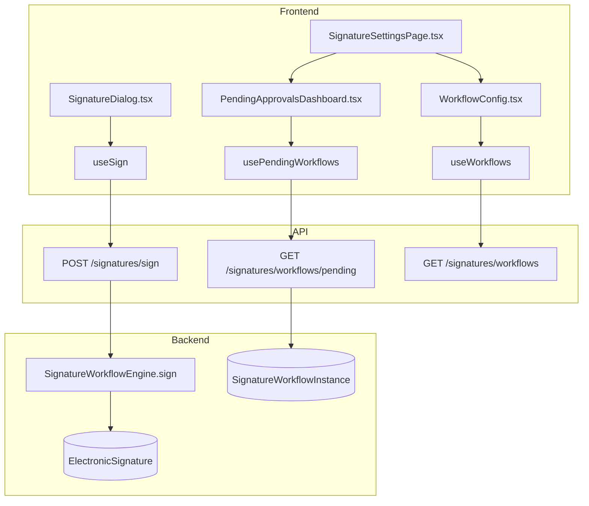
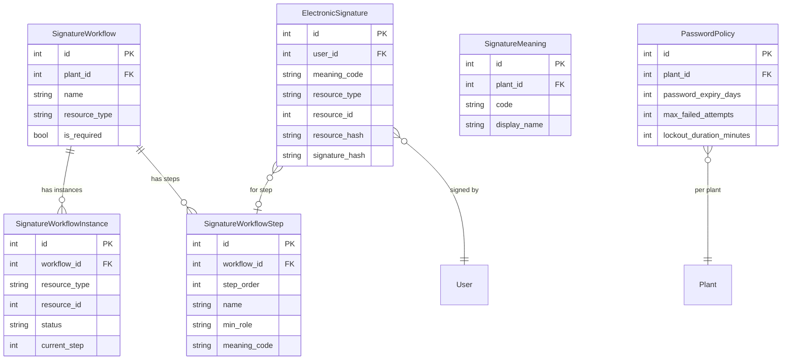

# Electronic Signatures (21 CFR Part 11)

## Data Flow

## Entity Relationships

## Backend

### Models
| Model | File | Key Columns/Relations | Migration |
|-------|------|-----------------------|-----------|
| ElectronicSignature | db/models/signature.py | id, user_id FK, username, timestamp, meaning_code, resource_type, resource_id, resource_hash (SHA-256), signature_hash (unique), is_valid | 031 |
| SignatureMeaning | db/models/signature.py | id, plant_id FK, code (unique per plant), display_name, requires_comment | 031 |
| SignatureWorkflow | db/models/signature.py | id, plant_id FK, name, resource_type (unique per plant), is_active, is_required | 031 |
| SignatureWorkflowStep | db/models/signature.py | id, workflow_id FK, step_order, name, min_role, meaning_code, allow_self_sign | 031 |
| SignatureWorkflowInstance | db/models/signature.py | id, workflow_id FK, resource_type, resource_id, status (pending/completed/rejected), current_step | 031 |
| PasswordPolicy | db/models/signature.py | id, plant_id FK (unique), password_expiry_days, max_failed_attempts, lockout_duration_minutes, min_password_length | 031 |

### Endpoints
| Method | Path | Params | Response Shape | Auth |
|--------|------|--------|----------------|------|
| POST | /signatures/sign | SignRequest body (resource_type, resource_id, meaning_code, password) | SignatureResponse | get_current_user |
| POST | /signatures/sign-standalone | StandaloneSignRequest body | SignatureResponse | get_current_user |
| POST | /signatures/verify | VerifyRequest body | VerifyResponse | get_current_user |
| GET | /signatures/history | resource_type, resource_id query | list[SignatureResponse] | get_current_user |
| POST | /signatures/workflows/initiate | InitiateRequest body | WorkflowInstanceResponse | get_current_user |
| POST | /signatures/workflows/{instance_id}/sign | instance_id, body | WorkflowInstanceResponse | get_current_user |
| POST | /signatures/workflows/{instance_id}/reject | instance_id, reason body | WorkflowInstanceResponse | get_current_user |
| GET | /signatures/workflows/pending | plant_id query | list[WorkflowInstanceResponse] | get_current_user |
| GET | /signatures/workflows | plant_id query | list[WorkflowResponse] | get_current_engineer |
| POST | /signatures/workflows | WorkflowCreate body | WorkflowResponse | get_current_engineer |
| PUT | /signatures/workflows/{id} | path id, body | WorkflowResponse | get_current_engineer |
| DELETE | /signatures/workflows/{id} | path id | 204 | get_current_engineer |
| GET | /signatures/meanings | plant_id query | list[MeaningResponse] | get_current_user |
| POST | /signatures/meanings | MeaningCreate body | MeaningResponse | get_current_engineer |
| PUT | /signatures/meanings/{id} | path id, body | MeaningResponse | get_current_engineer |
| DELETE | /signatures/meanings/{id} | path id | 204 | get_current_engineer |
| GET | /signatures/password-policy | plant_id query | PasswordPolicyResponse | get_current_engineer |
| PUT | /signatures/password-policy | PasswordPolicyUpdate body | PasswordPolicyResponse | get_current_engineer |
| POST | /signatures/check-workflow | resource_type, plant_id query | {required: bool} | get_current_user |
| POST | /signatures/invalidate | resource_type, resource_id body | {invalidated: int} | get_current_engineer |

### Services
| Module | File | Key Functions |
|--------|------|---------------|
| SignatureWorkflowEngine | core/signature_engine.py | sign(), sign_standalone(), verify(), initiate_workflow(), check_workflow_required(), invalidate_signatures_for_resource() |

### Repositories
| Class | File | Key Methods |
|-------|------|-------------|
| SignatureRepository | db/repositories/signature.py | create_signature, get_by_resource, verify_hash |
| WorkflowRepository | db/repositories/workflow.py | get_pending, get_instance, advance_step |

## Frontend

### Components
| Component | File | Key Props | Hooks Used |
|-----------|------|-----------|------------|
| SignatureDialog | components/signatures/SignatureDialog.tsx | resourceType, resourceId, onSigned | useSign |
| PendingApprovalsDashboard | components/signatures/PendingApprovalsDashboard.tsx | plantId | usePendingWorkflows |
| WorkflowConfig | components/signatures/WorkflowConfig.tsx | plantId | useWorkflows |
| WorkflowStepEditor | components/signatures/WorkflowStepEditor.tsx | workflow | useUpdateWorkflow |
| MeaningManager | components/signatures/MeaningManager.tsx | plantId | useMeanings |
| PasswordPolicySettings | components/signatures/PasswordPolicySettings.tsx | plantId | usePasswordPolicy |
| SignatureHistory | components/signatures/SignatureHistory.tsx | resourceType, resourceId | useSignatureHistory |
| SignatureVerifyBadge | components/signatures/SignatureVerifyBadge.tsx | resourceType, resourceId | useVerifySignature |
| WorkflowProgress | components/signatures/WorkflowProgress.tsx | instanceId | useWorkflowInstance |
| RejectDialog | components/signatures/RejectDialog.tsx | onReject | - |
| SignatureManifest | components/signatures/SignatureManifest.tsx | resourceType, resourceId | useSignatureHistory |

### Hooks / API
| Hook/Method | Namespace | Endpoint | Cache Key |
|-------------|-----------|----------|-----------|
| useSign | signatureApi | POST /signatures/sign | invalidates signatures |
| usePendingWorkflows | signatureApi | GET /signatures/workflows/pending | ['pendingWorkflows'] |
| useWorkflows | signatureApi | GET /signatures/workflows | ['signatureWorkflows'] |
| useMeanings | signatureApi | GET /signatures/meanings | ['signatureMeanings'] |
| usePasswordPolicy | signatureApi | GET /signatures/password-policy | ['passwordPolicy'] |
| useSignatureHistory | signatureApi | GET /signatures/history | ['signatureHistory', type, id] |

### Pages / Routes
| Route | Page | Key Components |
|-------|------|----------------|
| /settings | SettingsView (Signatures tab) | SignatureSettingsPage |

## Migrations
- 031: electronic_signature, signature_meaning, signature_workflow, signature_workflow_step, signature_workflow_instance, password_policy tables + user columns (full_name, password_changed_at, failed_login_count, locked_until, password_history, last_signature_auth_at)

## Known Issues / Gotchas
- **Resource hash**: MUST include actual content, not just type+id -- SHA-256 of serialized resource data
- **Signature re-auth timeout**: Configurable per-plant via signature_timeout_minutes in PasswordPolicy
- **Workflow step order**: Steps execute in step_order sequence; current_step tracks progress
