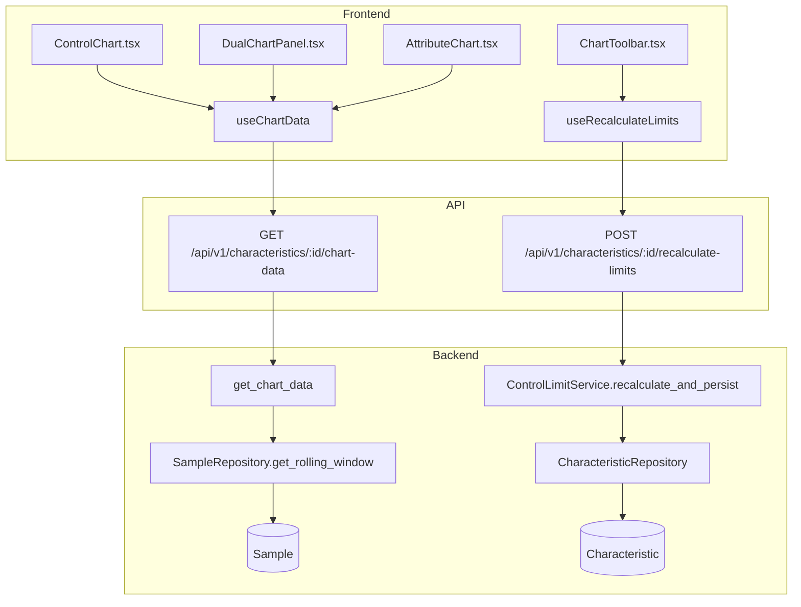
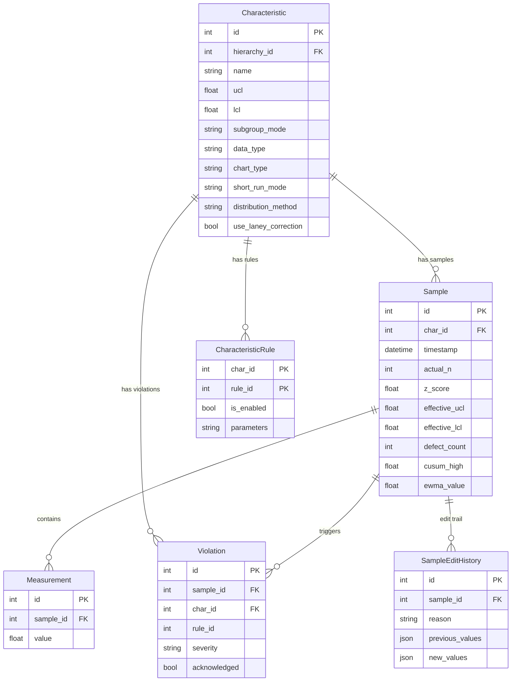

# SPC Engine

## Data Flow

## Entity Relationships

## Backend

### Models
| Model | File | Key Columns/Relations | Migration |
|-------|------|-----------------------|-----------|
| Characteristic | `db/models/characteristic.py` | id, hierarchy_id FK, name, ucl, lcl, subgroup_mode, data_type, chart_type, short_run_mode, distribution_method, use_laney_correction | 001, 032, 033 |
| CharacteristicRule | `db/models/characteristic.py` | char_id FK+PK, rule_id PK, is_enabled, parameters | 001, 032 |
| Sample | `db/models/sample.py` | id, char_id FK, timestamp, actual_n, z_score, effective_ucl, defect_count, cusum_high, ewma_value | 001 |
| Measurement | `db/models/sample.py` | id, sample_id FK, value | 001 |
| Violation | `db/models/violation.py` | id, sample_id FK, char_id FK, rule_id, severity, acknowledged | 001, 020 |
| SampleEditHistory | `db/models/sample.py` | id, sample_id FK, reason, previous_values, new_values | 001 |

### Endpoints
| Method | Path | Params | Response Shape | Auth |
|--------|------|--------|----------------|------|
| GET | /api/v1/characteristics/ | hierarchy_id, provider_type, plant_id, in_control, offset, limit, page, per_page | PaginatedResponse[CharacteristicResponse] | get_current_user |
| POST | /api/v1/characteristics/ | CharacteristicCreate body | CharacteristicResponse | get_current_engineer |
| GET | /api/v1/characteristics/{char_id} | char_id path | CharacteristicResponse | get_current_user |
| PATCH | /api/v1/characteristics/{char_id} | CharacteristicUpdate body | CharacteristicResponse | get_current_engineer |
| DELETE | /api/v1/characteristics/{char_id} | char_id path | 204 No Content | get_current_engineer |
| GET | /api/v1/characteristics/{char_id}/chart-data | limit, start_date, end_date | ChartDataResponse | get_current_user |
| POST | /api/v1/characteristics/{char_id}/recalculate-limits | exclude_ooc, min_samples, start_date, end_date, last_n | dict (before/after/calculation) | get_current_engineer |
| POST | /api/v1/characteristics/{char_id}/set-limits | SetLimitsRequest body (ucl, lcl, center_line, sigma) | ControlLimitsResponse | get_current_engineer |
| GET | /api/v1/characteristics/{char_id}/rules | char_id path | list[NelsonRuleConfig] | get_current_user |
| PUT | /api/v1/characteristics/{char_id}/rules | list[NelsonRuleConfig] body | list[NelsonRuleConfig] | get_current_engineer |
| POST | /api/v1/characteristics/{char_id}/change-mode | ChangeModeRequest body (new_mode) | ChangeModeResponse | get_current_engineer |

### Services
| Module | File | Key Functions |
|--------|------|---------------|
| SPCEngine | `core/engine/spc_engine.py` | process_sample(char_id, measurements, context) -> ProcessingResult |
| AttributeEngine | `core/engine/attribute_engine.py` | calculate_attribute_limits(), get_plotted_value(), check_attribute_nelson_rules(), process_attribute_sample(), calculate_laney_sigma_z(), get_per_point_limits_laney() |
| ControlLimitService | `core/engine/control_limits.py` | calculate_limits(char_id, exclude_ooc, min_samples), recalculate_and_persist() |
| NelsonRuleLibrary | `core/engine/nelson_rules.py` | check_all(window, enabled_rules), create_from_config(rule_configs), check_single() |
| RollingWindowManager | `core/engine/rolling_window.py` | get_window(char_id), add_sample(), invalidate(), update_boundaries() |
| CUSUMEngine | `core/engine/cusum_engine.py` | process_cusum_sample() |
| EWMAEngine | `core/engine/ewma_engine.py` | process_ewma_sample(), calculate_ewma_limits() |

### Repositories
| Class | File | Key Methods |
|-------|------|-------------|
| CharacteristicRepository | `db/repositories/characteristic.py` | get_by_id, get_with_rules, get_with_data_source, create |
| SampleRepository | `db/repositories/sample.py` | create_with_measurements, create_attribute_sample, get_rolling_window, get_rolling_window_data, get_attribute_rolling_window, get_by_characteristic |
| ViolationRepository | `db/repositories/violation.py` | create, get_by_sample, get_by_sample_ids |

## Frontend

### Components
| Component | File | Key Props | Hooks Used |
|-----------|------|-----------|------------|
| ControlChart | `components/ControlChart.tsx` | characteristicId | useChartData, useECharts |
| DualChartPanel | `components/charts/DualChartPanel.tsx` | characteristicId | useChartData, useECharts |
| RangeChart | `components/charts/RangeChart.tsx` | data | useECharts |
| BoxWhiskerChart | `components/charts/BoxWhiskerChart.tsx` | data | useECharts |
| ChartTypeSelector | `components/charts/ChartTypeSelector.tsx` | chartType, onChange | - |
| AttributeChart | `components/AttributeChart.tsx` | characteristicId | useChartData, useECharts |
| AttributeEntryForm | `components/AttributeEntryForm.tsx` | characteristicId | useSubmitAttributeSample |
| ChartPanel | `components/ChartPanel.tsx` | characteristicId | useChartData |
| ChartToolbar | `components/ChartToolbar.tsx` | characteristicId | useRecalculateLimits |
| CUSUMChart | `components/CUSUMChart.tsx` | characteristicId | useChartData, useECharts |
| EWMAChart | `components/EWMAChart.tsx` | characteristicId | useChartData, useECharts |

### Hooks / API
| Hook/Method | Namespace | Endpoint | Cache Key |
|-------------|-----------|----------|-----------|
| useCharacteristics | characteristicsApi | GET /characteristics/ | ['characteristics', 'list'] |
| useCharacteristic | characteristicsApi | GET /characteristics/:id | ['characteristics', 'detail', id] |
| useChartData | characteristicsApi | GET /characteristics/:id/chart-data | ['characteristics', 'chartData', id] |
| useRecalculateLimits | characteristicsApi | POST /characteristics/:id/recalculate-limits | invalidates chartData |
| useUpdateCharacteristic | characteristicsApi | PATCH /characteristics/:id | invalidates detail + chartData |
| useNelsonRules | characteristicsApi | GET /characteristics/:id/rules | ['characteristics', 'rules', id] |
| useUpdateNelsonRules | characteristicsApi | PUT /characteristics/:id/rules | invalidates rules |

### Pages / Routes
| Route | Page | Key Components |
|-------|------|----------------|
| /dashboard | OperatorDashboard | ChartPanel, ControlChart, DualChartPanel, ChartToolbar, CapabilityCard, AnomalyOverlay |

## Migrations
- 001: Initial schema (characteristic, sample, measurement, violation, characteristic_rules)
- 020: violation.char_id denormalized, CASCADE FKs, timezone datetimes, composite indexes
- 032: distribution_method, box_cox_lambda, distribution_params, use_laney_correction on characteristic; parameters on characteristic_rules; rule_preset table
- 033: short_run_mode on characteristic

## Known Issues / Gotchas
- TODO: Make DEFAULT_LIMIT_WINDOW_SIZE (100) configurable per-characteristic
- TODO: Consider soft-delete for characteristics instead of hard delete
- Zone classification uses raw values in short-run mode (low priority)
- DualChartPanel client-side stats may diverge from backend (low priority)
- Attribute Nelson rules limited to rules 1-4 (rules 5-8 silently ignored for binomial/Poisson distributions)
- Custom rule parameters must be re-applied via create_from_config on every process_sample call
- Short-run standardized mode uses sigma_xbar = sigma/sqrt(n) for subgroups > 1
- useUpdateCharacteristic must invalidate chartData key prefix ['characteristics', 'chartData', id] separately
- Backend config validation: short_run_mode incompatible with attribute data or CUSUM/EWMA
