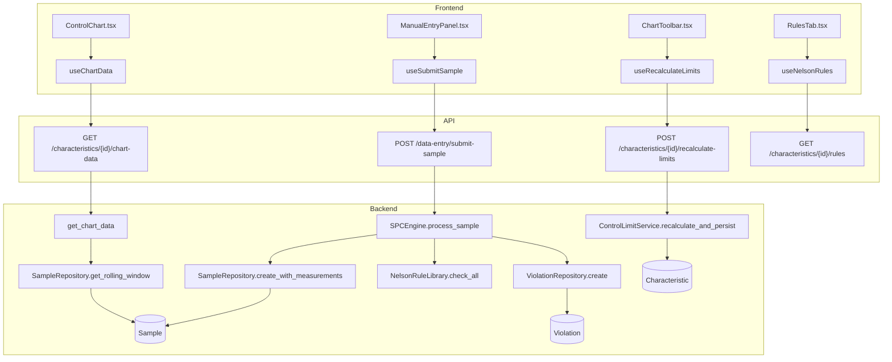
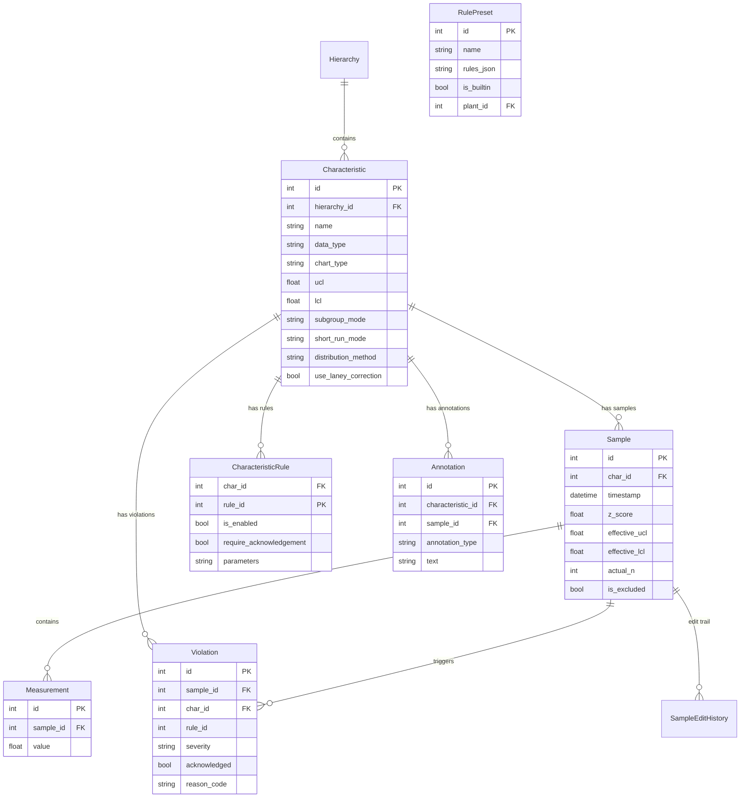

# SPC Engine

## Data Flow

## Entity Relationships

## Backend

### Models
| Model | File | Key Columns/Relations | Migration |
|-------|------|-----------------------|-----------|
| Characteristic | db/models/characteristic.py | hierarchy_id FK, name, data_type, chart_type, ucl, lcl, subgroup_mode, short_run_mode, distribution_method, use_laney_correction, target_value, stored_sigma, stored_center_line | 001, 032, 033 |
| CharacteristicRule | db/models/characteristic.py | char_id FK+PK, rule_id PK, is_enabled, require_acknowledgement, parameters | 001, 032 |
| Sample | db/models/sample.py | char_id FK, timestamp, z_score, effective_ucl/lcl, actual_n, is_undersized, cusum_high/low, ewma_value, defect_count, sample_size, units_inspected | 001 |
| Measurement | db/models/sample.py | sample_id FK, value | 001 |
| SampleEditHistory | db/models/sample.py | sample_id FK, edited_by, previous_values, new_values | 001 |
| Violation | db/models/violation.py | sample_id FK, char_id FK, rule_id, rule_name, severity, acknowledged, requires_acknowledgement, reason_code | 001, 020 |
| Annotation | db/models/annotation.py | characteristic_id FK, sample_id FK, start_sample_id FK, end_sample_id FK, annotation_type, text | 001 |
| AnnotationHistory | db/models/annotation.py | annotation_id FK, changed_by, field_changed | 001 |
| RulePreset | db/models/rule_preset.py | name, rules_json, is_builtin, plant_id FK | 032 |

### Endpoints
| Method | Path | Params | Response Shape | Auth |
|--------|------|--------|----------------|------|
| GET | /api/v1/characteristics/ | hierarchy_id, provider_type, plant_id, in_control, offset, limit, page, per_page | PaginatedResponse[CharacteristicResponse] | get_current_user |
| POST | /api/v1/characteristics/ | CharacteristicCreate body | CharacteristicResponse | get_current_engineer |
| GET | /api/v1/characteristics/{char_id} | - | CharacteristicResponse | get_current_user |
| PATCH | /api/v1/characteristics/{char_id} | CharacteristicUpdate body | CharacteristicResponse | get_current_engineer |
| DELETE | /api/v1/characteristics/{char_id} | - | 204 | get_current_engineer |
| GET | /api/v1/characteristics/{char_id}/chart-data | limit, start_date, end_date | ChartDataResponse | get_current_user |
| POST | /api/v1/characteristics/{char_id}/recalculate-limits | exclude_ooc, min_samples, start_date, end_date, last_n | {before, after, calculation} | get_current_engineer |
| POST | /api/v1/characteristics/{char_id}/set-limits | SetLimitsRequest (ucl, lcl, center_line, sigma) | ControlLimitsResponse | get_current_engineer |
| GET | /api/v1/characteristics/{char_id}/rules | - | list[NelsonRuleConfig] | get_current_user |
| PUT | /api/v1/characteristics/{char_id}/rules | list[NelsonRuleConfig] body | list[NelsonRuleConfig] | get_current_engineer |
| POST | /api/v1/characteristics/{char_id}/change-mode | ChangeModeRequest (new_mode) | ChangeModeResponse | get_current_engineer |
| GET | /api/v1/characteristics/{char_id}/config | - | CharacteristicConfigResponse | get_current_user |
| PUT | /api/v1/characteristics/{char_id}/config | CharacteristicConfigUpdate body | CharacteristicConfigResponse | get_current_engineer |
| DELETE | /api/v1/characteristics/{char_id}/config | - | 204 | get_current_engineer |
| GET | /api/v1/violations/ | char_id, severity, acknowledged, plant_id, limit, offset | PaginatedResponse[ViolationResponse] | get_current_user |
| GET | /api/v1/violations/stats | plant_id | ViolationStats | get_current_user |
| GET | /api/v1/violations/reason-codes | - | list[str] | get_current_user |
| GET | /api/v1/violations/{violation_id} | - | ViolationResponse | get_current_user |
| POST | /api/v1/violations/{violation_id}/acknowledge | reason_code, notes | ViolationResponse | get_current_user |
| POST | /api/v1/violations/batch-acknowledge | BatchAcknowledgeRequest body | BatchAcknowledgeResult | get_current_user |
| GET | /api/v1/characteristics/rule-presets | plant_id | list[PresetResponse] | get_current_user |
| GET | /api/v1/characteristics/rule-presets/{preset_id} | - | PresetResponse | get_current_user |
| POST | /api/v1/characteristics/rule-presets | CreatePresetRequest body | PresetResponse | get_current_engineer |
| PUT | /api/v1/characteristics/{char_id}/rules/preset | {preset_id} body | dict | get_current_engineer |
| GET | /api/v1/annotations/{char_id} | - | list[AnnotationResponse] | get_current_user |
| POST | /api/v1/annotations/{char_id} | AnnotationCreate body | AnnotationResponse | get_current_user |
| PUT | /api/v1/annotations/{char_id}/{annotation_id} | AnnotationUpdate body | AnnotationResponse | get_current_user |
| DELETE | /api/v1/annotations/{char_id}/{annotation_id} | - | 204 | get_current_user |

### Services
| Module | File | Key Functions |
|--------|------|---------------|
| SPCEngine | core/engine/spc_engine.py | process_sample(), recalculate_limits() |
| ControlLimitService | core/engine/control_limits.py | recalculate_and_persist() |
| NelsonRuleLibrary | core/engine/nelson_rules.py | check_all(), create_from_config(), 8 rule classes (Rule1..Rule8) |
| RollingWindowManager | core/engine/rolling_window.py | add_sample(), get_window(), invalidate() |
| AttributeEngine | core/engine/attribute_engine.py | calculate_attribute_limits(), calculate_laney_sigma_z(), get_per_point_limits(), get_per_point_limits_laney() |
| CUSUMEngine | core/engine/cusum_engine.py | process_cusum_sample() |
| EWMAEngine | core/engine/ewma_engine.py | calculate_ewma_limits(), estimate_sigma_from_values() |

### Repositories
| Class | File | Key Methods |
|-------|------|-------------|
| CharacteristicRepository | db/repositories/characteristic.py | get_by_id, get_with_rules, get_with_data_source, create |
| SampleRepository | db/repositories/sample.py | create_with_measurements, get_rolling_window, get_rolling_window_data, get_attribute_rolling_window, get_by_characteristic |
| ViolationRepository | db/repositories/violation.py | create, get_by_sample_ids, get_by_characteristic |

## Frontend

### Components
| Component | File | Key Props | Hooks Used |
|-----------|------|-----------|------------|
| ControlChart | components/ControlChart.tsx | characteristicId | useChartData, useECharts |
| CUSUMChart | components/CUSUMChart.tsx | characteristicId | useChartData, useECharts |
| EWMAChart | components/EWMAChart.tsx | characteristicId | useChartData, useECharts |
| AttributeChart | components/AttributeChart.tsx | characteristicId | useChartData, useECharts |
| AttributeEntryForm | components/AttributeEntryForm.tsx | characteristicId | useSubmitAttributeData |
| DualChartPanel | components/charts/DualChartPanel.tsx | characteristicId | useChartData |
| RangeChart | components/charts/RangeChart.tsx | data, limits | useECharts |
| BoxWhiskerChart | components/charts/BoxWhiskerChart.tsx | data | useECharts |
| ChartTypeSelector | components/charts/ChartTypeSelector.tsx | chartType, onChange | - |
| ChartPanel | components/ChartPanel.tsx | characteristicId | useCharacteristic |
| ChartToolbar | components/ChartToolbar.tsx | characteristicId | useRecalculateLimits, useSetManualLimits |
| ChartRangeSlider | components/ChartRangeSlider.tsx | range, onChange | - |
| ViolationLegend | components/ViolationLegend.tsx | violations | - |
| BulkAcknowledgeDialog | components/BulkAcknowledgeDialog.tsx | violationIds | useBatchAcknowledgeViolation |
| RulesTab | components/characteristic-config/RulesTab.tsx | charId | useNelsonRules, useUpdateNelsonRules, useRulePresets, useApplyPreset |
| LimitsTab | components/characteristic-config/LimitsTab.tsx | charId | useRecalculateLimits |
| GeneralTab | components/characteristic-config/GeneralTab.tsx | charId | useUpdateCharacteristic |
| SamplingTab | components/characteristic-config/SamplingTab.tsx | charId | useChangeMode |
| NelsonSparklines | components/characteristic-config/NelsonSparklines.tsx | rules | - |
| CharacteristicConfigTabs | components/characteristic-config/CharacteristicConfigTabs.tsx | charId | useCharacteristic |
| AnnotationDialog | components/AnnotationDialog.tsx | charId | useCreateAnnotation, useUpdateAnnotation |
| AnnotationListPanel | components/AnnotationListPanel.tsx | charId | useAnnotations |

### Hooks / API
| Hook/Method | Namespace | Endpoint | Cache Key |
|-------------|-----------|----------|-----------|
| useChartData | characteristicApi.chartData | GET /characteristics/{id}/chart-data | ['characteristics', 'chartData', id] |
| useCharacteristic | characteristicApi.get | GET /characteristics/{id} | ['characteristics', 'detail', id] |
| useCharacteristics | characteristicApi.list | GET /characteristics/ | ['characteristics', 'list'] |
| useCreateCharacteristic | characteristicApi.create | POST /characteristics/ | invalidates list |
| useUpdateCharacteristic | characteristicApi.update | PATCH /characteristics/{id} | invalidates detail+list+chartData |
| useDeleteCharacteristic | characteristicApi.delete | DELETE /characteristics/{id} | invalidates list |
| useRecalculateLimits | characteristicApi.recalculateLimits | POST /characteristics/{id}/recalculate-limits | invalidates chartData+detail |
| useSetManualLimits | characteristicApi.setLimits | POST /characteristics/{id}/set-limits | invalidates chartData+detail |
| useNelsonRules | characteristicApi.getRules | GET /characteristics/{id}/rules | ['characteristics', 'rules', id] |
| useUpdateNelsonRules | characteristicApi.updateRules | PUT /characteristics/{id}/rules | invalidates rules |
| useChangeMode | characteristicApi.changeMode | POST /characteristics/{id}/change-mode | invalidates detail+chartData |
| useViolations | violationApi.list | GET /violations/ | ['violations', 'list'] |
| useViolationStats | violationApi.stats | GET /violations/stats | ['violations', 'stats'] |
| useAcknowledgeViolation | violationApi.acknowledge | POST /violations/{id}/acknowledge | invalidates violations+chartData |
| useBatchAcknowledgeViolation | violationApi.batchAcknowledge | POST /violations/batch-acknowledge | invalidates violations |
| useRulePresets | rulePresetApi.list | GET /characteristics/rule-presets | ['rulePresets'] |
| useApplyPreset | rulePresetApi.apply | PUT /characteristics/{id}/rules/preset | invalidates rules |
| useAnnotations | annotationApi.list | GET /annotations/{charId} | ['annotations', charId] |
| useSubmitSample | sampleApi.submit | POST /samples/ | invalidates chartData+violations |

### Pages / Routes
| Route | Page | Key Components |
|-------|------|----------------|
| /dashboard | OperatorDashboard | ControlChart, DualChartPanel, ChartToolbar, CapabilityCard, AnomalyOverlay, CharacteristicContextBar |
| /violations | ViolationsView | ViolationLegend, BulkAcknowledgeDialog |
| /configuration | CharacteristicConfigTabs | GeneralTab, LimitsTab, RulesTab, SamplingTab |

## Migrations
- 001: Initial schema (characteristic, sample, measurement, violation, characteristic_rules, annotation)
- 020: violation.char_id denormalized, CASCADE FKs, composite indexes, annotation CHECK constraints
- 032: distribution_method, box_cox_lambda, distribution_params, use_laney_correction on characteristic; parameters on characteristic_rules; rule_preset table
- 033: short_run_mode on characteristic

## Known Issues / Gotchas
- TODO: Make DEFAULT_LIMIT_WINDOW_SIZE configurable per-characteristic (spc_engine.py:34)
- TODO: Consider adding soft-delete for characteristics instead of hard delete (characteristics.py:337)
- Zone classification uses raw values in short-run mode (not transformed) -- low priority
- DualChartPanel calculates client-side statistics that may diverge from server
- Attribute Nelson rules backend intersects with {1,2,3,4} only; rules 5-8 silently ignored
- RollingWindowManager caches are session-coupled (not decoupled from session lifecycle)
- useUpdateCharacteristic MUST invalidate chartData key prefix, not just detail/list
- CharacteristicForm onChange type must be (field: string, value: string | boolean) for checkbox fields
- Short-run spec limits must use sigma/sqrt(n) to match display_value transform
