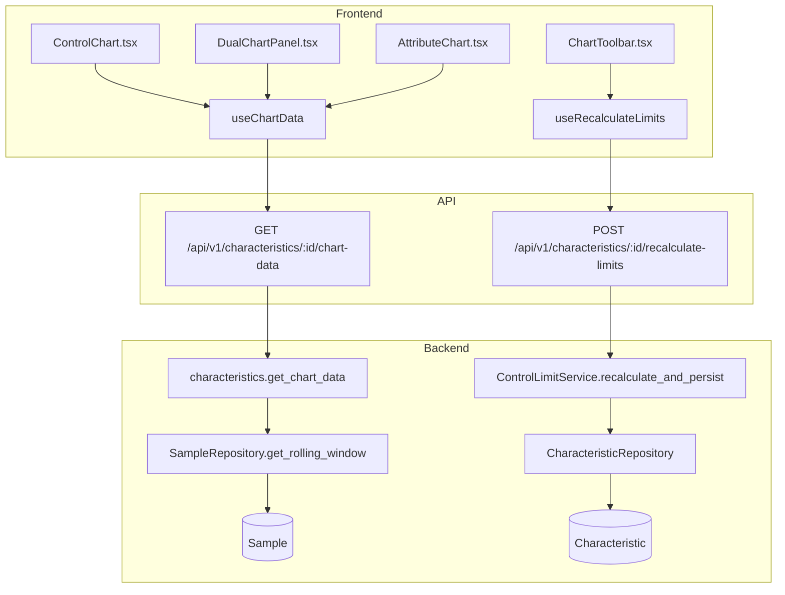

# SPC Engine

## Data Flow



## Entity Relationships

```mermaid
erDiagram
    Hierarchy ||--o{ Characteristic : contains
    Characteristic ||--o{ Sample : "has samples"
    Characteristic ||--o{ CharacteristicRule : "has rules"
    Characteristic {
        int id PK
        int hierarchy_id FK
        string name
        string data_type
        string chart_type
        string subgroup_mode
        int subgroup_size
        float ucl
        float lcl
        float stored_sigma
        float stored_center_line
        string short_run_mode
        string distribution_method
        bool use_laney_correction
    }
    Sample ||--o{ Measurement : contains
    Sample ||--o{ Violation : "has violations"
    Sample {
        int id PK
        int char_id FK
        datetime timestamp
        int actual_n
        float z_score
        float effective_ucl
        float effective_lcl
        int defect_count
        float cusum_high
        float cusum_low
        float ewma_value
    }
    Measurement {
        int id PK
        int sample_id FK
        float value
    }
    Violation {
        int id PK
        int sample_id FK
        int char_id FK
        int rule_id
        string severity
        bool acknowledged
    }
    CharacteristicRule {
        int char_id PK_FK
        int rule_id PK
        bool is_enabled
        string parameters
    }
    RulePreset {
        int id PK
        string name
        string preset_type
    }
```

## Backend

### Models
| Model | File | Key Columns/Relations | Migration |
|-------|------|-----------------------|-----------|
| Characteristic | `db/models/characteristic.py` | id, hierarchy_id FK, name, data_type, chart_type, subgroup_mode, subgroup_size, ucl, lcl, stored_sigma, stored_center_line, short_run_mode, distribution_method, use_laney_correction; rels: hierarchy, rules, samples, config, data_source | 001 + 032 + 033 |
| CharacteristicRule | `db/models/characteristic.py` | char_id FK PK, rule_id PK, is_enabled, require_acknowledgement, parameters | 001 + 032 |
| Sample | `db/models/sample.py` | id, char_id FK, timestamp, actual_n, z_score, effective_ucl/lcl, defect_count, sample_size, cusum_high/low, ewma_value, is_excluded, is_modified; rels: measurements, violations, edit_history | 001 + 023 |
| Measurement | `db/models/sample.py` | id, sample_id FK, value | 001 |
| Violation | `db/models/violation.py` | id, sample_id FK, char_id FK, rule_id, rule_name, severity, acknowledged, requires_acknowledgement, ack_user, ack_reason | 001 + 020 |
| SampleEditHistory | `db/models/sample.py` | id, sample_id FK, edited_at, edited_by, reason, previous_values JSON, new_values JSON | 015 |
| RulePreset | `db/models/rule_preset.py` | id, name, preset_type, rules JSON | 032 |

### Endpoints
| Method | Path | Params | Response Shape | Auth |
|--------|------|--------|----------------|------|
| GET | /api/v1/characteristics/ | hierarchy_id, provider_type, plant_id, in_control, offset, limit, page, per_page | PaginatedResponse[CharacteristicResponse] | get_current_user |
| POST | /api/v1/characteristics/ | body: CharacteristicCreate | CharacteristicResponse | get_current_engineer |
| GET | /api/v1/characteristics/{char_id} | char_id | CharacteristicResponse | get_current_user |
| PATCH | /api/v1/characteristics/{char_id} | char_id, body: CharacteristicUpdate | CharacteristicResponse | get_current_engineer |
| DELETE | /api/v1/characteristics/{char_id} | char_id | 204 No Content | get_current_engineer |
| GET | /api/v1/characteristics/{char_id}/chart-data | char_id, limit, start_date, end_date | ChartDataResponse | get_current_user |
| POST | /api/v1/characteristics/{char_id}/recalculate-limits | char_id, exclude_ooc, min_samples, start_date, end_date, last_n | {before, after, calculation} | get_current_engineer |
| POST | /api/v1/characteristics/{char_id}/set-limits | body: SetLimitsRequest (ucl, lcl, center_line, sigma) | ControlLimitsResponse | get_current_engineer |
| GET | /api/v1/characteristics/{char_id}/rules | char_id | list[NelsonRuleConfig] | get_current_user |
| PUT | /api/v1/characteristics/{char_id}/rules | body: list[NelsonRuleConfig] | list[NelsonRuleConfig] | get_current_engineer |
| POST | /api/v1/characteristics/{char_id}/change-mode | body: ChangeModeRequest (new_mode) | ChangeModeResponse | get_current_engineer |
| GET | /api/v1/rule-presets/ | - | list[RulePresetResponse] | get_current_user |
| POST | /api/v1/rule-presets/ | body: RulePresetCreate | RulePresetResponse | get_current_engineer |
| PUT | /api/v1/rule-presets/{id} | body: RulePresetUpdate | RulePresetResponse | get_current_engineer |
| DELETE | /api/v1/rule-presets/{id} | - | 204 No Content | get_current_engineer |

### Services
| Module | File | Key Functions |
|--------|------|---------------|
| SPCEngine | `core/engine/spc_engine.py` | process_sample(char_id, measurements, context) -> ProcessingResult |
| ControlLimitService | `core/engine/control_limits.py` | calculate_limits(char_id, exclude_ooc, min_samples), recalculate_and_persist() -> CalculationResult |
| NelsonRuleLibrary | `core/engine/nelson_rules.py` | check_all(window, enabled_rules), create_from_config(configs), check_single(window, rule_id) |
| AttributeEngine | `core/engine/attribute_engine.py` | calculate_attribute_limits(chart_type, samples), process_attribute_sample(), check_attribute_nelson_rules(), calculate_laney_sigma_z(), get_per_point_limits(), get_per_point_limits_laney() |
| CUSUMEngine | `core/engine/cusum_engine.py` | process_cusum_sample(char_id, measurement) -> CUSUMProcessingResult |
| EWMAEngine | `core/engine/ewma_engine.py` | process_ewma_sample(char_id, measurement) -> EWMAProcessingResult, calculate_ewma_limits() |
| RollingWindowManager | `core/engine/rolling_window.py` | add_sample(), get_window(), invalidate() |

### Repositories
| Class | File | Key Methods |
|-------|------|-------------|
| CharacteristicRepository | `db/repositories/characteristic.py` | get_by_id, get_with_rules, get_with_data_source, create |
| SampleRepository | `db/repositories/sample.py` | create_with_measurements, get_rolling_window, get_rolling_window_data, get_attribute_rolling_window, get_by_characteristic, create_attribute_sample |
| ViolationRepository | `db/repositories/violation.py` | create, get_by_sample_ids, get_unacknowledged, acknowledge |

## Frontend

### Components
| Component | File | Key Props | Hooks Used |
|-----------|------|-----------|------------|
| ControlChart | `components/ControlChart.tsx` | chartData, characteristicId | useECharts |
| CUSUMChart | `components/CUSUMChart.tsx` | chartData | useECharts |
| EWMAChart | `components/EWMAChart.tsx` | chartData | useECharts |
| AttributeChart | `components/AttributeChart.tsx` | chartData | useECharts |
| AttributeEntryForm | `components/AttributeEntryForm.tsx` | characteristicId, chartType | useSubmitAttributeSample |
| ChartPanel | `components/ChartPanel.tsx` | characteristicId | useChartData, useCharacteristic |
| ChartToolbar | `components/ChartToolbar.tsx` | characteristicId, onRecalculate | useRecalculateLimits |
| DualChartPanel | `components/charts/DualChartPanel.tsx` | chartData, chartType | useECharts |
| RangeChart | `components/charts/RangeChart.tsx` | chartData | useECharts |
| BoxWhiskerChart | `components/charts/BoxWhiskerChart.tsx` | chartData | useECharts |
| ChartTypeSelector | `components/charts/ChartTypeSelector.tsx` | value, onChange | - |

### Hooks / API
| Hook/Method | Namespace | Endpoint | Cache Key |
|-------------|-----------|----------|-----------|
| useCharacteristics | characteristicApi.list | GET /characteristics/ | ['characteristics', 'list', params] |
| useCharacteristic | characteristicApi.get | GET /characteristics/:id | ['characteristics', 'detail', id] |
| useChartData | characteristicApi.getChartData | GET /characteristics/:id/chart-data | ['characteristics', 'chartData', id, opts] |
| useRecalculateLimits | characteristicApi.recalculateLimits | POST /characteristics/:id/recalculate-limits | invalidates chartData |
| useCreateCharacteristic | characteristicApi.create | POST /characteristics/ | invalidates list |
| useUpdateCharacteristic | characteristicApi.update | PATCH /characteristics/:id | invalidates detail + chartData |
| useDeleteCharacteristic | characteristicApi.delete | DELETE /characteristics/:id | invalidates list |
| useRules | characteristicApi.getRules | GET /characteristics/:id/rules | ['characteristics', 'rules', id] |
| useUpdateRules | characteristicApi.updateRules | PUT /characteristics/:id/rules | invalidates rules |

### Pages / Routes
| Route | Page | Key Components |
|-------|------|----------------|
| /dashboard | OperatorDashboard | ChartPanel, ControlChart, DualChartPanel, ChartToolbar, CapabilityCard |
| /kiosk | KioskView | ControlChart |
| /wall | WallDashboard | WallChartCard |

## Migrations
- 001: Initial schema (characteristic, sample, measurement, violation, characteristic_rules)
- 015: sample_edit_history table
- 020: CASCADE FKs, violation.char_id denormalized, composite indexes
- 023: Attribute chart columns (defect_count, sample_size, units_inspected, cusum_high/low, ewma_value)
- 032: distribution_method, box_cox_lambda, distribution_params, use_laney_correction, parameters on rules, rule_preset table
- 033: short_run_mode on characteristic

## Known Issues / Gotchas
- Zone classification uses raw values in short-run mode (low priority)
- DualChartPanel client-side stats may diverge from server stats
- RangeChart uses nominal n for variable-limits mode
- Attribute Nelson Rules only 1-4 (5-8 silently ignored for binomial/Poisson)
- Custom rule params must be applied via create_from_config before check_all
- Short-run standardized Z-transform must use sigma_xbar = sigma/sqrt(n)
- useUpdateCharacteristic must invalidate chartData key separately
- TODO: Make DEFAULT_LIMIT_WINDOW_SIZE configurable per-characteristic
- TODO: Consider soft-delete for characteristics instead of hard delete
