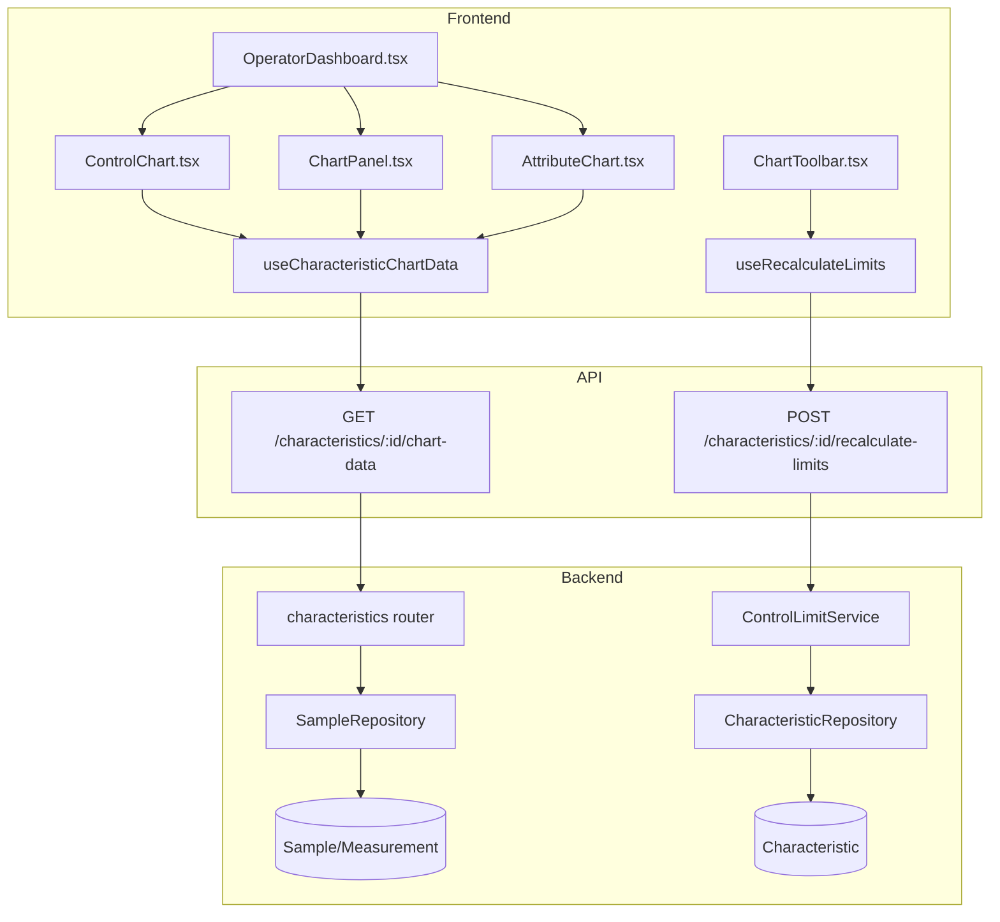
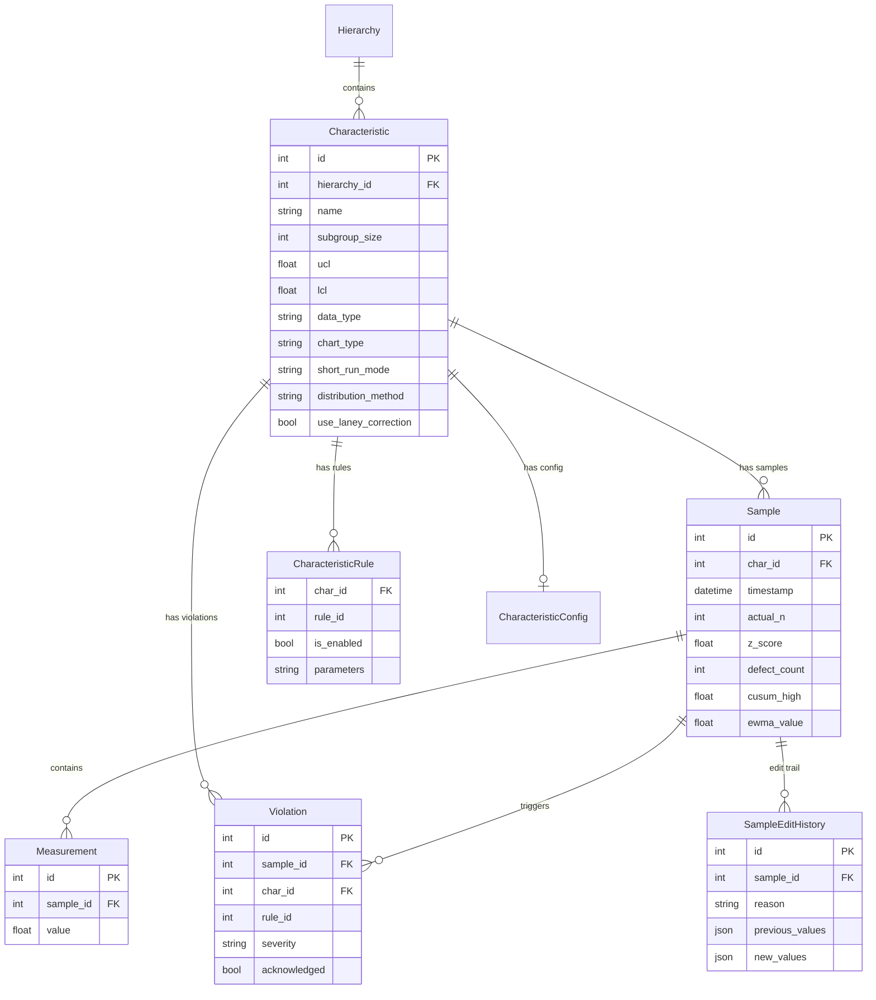

# SPC Engine

## Data Flow

## Entity Relationships

## Backend

### Models
| Model | File | Key Columns/Relations | Migration |
|-------|------|-----------------------|-----------|
| Characteristic | db/models/characteristic.py | id, hierarchy_id FK, name, subgroup_size, ucl/lcl, usl/lsl, data_type, chart_type, short_run_mode, distribution_method, use_laney_correction, subgroup_mode | 001+032+033 |
| CharacteristicRule | db/models/characteristic.py | char_id FK (PK), rule_id (PK), is_enabled, require_acknowledgement, parameters (JSON) | 001+032 |
| Sample | db/models/sample.py | id, char_id FK, timestamp, actual_n, is_undersized, z_score, effective_ucl/lcl, defect_count, sample_size, cusum_high/low, ewma_value, is_modified | 001+023 |
| Measurement | db/models/sample.py | id, sample_id FK, value | 001 |
| Violation | db/models/violation.py | id, sample_id FK, char_id FK, rule_id, rule_name, severity, acknowledged, requires_acknowledgement | 001+020 |
| SampleEditHistory | db/models/sample.py | id, sample_id FK, edited_by, reason, previous_values (JSON), new_values (JSON) | 001 |
| RulePreset | db/models/rule_preset.py | id, name, preset_type, rules_config | 032 |
| Annotation | db/models/annotation.py | id, characteristic_id FK, sample_id FK, text, type | 001 |

### Endpoints
| Method | Path | Params | Response Shape | Auth |
|--------|------|--------|----------------|------|
| GET | /characteristics | plant_id, hierarchy_id, page, limit | PaginatedResponse[CharacteristicResponse] | get_current_user |
| POST | /characteristics | CharacteristicCreate body | CharacteristicResponse | get_current_engineer |
| GET | /characteristics/{id} | path id | CharacteristicResponse | get_current_user |
| PUT | /characteristics/{id} | path id, CharacteristicUpdate body | CharacteristicResponse | get_current_engineer |
| DELETE | /characteristics/{id} | path id | 204 | get_current_engineer |
| GET | /characteristics/{id}/chart-data | id, start_date, end_date, last_n | ChartDataResponse | get_current_user |
| POST | /characteristics/{id}/recalculate-limits | id, exclude_ooc, min_samples, last_n | ControlLimitsResponse | get_current_engineer |
| PUT | /characteristics/{id}/set-limits | id, SetLimitsRequest body | ControlLimitsResponse | get_current_engineer |
| GET | /characteristics/{id}/rules | path id | list[NelsonRuleConfig] | get_current_user |
| PUT | /characteristics/{id}/rules | path id, list[NelsonRuleConfig] body | list[NelsonRuleConfig] | get_current_engineer |
| POST | /characteristics/{id}/change-mode | id, ChangeModeRequest body | ChangeModeResponse | get_current_engineer |
| GET | /rule-presets | plant_id query | list[RulePresetResponse] | get_current_user |
| POST | /rule-presets | RulePresetCreate body | RulePresetResponse | get_current_engineer |
| PUT | /rule-presets/{id} | path id, body | RulePresetResponse | get_current_engineer |
| DELETE | /rule-presets/{id} | path id | 204 | get_current_engineer |
| GET | /violations | char_id, acknowledged, page, limit | PaginatedResponse[ViolationResponse] | get_current_user |
| PATCH | /violations/{id}/acknowledge | path id, ack body | ViolationResponse | get_current_user |
| GET | /annotations | char_id query | list[AnnotationResponse] | get_current_user |
| POST | /annotations | AnnotationCreate body | AnnotationResponse | get_current_user |

### Services
| Module | File | Key Functions |
|--------|------|---------------|
| SPCEngine | core/engine/spc_engine.py | process_sample(char_id, measurements, context) -> ProcessingResult |
| ControlLimitService | core/engine/control_limits.py | calculate_limits(), recalculate_and_persist() -> CalculationResult |
| NelsonRuleLibrary | core/engine/nelson_rules.py | check_all(window, enabled_rules), check_single(), create_from_config(rule_configs) |
| AttributeSPCEngine | core/engine/attribute_engine.py | process_attribute_sample(), calculate_attribute_limits(), calculate_laney_sigma_z(), get_per_point_limits_laney() |
| RollingWindowManager | core/engine/rolling_window.py | add_sample(), get_window(), invalidate() |
| CUSUMEngine | core/engine/cusum_engine.py | calculate_cusum() |
| EWMAEngine | core/engine/ewma_engine.py | calculate_ewma() |

### Repositories
| Class | File | Key Methods |
|-------|------|-------------|
| CharacteristicRepository | db/repositories/characteristic.py | get_by_id, get_with_rules, list_by_hierarchy, create, update |
| SampleRepository | db/repositories/sample.py | get_by_characteristic, get_rolling_window_data, create_with_measurements, get_attribute_rolling_window, create_attribute_sample |
| ViolationRepository | db/repositories/violation.py | create, get_by_sample, get_by_characteristic, acknowledge |

## Frontend

### Components
| Component | File | Key Props | Hooks Used |
|-----------|------|-----------|------------|
| ControlChart | components/ControlChart.tsx | characteristicId | useCharacteristicChartData, useECharts |
| CUSUMChart | components/CUSUMChart.tsx | characteristicId | useCharacteristicChartData |
| EWMAChart | components/EWMAChart.tsx | characteristicId | useCharacteristicChartData |
| AttributeChart | components/AttributeChart.tsx | characteristicId | useCharacteristicChartData |
| AttributeEntryForm | components/AttributeEntryForm.tsx | characteristicId, onSubmit | useSubmitAttributeSample |
| ChartPanel | components/ChartPanel.tsx | characteristicId | useCharacteristic |
| ChartToolbar | components/ChartToolbar.tsx | characteristicId, onRecalculate | useRecalculateLimits |
| DualChartPanel | components/charts/DualChartPanel.tsx | characteristicId | useCharacteristicChartData |
| RangeChart | components/charts/RangeChart.tsx | data | useECharts |
| BoxWhiskerChart | components/charts/BoxWhiskerChart.tsx | data | useECharts |
| ChartTypeSelector | components/charts/ChartTypeSelector.tsx | value, onChange | - |
| DistributionHistogram | components/DistributionHistogram.tsx | data | useECharts |
| ChartRangeSlider | components/ChartRangeSlider.tsx | range, onChange | - |

### Hooks / API
| Hook/Method | Namespace | Endpoint | Cache Key |
|-------------|-----------|----------|-----------|
| useCharacteristics | characteristicsApi | GET /characteristics | ['characteristics', 'list'] |
| useCharacteristic | characteristicsApi | GET /characteristics/:id | ['characteristics', 'detail', id] |
| useCharacteristicChartData | characteristicsApi | GET /characteristics/:id/chart-data | ['characteristics', 'chartData', id] |
| useRecalculateLimits | characteristicsApi | POST /characteristics/:id/recalculate-limits | invalidates chartData |
| useUpdateCharacteristic | characteristicsApi | PUT /characteristics/:id | invalidates detail + chartData |
| useNelsonRules | characteristicsApi | GET /characteristics/:id/rules | ['characteristics', 'rules', id] |
| useRulePresets | characteristicsApi | GET /rule-presets | ['rulePresets'] |

### Pages / Routes
| Route | Page | Key Components |
|-------|------|----------------|
| / | OperatorDashboard | ChartPanel, ControlChart, ChartToolbar, CapabilityCard, AnomalyOverlay |

## Migrations
- 001: Initial schema (characteristic, sample, measurement, violation, characteristic_rules)
- 020: violation.char_id denormalization, CASCADE FKs, composite indexes, timezone datetimes
- 023: Attribute chart columns on sample (defect_count, sample_size, units_inspected)
- 032: distribution_method, box_cox_lambda, distribution_params, use_laney_correction on characteristic; parameters on characteristic_rules; rule_preset table

## Known Issues / Gotchas
- **Async lazy-loading**: NEVER access SQLAlchemy relationships without selectinload. SPC engine extracts all needed values immediately after loading to avoid lazy-loading trap
- **Short-run sigma**: Z-score transform MUST use sigma/sqrt(n) for subgroups > 1
- **Attribute Nelson rules**: Backend intersects with {1,2,3,4} -- rules 5-8 silently ignored. RulesTab must filter display by dataType
- **Config validation**: short_run_mode incompatible with attribute data or CUSUM/EWMA; use_laney_correction only for p/u charts
- **useUpdateCharacteristic**: Must invalidate ['characteristics', 'chartData', id] -- doesn't match ['characteristics', 'detail', id]
- **ECharts container**: Container div MUST always be in DOM. Use visibility:hidden, not conditional rendering
- **DEFAULT_LIMIT_WINDOW_SIZE**: Hardcoded to 100, TODO to make configurable per-characteristic
- **p-chart UCL cap**: UCL is capped at 1.0 (probability bound)
