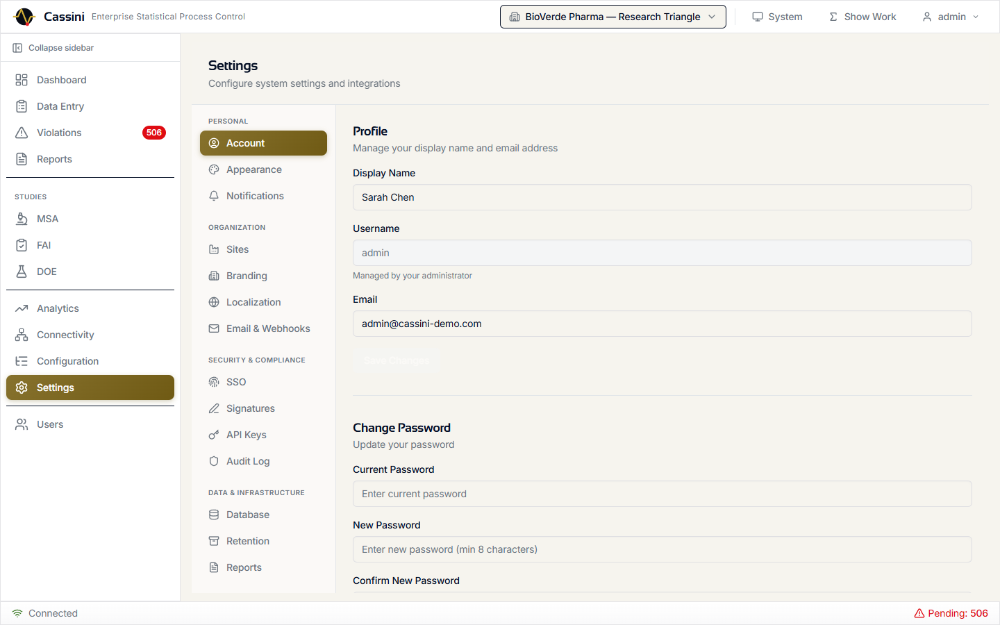
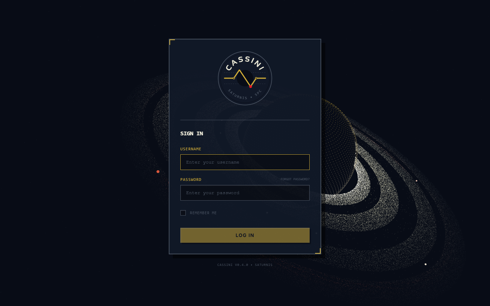

```
  ██████╗  █████╗  ██████╗ ██████╗ ██╗███╗   ██╗██╗
 ██╔════╝ ██╔══██╗██╔════╝██╔════╝ ██║████╗  ██║██║
 ██║      ███████║╚█████╗ ╚█████╗  ██║██╔██╗ ██║██║
 ██║      ██╔══██║ ╚═══██╗ ╚═══██╗ ██║██║╚██╗██║██║
 ╚██████╗ ██║  ██║██████╔╝██████╔╝ ██║██║ ╚████║██║
  ╚═════╝ ╚═╝  ╚═╝╚═════╝ ╚═════╝  ╚═╝╚═╝  ╚═══╝╚═╝

 ╌╌╌╌╌╌╌╌╌╌╌╌╌╌╌╌╌╌╌╌╌╌╌╌╌╌╌╌╌╌╌╌╌╌╌╌╌╌╌╌╌╌╌╌╌╌╌╌╌╌ UCL
       ●            ●                          ●
 ● ╌╌╌╌╌╌╌ ● ╌╌╌╌╌╌╌╌ ● ╌╌╌╌╌ ● ╌╌╌╌╌╌╌╌ ● ╌ ●    CL
                 ●               ●
 ╌╌╌╌╌╌╌╌╌╌╌╌╌╌╌╌╌╌╌╌╌╌╌╌╌╌╌╌╌╌╌╌╌╌╌╌╌╌╌╌╌╌╌╌╌╌╌╌╌╌ LCL

 Statistical Process Control Platform
 by Saturnis LLC
```


# Cassini

An open-source enterprise Statistical Process Control platform by Saturnis LLC. Monitor process stability, detect out-of-control conditions, run capability studies, and manage quality data across one or many manufacturing sites -- from a single control chart to a regulated multi-plant deployment.

*"In-control, like the Cassini Division"*


---

## Quick Start

**Prerequisites:** Python 3.11+, Node.js 18+, Git

```bash
# Clone the repository
git clone https://github.com/djbrandl/Cassini.git
cd Cassini

# Start the backend
cd backend
python -m venv .venv && .venv/Scripts/activate   # Windows
# source .venv/bin/activate                       # macOS/Linux
pip install -e .
alembic upgrade head
uvicorn cassini.main:app --reload --host 0.0.0.0 --port 8000

# In a new terminal, start the frontend
cd frontend
npm install && npm run dev
```

Open **http://localhost:5173** and log in with `admin` / `password`.

### Docker

```bash
docker compose up -d
```

The compose file starts the app with PostgreSQL. See [Getting Started](docs/getting-started.md) for configuration details.

---

## Features at a Glance

| Category | Capabilities |
|----------|-------------|
| **Control Charts** | X-bar, X-bar & R, X-bar & S, I-MR, CUSUM, EWMA, p, np, c, u |
| **Run Rules** | All 8 Nelson / Western Electric rules, custom presets (AIAG, WECO, Wheeler) |
| **Capability** | Cp, Cpk, Pp, Ppk, Cpm with non-normal distribution fitting |
| **Studies** | Gage R&R / MSA, First Article Inspection (AS9102), Design of Experiments |
| **Connectivity** | MQTT / Sparkplug B, OPC-UA, RS-232/USB gages, ERP/LIMS adapters |
| **Compliance** | Electronic signatures (21 CFR Part 11), audit trail, data retention |
| **Analytics** | AI/ML anomaly detection, correlation, multivariate SPC, forecasting |
| **Infrastructure** | Multi-database, multi-plant, SSO/OIDC, RBAC, Docker, PWA |

---

## Control Charts & SPC Engine

Real-time control charts rendered on HTML5 canvas with zone shading, gradient lines, cross-chart hover sync, and resizable panels. WebSocket push means charts update the moment new data arrives.


- **Variable charts**: X-bar, X-bar & R, X-bar & S, I-MR, CUSUM, EWMA
- **Attribute charts**: p, np, c, u with Laney p'/u' overdispersion correction
- **Nelson Rules**: All 8 rules individually configurable with parameterized thresholds and four built-in presets (Nelson, AIAG, WECO, Wheeler)
- **Short-run charts**: Deviation mode and standardized Z-score mode for low-volume, high-mix production
- **Annotations**: Point and period annotations with categories and descriptions
- **Show Your Work**: Click any statistical value to see the formula (KaTeX-rendered), step-by-step computation, raw inputs, and AIAG citation

---

## Capability Analysis

Full process capability with Cp, Cpk, Pp, Ppk, and Cpm. Non-normal distributions are handled automatically via Shapiro-Wilk normality testing, Box-Cox transformation, and 6-distribution auto-fitting (normal, lognormal, Weibull, gamma, exponential, beta).

- Color-coded capability metrics with trend charting
- Distribution analysis modal with histogram, Q-Q plot, and comparison table
- Snapshot history for tracking capability over time

---

## Violations & Nelson Rules


Violations are detected in real time as data flows in. Each violation references the specific Nelson rule triggered, the sample that caused it, and the characteristic's current state. Bulk acknowledgment, filtering by severity/status/rule, and one-click navigation to the offending chart point.

---

## Industrial Connectivity


A unified Connectivity Hub manages all data sources with a visual data flow pipeline showing source health, ingestion metrics, and SPC engine status at a glance.

- **MQTT / Sparkplug B**: Multi-broker support, topic tree browsing, tag-to-characteristic mapping, live value preview
- **OPC-UA**: Multi-server management, node tree browsing, subscription-to-SPC engine pipeline with priority triggers
- **RS-232/USB Gages**: Python bridge agent (`cassini-bridge` pip package) translates serial gage protocols (Mitutoyo Digimatic, generic regex) to MQTT on shop floor PCs
- **ERP/LIMS**: SAP OData, Oracle REST, generic LIMS, and webhook adapters with cron-based sync scheduling and Fernet-encrypted credentials
- **MQTT Outbound**: Publish SPC events (violations, statistics, Nelson rule triggers) to configurable topics with rate control

---

## Quality Studies

### Measurement System Analysis (Gage R&R)


Crossed ANOVA, range method, nested ANOVA, and attribute agreement analysis (Cohen's and Fleiss' Kappa). Uses AIAG MSA 4th Edition d2* tables for range-method calculations. Full wizard from study setup through results interpretation.

### First Article Inspection


AS9102 Rev C compliant inspection reports with Forms 1, 2, and 3. Draft-to-submitted-to-approved workflow with separation of duties enforcement (approver cannot be the submitter). Print-optimized view for physical records.

### Design of Experiments


Full factorial, fractional factorial, Plackett-Burman, and central composite designs. Interactive design matrix, run table for data collection, ANOVA results table, main effects plot, and interaction plots.

---

## Advanced Analytics


A four-tab analytics hub for deeper analysis beyond standard SPC:

- **Correlation**: Multi-variate correlation heatmap across characteristics
- **Multivariate SPC**: PCA biplot, Hotelling T-squared chart, decomposition table
- **Predictions**: Time series forecasting with ARIMA/Prophet overlay on control charts
- **AI Insights**: LLM-generated analysis with guardrails for responsible interpretation

---

## AI/ML Anomaly Detection

Three machine learning detectors run per-characteristic with configurable sensitivity:

- **PELT Changepoint**: Detects abrupt shifts in process mean or variance
- **Kolmogorov-Smirnov**: Identifies distribution drift over sliding windows
- **Isolation Forest**: Spots multivariate outliers invisible to univariate rules

Detected anomalies overlay directly on control charts as marked points and regions, and integrate with the notification system for email, webhook, or push alerts.

---

## Enterprise Compliance

### Electronic Signatures (21 CFR Part 11)

Configurable multi-step signature workflows with password re-authentication, SHA-256 tamper detection, plant-scoped signature meanings, and FDA-compliant password policies. Every signature is immutable and verifiable through the audit trail.

### Audit Trail

Fire-and-forget middleware captures every POST, PUT, PATCH, and DELETE. Event bus integration logs background operations (notifications, anomaly detection). Searchable viewer with filters and CSV export.

### Data Retention

Configurable retention policies with an inheritance chain (global > plant > area > line > station). Purge engine runs on schedule with full history tracking for regulatory compliance.

---

## Configuration & Administration

### Equipment Hierarchy


ISA-95 / UNS-compatible equipment hierarchy (enterprise > site > area > line > station) with characteristics as leaves. Create, move, and organize your plant structure visually.

### Settings



Comprehensive settings organized into five sections:

| Section | Tabs |
|---------|------|
| **Personal** | Account, Appearance (light/dark, retro/glass themes), Notifications |
| **Organization** | Sites, Branding, Localization, Email & Webhooks |
| **Security & Compliance** | SSO/OIDC, Electronic Signatures, API Keys, Audit Log |
| **Data & Infrastructure** | Database, Data Retention, Scheduled Reports |
| **Integrations** | AI/ML Anomaly Detection |

### User Management


Plant-scoped role-based access control across four tiers:

| Role | Access |
|------|--------|
| **Operator** | Dashboard, data entry, violations |
| **Supervisor** | + Reports |
| **Engineer** | + MSA, FAI, DOE, analytics, connectivity, configuration, settings |
| **Admin** | + User management, all plants |

### Multi-Database

SQLite (default, zero-config), PostgreSQL, MySQL, and MSSQL. Encrypted credential storage (Fernet), one-click switching, and a database administration panel for backup, vacuum, and migration status.

### SSO/OIDC

DB-backed state store, claim mapping, plant-scoped role mapping, account linking, and RP-initiated logout. Multiple identity providers supported simultaneously.

---

## Reports & Display Modes

- **Reports**: PDF, Excel, and PNG export with built-in templates for SPC summaries, capability analysis, MSA results, and FAI
- **Scheduled Reports**: Cron-based report scheduling with email delivery
- **Kiosk Mode**: Full-screen auto-rotating characteristic display for factory floor monitors with configurable intervals
- **Wall Dashboard**: Multi-chart grid layouts (2x2, 3x3, 4x4, 2x3, 3x2) with saved presets for control room displays

---

## Architecture

> **Interactive diagrams**: Open [docs/cassini-architecture.html](docs/cassini-architecture.html) for a detailed visual architecture overview, or [docs/cassini-features.html](docs/cassini-features.html) for the full feature matrix with status indicators.

```
┌────────────────────────────────────────────────────────────────┐
│                        Data Sources                            │
│  MQTT/SparkplugB  OPC-UA  RS-232 Gages  CSV/Excel  ERP/LIMS  │
└──────────────────────────┬─────────────────────────────────────┘
                           │
┌──────────────────────────▼─────────────────────────────────────┐
│                    FastAPI Backend                              │
│  JWT Auth · RBAC · Audit Middleware · Rate Limiting             │
│                                                                │
│  ┌─────────────┐ ┌──────────────┐ ┌──────────────┐            │
│  │ SPC Engine   │ │ Capability   │ │ MSA Engine   │            │
│  │ 8 Nelson     │ │ Non-normal   │ │ Gage R&R     │            │
│  │ rules        │ │ distributions│ │ ANOVA        │            │
│  └─────────────┘ └──────────────┘ └──────────────┘            │
│  ┌─────────────┐ ┌──────────────┐ ┌──────────────┐            │
│  │ Anomaly Det.│ │ Signature    │ │ Notification  │            │
│  │ PELT/KS/IF  │ │ Engine       │ │ Dispatcher    │            │
│  └─────────────┘ └──────────────┘ └──────────────┘            │
│                                                                │
│  Event Bus ──── WebSocket · Notifications · Audit · MQTT Out   │
│                                                                │
│  SQLAlchemy Async ── SQLite / PostgreSQL / MySQL / MSSQL       │
└────────────────────────────────────────────────────────────────┘
                           │
┌──────────────────────────▼─────────────────────────────────────┐
│                    React Frontend                               │
│  TanStack Query · Zustand · ECharts 6 · Zod · Tailwind CSS    │
│                                                                │
│  19 pages · 145+ components · 120+ React Query hooks           │
│  PWA with push notifications and offline queue                 │
└────────────────────────────────────────────────────────────────┘
```

### Tech Stack

| Layer | Technology |
|-------|-----------|
| **Backend** | Python 3.11+, FastAPI, SQLAlchemy async, Alembic, Pydantic |
| **Frontend** | React 19, TypeScript 5.9, Vite 7, TanStack Query v5, Zustand v5 |
| **Charts** | ECharts 6 (tree-shaken, canvas renderer) |
| **Validation** | Zod v4 (frontend), Pydantic v2 (backend) |
| **Styling** | Tailwind CSS v4 with retro and glass visual themes |
| **Bridge** | Python, pyserial, paho-mqtt (pip-installable `cassini-bridge`) |
| **Database** | SQLite, PostgreSQL, MySQL, MSSQL via dialect abstraction |
| **Real-time** | WebSocket (FastAPI native), MQTT (paho-mqtt / asyncio-mqtt) |
| **ML** | ruptures (changepoint), scikit-learn (Isolation Forest), scipy |

### Monorepo Structure

```
cassini/
├── backend/           FastAPI application
│   ├── src/cassini/
│   │   ├── api/       Routers, schemas, dependencies
│   │   ├── core/      SPC engine, capability, MSA, anomaly, signatures
│   │   └── db/        Models, repositories, migrations
│   └── alembic/       38 database migrations
├── frontend/          React SPA
│   └── src/
│       ├── api/       API client, hooks, namespaces (26 API modules)
│       ├── components/ 145+ components organized by domain
│       ├── pages/     19 page components
│       ├── stores/    Zustand state stores
│       └── hooks/     Custom React hooks
├── bridge/            Serial gage → MQTT translator
│   └── src/cassini_bridge/
│       ├── parsers/   Mitutoyo Digimatic, generic regex
│       ├── serial_reader.py
│       └── mqtt_publisher.py
└── docs/              Documentation and images
```

---

## Data Entry


Multiple paths to get data into the system:

- **Manual entry**: Form-based sample submission with validation
- **CSV/Excel import**: 4-step wizard (upload, validate, map columns, confirm)
- **MQTT / OPC-UA**: Automatic via connectivity mappings
- **RS-232/USB gages**: Via the bridge agent on shop floor PCs
- **ERP/LIMS sync**: Scheduled inbound sync from enterprise systems
- **API**: RESTful endpoints for programmatic integration

---

## Login



Animated Three.js Saturn background with SSO/OIDC support alongside local authentication. Remember-me option with secure refresh token rotation.

---

## Development

```bash
# Type checking (frontend)
cd frontend && npx tsc --noEmit

# Full build check
cd frontend && npx tsc -b

# Production build
cd frontend && npm run build

# Run backend with auto-reload
cd backend && uvicorn cassini.main:app --reload

# New database migration
cd backend && alembic revision --autogenerate -m "description"

# Install bridge for development
cd bridge && pip install -e .
```

### Key Conventions

- **TypeScript**: Strict mode, `noUnusedLocals`, `noUnusedParameters`
- **Formatting**: Prettier -- no semicolons, single quotes, trailing commas, 100 char width
- **Imports**: `@/` alias for `src/` (never relative cross-directory)
- **Components**: Function components, named exports, one per file
- **API paths**: Never include `/api/v1/` prefix in `fetchApi` calls (prepended automatically)

---

## License

Open source by [Saturnis LLC](https://saturnis.io).

---

<sub>Built with FastAPI, React, ECharts, and a lot of statistical rigor.</sub>
