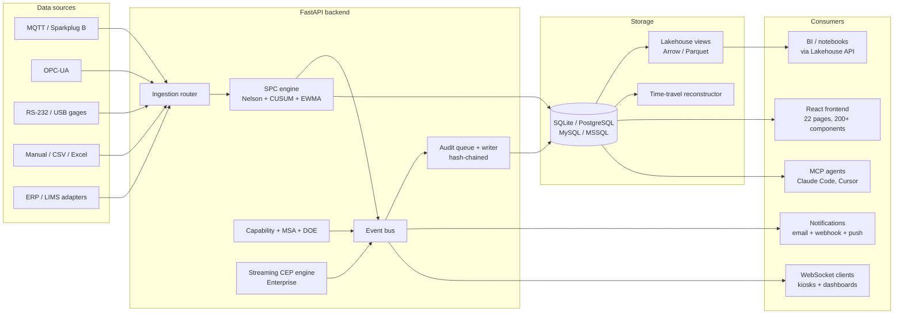

```
  ██████╗  █████╗  ██████╗ ██████╗ ██╗███╗   ██╗██╗
 ██╔════╝ ██╔══██╗██╔════╝██╔════╝ ██║████╗  ██║██║
 ██║      ███████║╚█████╗ ╚█████╗  ██║██╔██╗ ██║██║
 ██║      ██╔══██║ ╚═══██╗ ╚═══██╗ ██║██║╚██╗██║██║
 ╚██████╗ ██║  ██║██████╔╝██████╔╝ ██║██║ ╚████║██║
  ╚═════╝ ╚═╝  ╚═╝╚═════╝ ╚═════╝  ╚═╝╚═╝  ╚═══╝╚═╝

 Statistical Process Control Platform
 by Saturnis LLC
```


# Cassini

**Ambient. Agentic. Audited. Open-source statistical process control for manufacturing.**

**Three editions**: Open (free, AGPL-3.0) | [Pro](https://saturnis.io/pricing) ($1,200/plant/yr) | [Enterprise](https://saturnis.io/pricing) ($5,000/plant/yr)


Cassini is an open-source SPC platform that lives next to the production line. Charts update in real time as samples flow in. Every value on every chart links to the formula that produced it. Every change is recorded in a hash-chained audit log. AI agents talk to it natively over MCP. Analytics workloads pull through a versioned Arrow / Parquet data product. Multi-plant, multi-database, multi-tier — but the open core ships a complete SPC platform with no license key required.

*"In-control, like the Cassini Division."*

### What sets Cassini apart

- **Ambient.** Charts, dashboards, and kiosks update by WebSocket push. Operators don't refresh — the floor reflects reality.
- **Agentic.** A built-in MCP server exposes a curated agent surface so Claude Code, Cursor, and Claude Desktop can query plants, capability, and violations directly. Optional `--allow-writes` for unattended automation.
- **Audited.** Every mutation is hash-chained. Every numeric value on every chart is reproducible via Show Your Work — formula, inputs, intermediate steps, AIAG citation. Time-travel replay reconstructs any chart's state at any historical timestamp from the audit log alone.
- **Open core.** AGPL-3.0 community edition is a complete SPC platform — Nelson rules, capability, MSA, DOE, Show Your Work, the works. Pro and Enterprise unlock multi-plant, compliance, and advanced analytics.

> **Open-core model**: The Open Edition is free under AGPL-3.0 and includes a complete SPC platform. [Pro and Enterprise licenses](https://saturnis.io/pricing) unlock multi-plant, compliance, and advanced analytics features for organizations that need them.

---

## Table of Contents

- [Getting Started](docs/getting-started.md) -- install on Windows, macOS, or Linux
- [Configuration](docs/configuration.md) -- environment variables, TOML, database options
- [CLI Reference](docs/cli.md) -- `cassini serve`, `cassini check`, etc.
- [CLI as HTTP Client](#cli-as-http-client) -- `cassini plants list`, `cassini samples submit`
- [MCP Server (AI Agent Integration)](#mcp-server-ai-agent-integration) -- Claude Code, Cursor, Claude Desktop
- [Production Deployment](docs/deployment.md) -- reverse proxy, services, backups, upgrading
- [Open Edition](#open-edition-free-agpl-30) -- what's included for free
- [Pro Features](#pro-features) -- what the Pro license unlocks
- [Enterprise Features](#enterprise-features) -- what the Enterprise license unlocks
- [Cluster-Ready Architecture (Enterprise)](#cluster-ready-architecture-enterprise) -- multi-node deployment
- [Feature Comparison](#feature-comparison) -- three-tier side-by-side table
- [Architecture](#architecture) -- tech stack and project structure
- [Testing Harness](docs/testing-harness.md) -- Docker-orchestrated multi-DB test stack
- [AGENTS.md](AGENTS.md) -- API surface for AI agents and integrators
- [License](#license--commercial-use) -- AGPL-3.0 and commercial options

---

## Getting Started

Cassini runs on **Windows**, **macOS**, and **Linux**. Pick your path:

| Path | Platform | Time | Guide |
|------|----------|------|-------|
| **Windows Installer** | Windows | 2 min | [Download and run](docs/getting-started.md#windows) |
| **Docker (single-stack)** | Any | 5 min | [Two commands](docs/getting-started.md#docker) |
| **Docker (full test stack)** | Any | 5 min | [`docker-compose.full.yml`](docs/testing-harness.md) — Postgres + MySQL + MSSQL + Valkey + MQTT + OPC-UA simulator + backend + frontend |
| **From Source** | Any | 10 min | [Full dev setup](docs/getting-started.md#from-source) |

### Quick Docker single-stack

```bash
docker compose up -d
# Backend: http://localhost:8000
# Frontend: served by the backend
```

### Quick from-source

```bash
# Backend
cd backend
python -m venv .venv && source .venv/bin/activate   # Windows: .venv\Scripts\activate
pip install -e ".[dev]"
alembic upgrade head
uvicorn cassini.main:app --reload                    # http://localhost:8000

# Frontend (in a new terminal)
cd frontend
npm install
npm run dev                                          # http://localhost:5173
```

Default login: `admin` / `cassini` (you'll be prompted to change the password).

### Multi-database support

Cassini speaks all four mainstream SQL dialects. Pick one in `cassini.toml` or via env:

| Dialect | Driver | Connection string example |
|---------|--------|---------------------------|
| **SQLite** (default, dev) | `aiosqlite` | `sqlite+aiosqlite:///./data/cassini.db` |
| **PostgreSQL** (recommended for production) | `asyncpg` | `postgresql+asyncpg://user:pw@host/cassini` |
| **MySQL** | `aiomysql` / `asyncmy` | `mysql+aiomysql://user:pw@host/cassini` |
| **MSSQL** | `aioodbc` | `mssql+aioodbc://...?driver=ODBC+Driver+18+for+SQL+Server` |

The same Alembic migration set runs against every dialect. CI runs the full integration suite against PostgreSQL and MySQL on every pull request, plus MSSQL nightly. See [docs/testing-harness.md](docs/testing-harness.md) for the multi-DB CI matrix.

> **Next steps:** [Configuration](docs/configuration.md) · [CLI Reference](docs/cli.md) · [Production Deployment](docs/deployment.md)

---

## CLI as HTTP Client

The `cassini` CLI is a full HTTP client that connects to a running Cassini server. It wraps the operations-first subset of the API and produces structured output suitable for both human operators and AI agents.

### Connection & Authentication

```bash
# Login (creates a scoped API key, stores in ~/.cassini/credentials.json)
cassini login --server https://factory-floor:8000

# Or use environment variables
export CASSINI_SERVER_URL=https://factory-floor:8000
export CASSINI_API_KEY=cassini_abc123...
```

### Resource Commands

```bash
# Plants & hierarchy
cassini plants list
cassini plants get 1

# Characteristics & SPC
cassini characteristics list --plant-id 1
cassini capability get 5
cassini violations list --char-id 5 --active

# Samples & data
cassini samples list --char-id 5 --limit 100
cassini samples submit --char-id 5 --values 1.2,1.3,1.4

# Admin
cassini users list
cassini audit search --after 2026-03-01
cassini license status
cassini api-keys list

# Operations
cassini health
cassini status
cassini cluster status    # Enterprise only
```

### Output Modes

```bash
cassini plants list                    # Human-readable table (TTY default)
cassini plants list --json             # JSON (pipe default)
cassini plants list --csv              # CSV export
cassini plants list --json | jq .      # Pipe-friendly
```

---

## MCP Server (AI Agent Integration)

Cassini includes a built-in MCP (Model Context Protocol) server, allowing Claude Code, Claude Desktop, Cursor, and other MCP clients to interact with Cassini natively.

```bash
cassini mcp-server                                     # stdio transport (default)
cassini mcp-server --transport sse --port 3001         # SSE for remote clients
cassini mcp-server --allow-writes                      # Enable write tools
```

**Read-only by default.** Write tools require the `--allow-writes` flag.

### Claude Code Configuration

```json
// ~/.claude/mcp_servers.json
{
  "cassini": {
    "command": "cassini",
    "args": ["mcp-server", "--allow-writes"],
    "env": {
      "CASSINI_SERVER_URL": "https://factory-floor:8000",
      "CASSINI_API_KEY": "cassini_abc123..."
    }
  }
}
```

### Available Tools

**Read tools** (always available): `cassini_plants_list`, `cassini_characteristics_list`, `cassini_capability_get`, `cassini_violations_list`, `cassini_health`, `cassini_samples_query`, `cassini_audit_search`, `cassini_license_status`

**Write tools** (require `--allow-writes`): `cassini_samples_submit`, `cassini_plants_create`, `cassini_users_create`, `cassini_characteristics_create`

**Resources**: `cassini://plants`, `cassini://health`

---

## Open Edition (Free, AGPL-3.0)

Everything you need for production SPC -- no license key required.

### Control Charts & SPC Engine

Real-time control charts rendered on HTML5 canvas with zone shading, gradient lines, cross-chart hover sync, and resizable panels. WebSocket push means charts update the moment new data arrives.

- **Variable charts**: X-bar, X-bar & R, X-bar & S, I-MR, CUSUM, EWMA
- **Attribute charts**: p, np, c, u with Laney p'/u' overdispersion correction
- **Nelson Rules**: All 8 Nelson / WECO / AIAG rules individually configurable per characteristic with parameterized thresholds
- **Short-run charts**: Deviation mode and standardized Z-score mode for low-volume, high-mix production
- **Annotations**: Point and period annotations with categories and descriptions
- **Show Your Work**: Click any statistical value to see the formula (KaTeX-rendered), step-by-step computation, raw inputs, and AIAG citation

### Capability Analysis

Full process capability with Cp, Cpk, Pp, Ppk, and Cpm. Color-coded capability metrics with trend charting and full computation traceability via Show Your Work.

- Snapshot history for tracking capability over time
- Subgroup and individual measurement modes

### Violations & Nelson Rules

Violations are detected in real time as data flows in. Each violation references the specific Nelson rule triggered, the sample that caused it, and the characteristic's current state. Bulk acknowledgment, filtering by severity/status/rule, and one-click navigation to the offending chart point.


### Data Entry & Ingestion

Multiple paths to get data into the system, from manual single-sample entry to high-throughput batch pipelines processing up to 200K samples/min.


#### Manual & Interactive

- **Manual entry**: Form-based sample submission with measurement validation, subgroup size enforcement, and optional batch/operator metadata
- **CSV/Excel import**: 4-step wizard (upload → validate → map columns → confirm) with preview and error reporting

#### API Ingestion

The REST API provides three ingestion endpoints optimized for different use cases:

| Endpoint | Use Case | Throughput |
|----------|----------|------------|
| `POST /api/v1/data-entry/submit` | Single sample with full SPC + supplementary analysis (CUSUM/EWMA). Supports API key auth for machine integration. | Real-time |
| `POST /api/v1/samples/` | Single sample submission (user auth) | Real-time |
| `POST /api/v1/samples/batch` | Bulk import up to 10,000 samples per request | Up to 200K samples/min |

#### Batch Import (`POST /api/v1/samples/batch`)

The batch endpoint is the primary path for high-volume data ingestion. It accepts up to 10,000 samples per request, all targeting a single characteristic, with three processing modes:

| Mode | Flag | Description | Typical Use |
|------|------|-------------|-------------|
| **Skip rules** | `skip_rule_evaluation: true` | Direct database insert, no SPC evaluation | Historical data migration, backfill |
| **Sync SPC** | (default) | Each sample evaluated through full SPC pipeline (Nelson rules, zone classification) | Standard batch import with immediate violation detection |
| **Async SPC** | `async_spc: true` | Samples inserted immediately, SPC evaluation deferred to background workers | High-throughput production ingestion (**Enterprise**) |

**Request format:**
```json
{
  "characteristic_id": 42,
  "skip_rule_evaluation": false,
  "async_spc": false,
  "samples": [
    {"measurements": [10.1, 10.2, 10.0]},
    {"measurements": [9.9, 10.1, 10.0], "batch_number": "B-2024-001"},
    {"measurements": [10.3, 10.1, 10.2], "timestamp": "2024-01-15T08:30:00Z"}
  ]
}
```

**Response:**
```json
{
  "total": 3,
  "imported": 3,
  "failed": 0,
  "errors": [],
  "status": "complete"
}
```

Individual sample failures do not abort the batch — successful samples commit while errors are accumulated in the response.

#### Connectivity (MQTT / OPC-UA)

- **MQTT / Sparkplug B**: Topic-to-characteristic mapping with live value preview. Open Edition supports one broker; Pro/Enterprise unlock unlimited brokers.
- **OPC-UA**: Server management with node tree browsing and subscription-to-SPC pipeline (**Pro+**)
- **RS-232/USB Gages**: Bridge agent translates serial gage protocols to MQTT (**Enterprise**)

### MQTT Connectivity

Native MQTT and Sparkplug B support with topic tree browsing, tag-to-characteristic mapping, and live value preview. Open Edition includes one broker connection; Pro and Enterprise unlock unlimited brokers.


### Equipment Hierarchy

ISA-95 / UNS-compatible equipment hierarchy (Enterprise > Site > Area > Line > Cell > Equipment) with characteristics as leaves. Create, move, and organize your plant structure visually.

### User Management & RBAC

Plant-scoped role-based access control across four tiers:

| Role | Access |
|------|--------|
| **Operator** | Dashboard, data entry, violations |
| **Supervisor** | + Reports |
| **Engineer** | + Configuration, settings, connectivity |
| **Admin** | + User management, all plants |

### Database

SQLite (default, zero-config) included with Open Edition. PostgreSQL, MySQL, and MSSQL available with Pro and Enterprise licenses. Database administration panel for backup, vacuum, and migration status.

### Audit Trail (hash-chained)

Decoupled middleware enqueues every data modification — user, timestamp, action, target — to an in-memory ring buffer; a writer task batch-flushes to the database without blocking the request hot path. Each entry references the previous entry's SHA-256, producing a tamper-evident hash chain that `GET /api/v1/audit/verify` walks end-to-end. The same audit log feeds both the searchable viewer (filters, CSV export) and the time-travel replay engine, so any historical chart state is reconstructable from immutable history alone.

Reads of protected history (replay, lakehouse exports) are also logged — viewing immutable history is itself part of the record (21 CFR Part 11 §11.10(e)).

### Reports & Display Modes

- **Reports**: PDF, Excel, and PNG export with built-in templates
- **Kiosk Mode**: Full-screen auto-rotating characteristic display for factory floor monitors
- **Wall Dashboard**: Multi-chart grid layouts (2x2, 3x3, 4x4) with saved presets for control room displays


### Infrastructure

- **Windows Installer**: Download-and-run `.exe` with Windows Service, system tray, and auto-start
- **Docker**: Production-ready multi-stage Dockerfile + docker-compose with PostgreSQL
- **CLI**: `cassini serve`, `cassini check`, `cassini migrate`, and more — from any terminal
- **CLI as HTTP client**: `cassini plants list`, `cassini samples submit` — structured output for operators and scripts
- **MCP server**: `cassini mcp-server` — AI agent integration for Claude Code, Cursor, Claude Desktop
- **REST API**: 300+ endpoints for full programmatic access
- **Batch import**: Up to 10,000 samples per request, three processing modes (skip rules, sync SPC, async SPC)
- **Throughput**: Up to 200K samples/min bulk ingestion (benchmarked on PostgreSQL, 4 uvicorn workers)
- **WebSocket**: Real-time push for chart updates and notifications
- **PWA**: Progressive web app with offline queue support

---

## Pro Features

> **These features require a [Pro license](https://saturnis.io/pricing) ($1,200/plant/year).** Open Edition users can evaluate Pro and Enterprise features locally by setting `CASSINI_DEV_TIER=enterprise`. [Learn more →](https://saturnis.io/pricing)

### Time-travel SPC replay

Audit-grade reconstruction of any control chart's state at any historical moment. Pick a date and time on the chart UI and the limits, rule configuration, signatures, and contributing sample list re-render exactly as they were at that timestamp — rebuilt on demand from the hash-chained audit log, never persisted as a new artifact. Designed against 21 CFR Part 11 §11.10(b).

```bash
curl -H "Authorization: Bearer $TOKEN" \
  "https://cassini.example.com/api/v1/replay/characteristic/42?at=2026-03-14T14:00:00Z"
```

Full reference: [docs/features/time-travel-replay.md](docs/features/time-travel-replay.md)

### Cassini Lakehouse

A read-only data product API for analytics workloads. Curated tables (`samples`, `violations`, `characteristics`, `capability_snapshots`, `audit_log`) exported as JSON, CSV, Parquet, or Arrow IPC — plant-scoped, audited, rate-limited, schema-versioned.

```python
import io, pyarrow.ipc as ipc, pandas as pd, requests

resp = requests.get(
    "https://cassini.example.com/api/v1/lakehouse/samples",
    params={"format": "arrow", "from": "2026-01-01", "to": "2026-04-01"},
    headers={"Authorization": f"Bearer {token}"},
)
df = ipc.open_stream(io.BytesIO(resp.content)).read_all().to_pandas()
```

Full reference: [docs/features/lakehouse.md](docs/features/lakehouse.md)

### Multi-Plant & Multi-Database

- **Multi-plant**: Manage multiple sites from a single deployment
- **Multi-database**: PostgreSQL, MySQL, and MSSQL with encrypted credential storage (Fernet) and one-click switching

### Industrial Connectivity Hub

A unified Connectivity Hub manages all data sources with a visual data flow pipeline showing source health, ingestion metrics, and SPC engine status at a glance.

- **Unlimited MQTT Brokers**: Multi-broker management for complex industrial networks
- **OPC-UA**: Multi-server management, node tree browsing, subscription-to-SPC engine pipeline with priority triggers

### Non-Normal Distribution Fitting

Automatic non-normal distribution handling via Shapiro-Wilk normality testing, Box-Cox transformation, and 6-distribution auto-fitting (normal, lognormal, Weibull, gamma, exponential, beta). Includes distribution analysis modal with histogram, Q-Q plot, and comparison table.

### Run Rule Preset Management

Standardize rule configuration across your plant with four built-in presets (Nelson, AIAG, WECO, Wheeler) and the ability to create custom presets. Apply and manage rule configurations in bulk.

### Quality Studies

**Measurement System Analysis (Gage R&R)** -- Crossed ANOVA, range method, nested ANOVA, and attribute agreement analysis (Cohen's and Fleiss' Kappa). Uses AIAG MSA 4th Edition d2* tables. Full wizard from study setup through results interpretation.

**Design of Experiments** -- Full factorial, fractional factorial, Plackett-Burman, and central composite designs. Interactive design matrix, run table, ANOVA results, main effects plot, and interaction plots.

### Analytics & Reporting


- **Ishikawa Diagrams**: Interactive fishbone (cause-and-effect) diagrams for root cause analysis
- **Correlation**: Multi-variate correlation heatmap across characteristics
- **Scheduled Reports**: Cron-based report scheduling with email delivery
- **Scoped API Keys**: Machine-to-machine authentication with read-only/read-write scope and plant restrictions
- **Push Notifications**: Email, HMAC-signed webhooks, and PWA push notifications

---

## Enterprise Features

> **These features require an [Enterprise license](https://saturnis.io/pricing) ($5,000/plant/year).** Includes everything in Pro, plus compliance, advanced analytics, and dedicated support. [Learn more →](https://saturnis.io/pricing)

### Streaming CEP rules

A multi-stream complex-event-processing engine that fires when a pattern across two or more characteristics holds inside a sliding time window. Rules are authored in YAML, edited live in a Monaco editor with inline validation, and hot-reloaded into the running engine without restarting the backend.

```yaml
name: thermal-runaway
description: Coolant temperature and cut diameter both trending up
window: 2m
conditions:
  - characteristic: Plant 1 > Line A > Lathe 3 > Coolant Temp
    rule: increasing
    count: 6
  - characteristic: Plant 1 > Line A > Lathe 3 > Cut Diameter
    rule: increasing
    count: 6
action:
  violation: THERMAL_RUNAWAY_SUSPECTED
  severity: critical
  message: Pause the line and inspect coolant flow / chiller before the next cut.
```

Sample rules in [`docs/cep-examples/`](docs/cep-examples/) and a full reference at [docs/features/streaming-cep.md](docs/features/streaming-cep.md).

### RS-232/USB Gage Bridge

Python bridge agent (`cassini-bridge` pip package) translates serial gage protocols (Mitutoyo Digimatic, generic regex) to MQTT on shop floor PCs.

### Enterprise Compliance


**Electronic Signatures (21 CFR Part 11)** -- Configurable multi-step signature workflows with password re-authentication, SHA-256 tamper detection, plant-scoped signature meanings, and FDA-compliant password policies.

**First Article Inspection** -- AS9102 Rev C compliant inspection reports with Forms 1, 2, and 3. Draft-to-submitted-to-approved workflow with separation of duties enforcement. Print-optimized view for physical records.

**Data Retention** -- Configurable retention policies with inheritance chain (global > plant > area > line > station). Purge engine with full history tracking for regulatory compliance.

### Advanced Analytics

- **Multivariate SPC**: PCA biplot, Hotelling T-squared chart, MEWMA, decomposition table
- **Anomaly Detection (ML)**: PELT changepoint, Kolmogorov-Smirnov distribution drift, Isolation Forest multivariate outliers — overlaid on control charts
- **Predictive Analytics**: Time series forecasting with ARIMA/Prophet overlay on control charts
- **AI-Powered Analysis**: LLM-generated analysis with guardrails for responsible interpretation

### High-Throughput Async Ingestion

Production environments generating thousands of samples per minute need ingestion that doesn't block on SPC computation. The async SPC pipeline decouples data persistence from rule evaluation:

1. **Ingest**: Samples are validated and committed to the database immediately with `spc_status=pending_spc`
2. **Enqueue**: Sample IDs are published to the background SPC processor
3. **Evaluate**: Background workers run Nelson rules, zone classification, and violation detection asynchronously
4. **Notify**: Violations trigger real-time WebSocket updates and configured notifications

This achieves up to **175K samples/min with full SPC evaluation** — compared to ~26K/min with synchronous processing. The batch endpoint (`POST /api/v1/samples/batch`) enables async mode with a single flag:

```json
{
  "characteristic_id": 42,
  "async_spc": true,
  "samples": [...]
}
```

The response returns immediately with `"status": "processing"` and a list of `sample_ids` for tracking. SPC results appear on charts and dashboards as background processing completes.

| Metric | Sync SPC | Async SPC |
|--------|----------|-----------|
| Throughput (batch, 4 workers) | ~26K samples/min | ~175K samples/min |
| Latency per 1000-sample batch | ~7,400ms | ~2,400ms |
| Violation detection | Immediate in response | Background (seconds) |

### SSO/OIDC & ERP

- **SSO/OIDC**: Multiple identity providers, claim mapping, plant-scoped role mapping, account linking
- **ERP/LIMS**: SAP OData, Oracle REST, generic LIMS, and webhook adapters with cron-based sync scheduling
- **Dedicated Support**: SLA-backed support with guaranteed response times

---

## Cluster-Ready Architecture (Enterprise)

Enterprise deployments can run Cassini across multiple nodes with a Valkey (Redis-compatible) broker for distributed task queues, event streaming, and WebSocket fan-out.

### Single-Node Mode (Default)

No configuration needed. All subsystems run in-process with `asyncio.Queue` and in-memory pub/sub.

### Cluster Mode

```bash
# Set broker URL (enables cluster mode)
export CASSINI_BROKER_URL=valkey://valkey-host:6379

# API nodes (behind load balancer)
cassini serve --roles api

# SPC processing node
cassini serve --roles spc

# Background services node
cassini serve --roles reports,erp,purge

# All roles (small HA deployment)
cassini serve --roles all
```

### Available Roles

| Role | Description | Scaling |
|------|------------|---------|
| `api` | HTTP endpoints, auth, WebSocket | Horizontal (stateless) |
| `spc` | SPC queue consumer -- Nelson rules, CUSUM, EWMA | Horizontal (competing consumers) |
| `ingestion` | MQTT + OPC-UA connections | Per-broker singleton |
| `reports` | Scheduled PDF generation | Singleton (leader election) |
| `erp` | ERP sync connectors | Per-connector singleton |
| `purge` | Data retention enforcement | Singleton (leader election) |

### Health & Drain Mode

```bash
# Health check (includes broker, roles, queue depth)
curl http://localhost:8000/api/v1/health

# Readiness probe for load balancers (returns 503 when draining)
curl http://localhost:8000/api/v1/health/ready

# Cluster status (all nodes, roles, leaders)
cassini cluster status
```

---

## Environment Variables

| Variable | Description | Default |
|----------|-------------|---------|
| `CASSINI_BROKER_URL` | Valkey/Redis URL for cluster mode | (empty = local mode) |
| `CASSINI_ROLES` | Comma-separated node roles | `all` |
| `CASSINI_SERVER_URL` | Server URL for CLI/MCP client | `http://localhost:8000` |
| `CASSINI_API_KEY` | API key for CLI/MCP authentication | (none) |

> See [Configuration](docs/configuration.md) for the full list of environment variables and TOML settings.

---

## Feature Comparison

| Feature | Open | Pro | Enterprise |
|---------|:----:|:---:|:----------:|
| **SPC Engine** | | | |
| Control charts (X-bar, R, S, I-MR, CUSUM, EWMA, p/np/c/u) | Yes | Yes | Yes |
| Capability analysis (Cp, Cpk, Pp, Ppk, Cpm) | Yes | Yes | Yes |
| Nelson / WECO / AIAG run rules | Yes | Yes | Yes |
| Short-run SPC (deviation + Z-score) | Yes | Yes | Yes |
| Show Your Work (computation transparency) | Yes | Yes | Yes |
| Non-normal distribution fitting | -- | Yes | Yes |
| Run rule preset management | -- | Yes | Yes |
| **Data & Ingestion** | | | |
| Manual data entry | Yes | Yes | Yes |
| CSV / Excel import wizard | Yes | Yes | Yes |
| Batch import API (up to 10K samples/req) | Yes | Yes | Yes |
| Bulk import throughput | Up to 200K/min | Up to 200K/min | Up to 200K/min |
| Throughput with SPC rules | ~26K/min (sync) | ~26K/min (sync) | Up to 175K/min (async) |
| MQTT / Sparkplug B connectivity | 1 broker | Unlimited | Unlimited |
| OPC-UA connectivity | -- | Yes | Yes |
| RS-232 / USB gage bridge | -- | -- | Yes |
| ERP / LIMS connectors | -- | -- | Yes |
| ISA-95 plant hierarchy | 1 plant | Multi-plant | Multi-plant |
| **Quality Systems** | | | |
| MSA / Gage R&R | -- | Yes | Yes |
| DOE (Design of Experiments) | -- | Yes | Yes |
| First Article Inspection (AS9102) | -- | -- | Yes |
| Electronic signatures (21 CFR Part 11) | -- | -- | Yes |
| Audit log with hash-chain integrity | Yes | Yes | Yes |
| Time-travel SPC replay | -- | Yes | Yes |
| **Analytics & Reporting** | | | |
| Dashboard & violation tracking | Yes | Yes | Yes |
| Ishikawa root cause diagrams | -- | Yes | Yes |
| Correlation heatmap | -- | Yes | Yes |
| Scheduled & automated reporting | -- | Yes | Yes |
| Lakehouse data product API (Arrow / Parquet) | -- | Yes | Yes |
| Multivariate SPC (T-squared, MEWMA) | -- | -- | Yes |
| Anomaly detection (ML) | -- | -- | Yes |
| Streaming CEP rules (multi-stream YAML DSL) | -- | -- | Yes |
| Predictive analytics | -- | -- | Yes |
| AI-powered analysis | -- | -- | Yes |
| **Administration** | | | |
| User management & RBAC | Yes | Yes | Yes |
| Audit trail | Yes | Yes | Yes |
| API keys (scoped, plant-restricted) | -- | Yes | Yes |
| Push notifications | -- | Yes | Yes |
| SSO / OIDC | -- | -- | Yes |
| Data retention policies | -- | -- | Yes |
| ERP / MES integration | -- | -- | Yes |
| **Infrastructure** | | | |
| Windows installer + service | Yes | Yes | Yes |
| CLI (`cassini serve`, etc.) | Yes | Yes | Yes |
| CLI as HTTP client (`cassini plants list`, etc.) | Yes | Yes | Yes |
| MCP server for AI agents (`cassini mcp-server`) | Yes | Yes | Yes |
| Database | SQLite | + PostgreSQL, MySQL, MSSQL | + PostgreSQL, MySQL, MSSQL |
| REST API (300+) | Yes | Yes | Yes |
| Batch import API | Yes | Yes | Yes |
| Async SPC pipeline (175K samples/min) | -- | -- | Yes |
| Cluster deployment (`--roles`, Valkey broker) | -- | -- | Yes |
| Distributed leader election | -- | -- | Yes |
| WebSocket cross-node fan-out | -- | -- | Yes |
| Drain mode (`/health/ready`) | -- | -- | Yes |
| Source code access | Yes | Yes | Yes |
| Modification rights | AGPL (share-alike) | Proprietary | Proprietary |
| Support | Community (GitHub) | Community (GitHub) | Dedicated with SLA |
| | **Free** | **$1,200/plant/yr** | **$5,000/plant/yr** |

> Need custom terms, on-premise deployment assistance, validation documentation, or SLA guarantees? [Contact sales](mailto:sales@saturnis.io).

---

## Architecture

```text
┌────────────────────────────────────────────────────────────────┐
│                        Data Sources                            │
│  MQTT/SparkplugB  OPC-UA  RS-232 Gages  CSV/Excel  ERP/LIMS    │
└──────────────────────────┬─────────────────────────────────────┘
                           │
┌──────────────────────────▼─────────────────────────────────────┐
│                    FastAPI Backend                             │
│  JWT Auth · RBAC · Audit Middleware · Rate Limiting            │
│                                                                │
│  ┌─────────────┐ ┌──────────────┐ ┌──────────────┐             │
│  │ SPC Engine  │ │ Capability   │ │ MSA Engine   │             │
│  │ 8 Nelson    │ │ Non-normal   │ │ Gage R&R     │             │
│  │ rules       │ │ distributions│ │ ANOVA        │             │
│  └─────────────┘ └──────────────┘ └──────────────┘             │
│  ┌─────────────┐ ┌──────────────┐ ┌──────────────┐             │
│  │ Anomaly Det.│ │ Signature    │ │ Notification │             │
│  │ PELT/KS/IF  │ │ Engine       │ │ Dispatcher   │             │
│  └─────────────┘ └──────────────┘ └──────────────┘             │
│                                                                │
│  Event Bus ──── WebSocket · Notifications · Audit · MQTT Out   │
│                                                                │
│  SQLAlchemy Async ── SQLite / PostgreSQL / MySQL / MSSQL       │
└────────────────────────────────────────────────────────────────┘
                           │
┌──────────────────────────▼─────────────────────────────────────┐
│                    React Frontend                              │
│  TanStack Query · Zustand · ECharts 6 · Zod · Tailwind CSS     │
│                                                                │
│  22 pages · 200+ components · 240+ React Query hooks           │
│  PWA with push notifications and offline queue                 │
└────────────────────────────────────────────────────────────────┘
```

### Data flow



### Tech Stack

| Layer | Technology |
|-------|-----------|
| **Backend** | Python 3.11+, FastAPI, SQLAlchemy async, Alembic, Pydantic, Click (CLI) |
| **Frontend** | React 19, TypeScript 5.9, Vite 7, TanStack Query v5, Zustand v5 |
| **Charts** | ECharts 6 (tree-shaken, canvas renderer) |
| **Validation** | Zod v4 (frontend), Pydantic v2 (backend) |
| **Styling** | Tailwind CSS v4 with retro and glass visual themes |
| **Bridge** | Python, pyserial, paho-mqtt (pip-installable `cassini-bridge`) |
| **Desktop** | PyInstaller (freeze), Inno Setup (installer), pystray (tray), pywin32 (service) |
| **Database** | SQLite, PostgreSQL, MySQL, MSSQL via dialect abstraction |
| **Broker** | Local in-memory (default) or Valkey for cluster mode |
| **Real-time** | WebSocket (FastAPI native), MQTT (paho-mqtt / asyncio-mqtt) |
| **Analytics export** | Apache Arrow IPC, Parquet (via `pyarrow`) |
| **CEP engine** | Custom multi-stream YAML DSL with Pydantic-validated rule schema |
| **ML** | ruptures (changepoint), scikit-learn (Isolation Forest), scipy |
| **Test harness** | Docker Compose, testcontainers-python, Playwright, multi-DB CI matrix |

---

## Development

See [CONTRIBUTING.md](CONTRIBUTING.md) for the full development setup, coding standards, and pull request process.

### Key Conventions

- **TypeScript**: Strict mode, `noUnusedLocals`, `noUnusedParameters`
- **Formatting**: Prettier -- no semicolons, single quotes, trailing commas, 100 char width
- **Imports**: `@/` alias for `src/` (never relative cross-directory)
- **Components**: Function components, named exports, one per file
- **API paths**: Never include `/api/v1/` prefix in `fetchApi` calls (prepended automatically)

See [CONTRIBUTING.md](CONTRIBUTING.md) for the full contribution guide.

---

## Compliance hooks

Cassini's design assumptions are shaped by 21 CFR Part 11, AS9100 / AS9102, and ISO 9001 audits. The compliance surface is layered so a community-edition install already gives you the bones of a defensible record, and Pro / Enterprise add the formal workflows on top.

| Capability | Tier | What it provides |
|------------|------|------------------|
| **Hash-chained audit log** | Open | Every mutation is SHA-256-chained to the previous entry. `GET /api/v1/audit/verify` walks the chain end-to-end. |
| **Show Your Work** | Open | Click any number on any chart to see the formula, inputs, intermediate steps, and AIAG citation. The displayed value must equal the explained value — verified by `tests/test_showcase_consistency.py`. |
| **Plant-scoped RBAC** | Open | Operator / Supervisor / Engineer / Admin roles, plant-scoped. Cross-plant probes return 404, never 403. |
| **Time-travel SPC replay** | Pro | Reconstruct any chart's state at any historical moment from the audit log. 21 CFR Part 11 §11.10(b). |
| **Lakehouse with audit-logged exports** | Pro | Every analytical export is recorded — table, format, row count, plant filter, columns. |
| **Electronic signatures (21 CFR Part 11)** | Enterprise | Configurable multi-step workflows with password re-authentication, SHA-256 tamper detection, plant-scoped meanings, FDA-compliant password policies. |
| **First Article Inspection (AS9102 Rev C)** | Enterprise | Forms 1, 2, 3 with separation-of-duties enforcement and print-optimized output. |
| **Data retention enforcement** | Enterprise | Inheritance chain (global → plant → area → line → station) with full purge history for the regulator. |
| **License JWT validation** | All | Offline Ed25519-signed JWT with mandatory `iss`/`aud`/`exp`. No phone-home. |

> Validation documentation packages (IQ / OQ / PQ templates, traceability matrix) are available with Enterprise — [contact sales](mailto:sales@saturnis.io).

---

## License & Commercial Use

Cassini is dual-licensed:

- **Open Edition**: [GNU Affero General Public License v3.0](LICENSE) (AGPL-3.0)
- **Pro / Enterprise**: Commercial licenses available from [Saturnis LLC](https://saturnis.io/pricing)

### What This Means

The Open Edition is **genuinely free** and includes a complete SPC platform. Use it, deploy it, build on it.

The AGPL-3.0 is a strong copyleft license that ensures improvements stay open. The key requirement: **if you modify Cassini and make it available over a network -- including internal company networks -- the AGPL requires you to share your complete source code with all users.** This is what keeps open source sustainable.

If your organization needs to make proprietary modifications, embed Cassini in a closed-source product, or requires commercial features like multi-plant management and electronic signatures, a [Pro or Enterprise license](https://saturnis.io/pricing) removes the AGPL obligations and unlocks additional capabilities.

**Not sure which you need?** Email [sales@saturnis.io](mailto:sales@saturnis.io).

---

## Links

| | |
|---|---|
| **Pricing** | [saturnis.io/pricing](https://saturnis.io/pricing) |
| **Commercial License** | [saturnis.io/pricing](https://saturnis.io/pricing) |
| **Contributing** | [CONTRIBUTING.md](CONTRIBUTING.md) |
| **Changelog** | [CHANGELOG.md](CHANGELOG.md) |
| **Security** | [SECURITY.md](SECURITY.md) |
| **Code of Conduct** | [CODE_OF_CONDUCT.md](CODE_OF_CONDUCT.md) |
| **For AI agents** | [AGENTS.md](AGENTS.md) |
| **Time-travel replay** | [docs/features/time-travel-replay.md](docs/features/time-travel-replay.md) |
| **Lakehouse** | [docs/features/lakehouse.md](docs/features/lakehouse.md) |
| **Streaming CEP** | [docs/features/streaming-cep.md](docs/features/streaming-cep.md) |
| **Testing harness** | [docs/testing-harness.md](docs/testing-harness.md) |
| **Support** | [community@saturnis.io](mailto:community@saturnis.io) |

---

Copyright 2026 [Saturnis LLC](https://saturnis.io). Built with FastAPI, React, ECharts, and statistical rigor.
