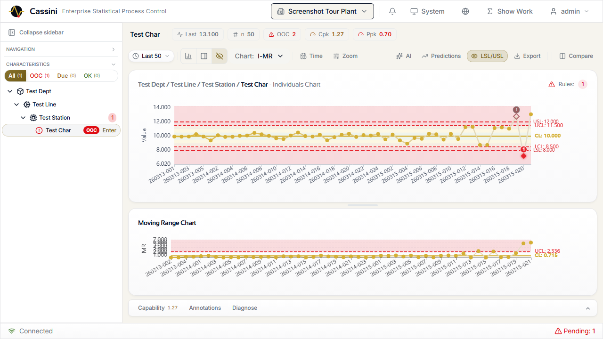
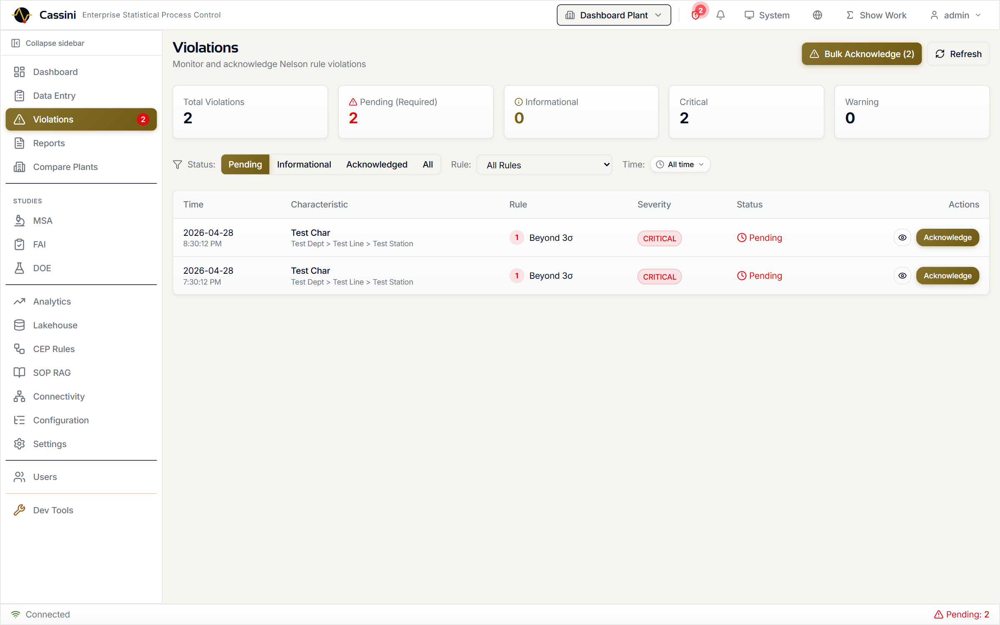
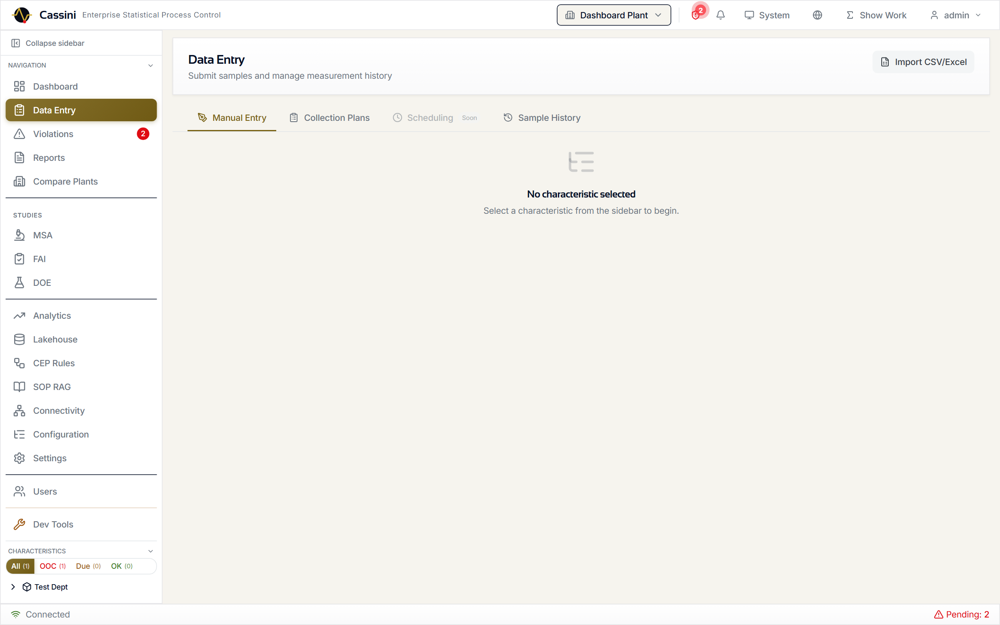
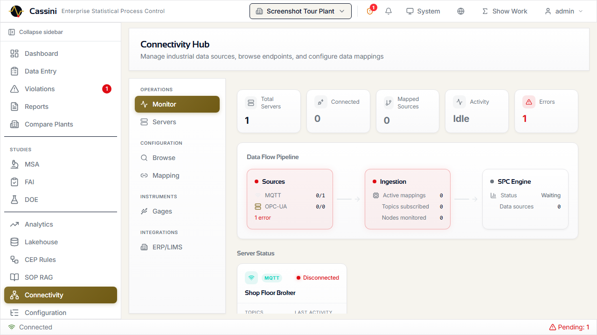
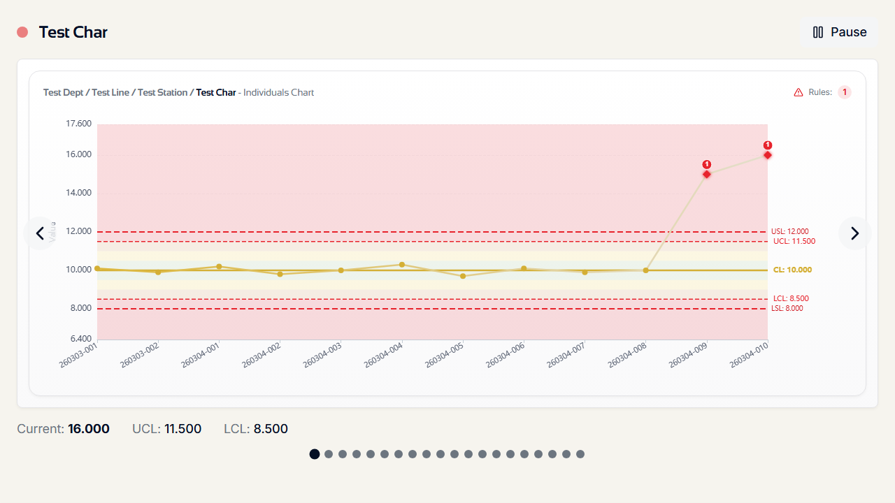
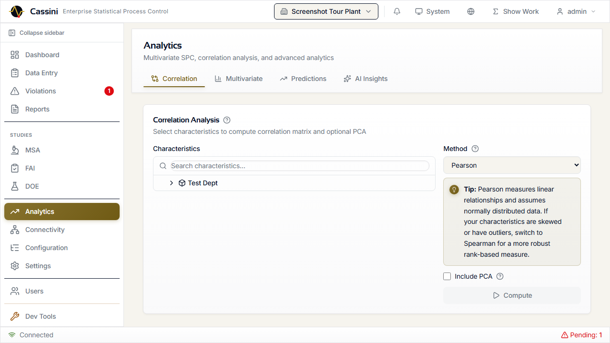
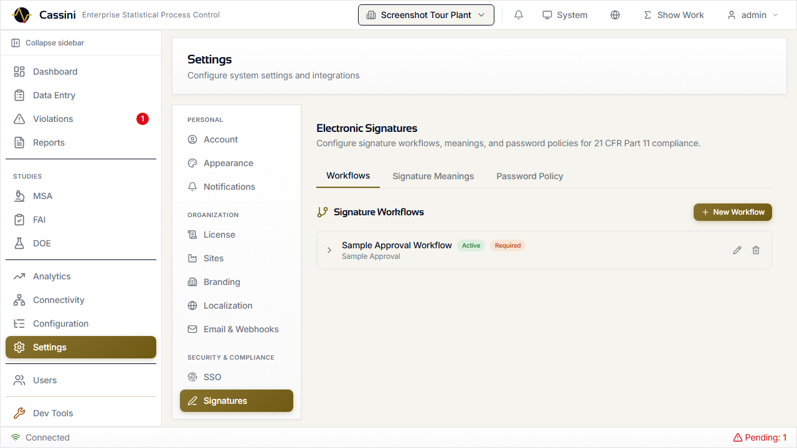

```
  ██████╗  █████╗  ██████╗ ██████╗ ██╗███╗   ██╗██╗
 ██╔════╝ ██╔══██╗██╔════╝██╔════╝ ██║████╗  ██║██║
 ██║      ███████║╚█████╗ ╚█████╗  ██║██╔██╗ ██║██║
 ██║      ██╔══██║ ╚═══██╗ ╚═══██╗ ██║██║╚██╗██║██║
 ╚██████╗ ██║  ██║██████╔╝██████╔╝ ██║██║ ╚████║██║
  ╚═════╝ ╚═╝  ╚═╝╚═════╝ ╚═════╝  ╚═╝╚═╝  ╚═══╝╚═╝

 Statistical Process Control Platform
 by Saturnis LLC
```


# Cassini

**Open-source statistical process control for manufacturing. Free forever, commercially supported.**



Monitor process stability, detect out-of-control conditions, run capability studies, and manage quality data across your manufacturing operation — from a single control chart to a regulated multi-plant deployment.

*"In-control, like the Cassini Division."*

> **Open-core model**: The Community Edition is free under AGPL-3.0 and includes a complete SPC platform. [Commercial licenses](https://saturnis.io/pricing) unlock multi-plant, compliance, and advanced analytics features for organizations that need them.

---

## Table of Contents

- [Getting Started](docs/getting-started.md) -- install on Windows, macOS, or Linux
- [Configuration](docs/configuration.md) -- environment variables, TOML, database options
- [CLI Reference](docs/cli.md) -- `cassini serve`, `cassini check`, etc.
- [Production Deployment](docs/deployment.md) -- reverse proxy, services, backups, upgrading
- [Community Edition](#community-edition-free-agpl-30) -- what's included for free
- [Commercial Features](#commercial-features) -- what the license unlocks
- [Feature Comparison](#feature-comparison) -- side-by-side table
- [Architecture](#architecture) -- tech stack and project structure
- [License](#license--commercial-use) -- AGPL-3.0 and commercial options

---

## Getting Started

Cassini runs on **Windows**, **macOS**, and **Linux**. Pick your path:

| Path | Platform | Time | Guide |
|------|----------|------|-------|
| **Windows Installer** | Windows | 2 min | [Download and run](docs/getting-started.md#windows) |
| **Docker** | Any | 5 min | [Two commands](docs/getting-started.md#docker) |
| **From Source** | Any | 10 min | [Full dev setup](docs/getting-started.md#from-source) |

Default login: `admin` / `cassini` (you'll be prompted to change the password).

> **Next steps:** [Configuration](docs/configuration.md) · [CLI Reference](docs/cli.md) · [Production Deployment](docs/deployment.md)

---

## Community Edition (Free, AGPL-3.0)

Everything you need for production SPC -- no license key required.

### Control Charts & SPC Engine

Real-time control charts rendered on HTML5 canvas with zone shading, gradient lines, cross-chart hover sync, and resizable panels. WebSocket push means charts update the moment new data arrives.

- **Variable charts**: X-bar, X-bar & R, X-bar & S, I-MR, CUSUM, EWMA
- **Attribute charts**: p, np, c, u with Laney p'/u' overdispersion correction
- **Nelson Rules**: All 8 Nelson / WECO / AIAG rules individually configurable per characteristic with parameterized thresholds
- **Short-run charts**: Deviation mode and standardized Z-score mode for low-volume, high-mix production
- **Annotations**: Point and period annotations with categories and descriptions
- **Show Your Work**: Click any statistical value to see the formula (KaTeX-rendered), step-by-step computation, raw inputs, and AIAG citation

### Capability Analysis

Full process capability with Cp, Cpk, Pp, Ppk, and Cpm. Color-coded capability metrics with trend charting and full computation traceability via Show Your Work.

- Snapshot history for tracking capability over time
- Subgroup and individual measurement modes

### Violations & Nelson Rules

Violations are detected in real time as data flows in. Each violation references the specific Nelson rule triggered, the sample that caused it, and the characteristic's current state. Bulk acknowledgment, filtering by severity/status/rule, and one-click navigation to the offending chart point.



### Data Entry & Ingestion

Multiple paths to get data into the system, from manual single-sample entry to high-throughput batch pipelines processing up to 200K samples/min.



#### Manual & Interactive

- **Manual entry**: Form-based sample submission with measurement validation, subgroup size enforcement, and optional batch/operator metadata
- **CSV/Excel import**: 4-step wizard (upload → validate → map columns → confirm) with preview and error reporting

#### API Ingestion

The REST API provides three ingestion endpoints optimized for different use cases:

| Endpoint | Use Case | Throughput |
|----------|----------|------------|
| `POST /api/v1/data-entry/submit` | Single sample with full SPC + supplementary analysis (CUSUM/EWMA). Supports API key auth for machine integration. | Real-time |
| `POST /api/v1/samples/` | Single sample submission (user auth) | Real-time |
| `POST /api/v1/samples/batch` | Bulk import up to 10,000 samples per request | Up to 200K samples/min |

#### Batch Import (`POST /api/v1/samples/batch`)

The batch endpoint is the primary path for high-volume data ingestion. It accepts up to 10,000 samples per request, all targeting a single characteristic, with three processing modes:

| Mode | Flag | Description | Typical Use |
|------|------|-------------|-------------|
| **Skip rules** | `skip_rule_evaluation: true` | Direct database insert, no SPC evaluation | Historical data migration, backfill |
| **Sync SPC** | (default) | Each sample evaluated through full SPC pipeline (Nelson rules, zone classification) | Standard batch import with immediate violation detection |
| **Async SPC** | `async_spc: true` | Samples inserted immediately, SPC evaluation deferred to background workers | High-throughput production ingestion (**commercial**) |

**Request format:**
```json
{
  "characteristic_id": 42,
  "skip_rule_evaluation": false,
  "async_spc": false,
  "samples": [
    {"measurements": [10.1, 10.2, 10.0]},
    {"measurements": [9.9, 10.1, 10.0], "batch_number": "B-2024-001"},
    {"measurements": [10.3, 10.1, 10.2], "timestamp": "2024-01-15T08:30:00Z"}
  ]
}
```

**Response:**
```json
{
  "total": 3,
  "imported": 3,
  "failed": 0,
  "errors": [],
  "status": "complete"
}
```

Individual sample failures do not abort the batch — successful samples commit while errors are accumulated in the response.

#### Connectivity (MQTT / OPC-UA)

- **MQTT / Sparkplug B**: Topic-to-characteristic mapping with live value preview. Community Edition supports one broker; commercial unlocks unlimited brokers.
- **OPC-UA**: Server management with node tree browsing and subscription-to-SPC pipeline (**commercial**)
- **RS-232/USB Gages**: Bridge agent translates serial gage protocols to MQTT (**commercial**)

### MQTT Connectivity

Native MQTT and Sparkplug B support with topic tree browsing, tag-to-characteristic mapping, and live value preview. Community Edition includes one broker connection; commercial unlocks unlimited brokers.



### Equipment Hierarchy

ISA-95 / UNS-compatible equipment hierarchy (Enterprise > Site > Area > Line > Cell > Equipment) with characteristics as leaves. Create, move, and organize your plant structure visually.

### User Management & RBAC

Plant-scoped role-based access control across four tiers:

| Role | Access |
|------|--------|
| **Operator** | Dashboard, data entry, violations |
| **Supervisor** | + Reports |
| **Engineer** | + Configuration, settings, connectivity |
| **Admin** | + User management, all plants |

### Database

SQLite (default, zero-config) included with Community Edition. PostgreSQL, MySQL, and MSSQL available with commercial license. Database administration panel for backup, vacuum, and migration status.

### Audit Trail

Fire-and-forget middleware captures every data modification with user, timestamp, and action detail. Event bus integration logs background operations. Searchable viewer with filters and CSV export.

### Reports & Display Modes

- **Reports**: PDF, Excel, and PNG export with built-in templates
- **Kiosk Mode**: Full-screen auto-rotating characteristic display for factory floor monitors
- **Wall Dashboard**: Multi-chart grid layouts (2x2, 3x3, 4x4) with saved presets for control room displays



### Infrastructure

- **Windows Installer**: Download-and-run `.exe` with Windows Service, system tray, and auto-start
- **Docker**: Production-ready multi-stage Dockerfile + docker-compose with PostgreSQL
- **CLI**: `cassini serve`, `cassini check`, `cassini migrate`, and more — from any terminal
- **REST API**: 300+ endpoints for full programmatic access
- **Batch import**: Up to 10,000 samples per request, three processing modes (skip rules, sync SPC, async SPC)
- **Throughput**: Up to 200K samples/min bulk ingestion (benchmarked on PostgreSQL, 4 uvicorn workers)
- **WebSocket**: Real-time push for chart updates and notifications
- **PWA**: Progressive web app with offline queue support

---

## Commercial Features

> **These features require a [commercial license](https://saturnis.io/pricing) ($3,500/plant/year).** Community Edition users can evaluate commercial features locally by setting `CASSINI_DEV_COMMERCIAL=true`. [Learn more →](https://saturnis.io/pricing)

### Industrial Connectivity Hub

A unified Connectivity Hub manages all data sources with a visual data flow pipeline showing source health, ingestion metrics, and SPC engine status at a glance.

- **Unlimited MQTT Brokers**: Multi-broker management for complex industrial networks
- **OPC-UA**: Multi-server management, node tree browsing, subscription-to-SPC engine pipeline with priority triggers
- **RS-232/USB Gages**: Python bridge agent (`cassini-bridge` pip package) translates serial gage protocols (Mitutoyo Digimatic, generic regex) to MQTT on shop floor PCs
- **ERP/LIMS**: SAP OData, Oracle REST, generic LIMS, and webhook adapters with cron-based sync scheduling

### Non-Normal Distribution Fitting

Automatic non-normal distribution handling via Shapiro-Wilk normality testing, Box-Cox transformation, and 6-distribution auto-fitting (normal, lognormal, Weibull, gamma, exponential, beta). Includes distribution analysis modal with histogram, Q-Q plot, and comparison table.

### Run Rule Preset Management

Standardize rule configuration across your plant with four built-in presets (Nelson, AIAG, WECO, Wheeler) and the ability to create custom presets. Apply and manage rule configurations in bulk.

### Quality Studies

**Measurement System Analysis (Gage R&R)** -- Crossed ANOVA, range method, nested ANOVA, and attribute agreement analysis (Cohen's and Fleiss' Kappa). Uses AIAG MSA 4th Edition d2* tables. Full wizard from study setup through results interpretation.

**First Article Inspection** -- AS9102 Rev C compliant inspection reports with Forms 1, 2, and 3. Draft-to-submitted-to-approved workflow with separation of duties enforcement. Print-optimized view for physical records.

**Design of Experiments** -- Full factorial, fractional factorial, Plackett-Burman, and central composite designs. Interactive design matrix, run table, ANOVA results, main effects plot, and interaction plots.

### Advanced Analytics



- **Correlation**: Multi-variate correlation heatmap across characteristics
- **Multivariate SPC**: PCA biplot, Hotelling T-squared chart, MEWMA, decomposition table
- **Predictions**: Time series forecasting with ARIMA/Prophet overlay on control charts
- **AI Insights**: LLM-generated analysis with guardrails for responsible interpretation
- **Ishikawa Diagrams**: Interactive fishbone (cause-and-effect) diagrams for root cause analysis

### AI/ML Anomaly Detection

Three machine learning detectors per characteristic:

- **PELT Changepoint**: Detects abrupt shifts in process mean or variance
- **Kolmogorov-Smirnov**: Identifies distribution drift over sliding windows
- **Isolation Forest**: Spots multivariate outliers invisible to univariate rules

Anomalies overlay directly on control charts and integrate with the notification system.

### High-Throughput Async Ingestion

Production environments generating thousands of samples per minute need ingestion that doesn't block on SPC computation. The async SPC pipeline decouples data persistence from rule evaluation:

1. **Ingest**: Samples are validated and committed to the database immediately with `spc_status=pending_spc`
2. **Enqueue**: Sample IDs are published to the background SPC processor
3. **Evaluate**: Background workers run Nelson rules, zone classification, and violation detection asynchronously
4. **Notify**: Violations trigger real-time WebSocket updates and configured notifications

This achieves up to **175K samples/min with full SPC evaluation** — compared to ~26K/min with synchronous processing. The batch endpoint (`POST /api/v1/samples/batch`) enables async mode with a single flag:

```json
{
  "characteristic_id": 42,
  "async_spc": true,
  "samples": [...]
}
```

The response returns immediately with `"status": "processing"` and a list of `sample_ids` for tracking. SPC results appear on charts and dashboards as background processing completes.

| Metric | Sync SPC | Async SPC |
|--------|----------|-----------|
| Throughput (batch, 4 workers) | ~26K samples/min | ~175K samples/min |
| Latency per 1000-sample batch | ~7,400ms | ~2,400ms |
| Violation detection | Immediate in response | Background (seconds) |

### Enterprise Compliance



**Electronic Signatures (21 CFR Part 11)** -- Configurable multi-step signature workflows with password re-authentication, SHA-256 tamper detection, plant-scoped signature meanings, and FDA-compliant password policies.

**Data Retention** -- Configurable retention policies with inheritance chain (global > plant > area > line > station). Purge engine with full history tracking for regulatory compliance.

### Multi-Plant, SSO & Operations

- **Multi-database**: PostgreSQL, MySQL, and MSSQL with encrypted credential storage (Fernet) and one-click switching
- **Multi-plant**: Manage multiple sites from a single deployment
- **SSO/OIDC**: Multiple identity providers, claim mapping, plant-scoped role mapping, account linking
- **Notifications**: Email, HMAC-signed webhooks, and PWA push notifications
- **Scheduled Reports**: Cron-based report scheduling with email delivery

---

## Feature Comparison

| Feature | Community | Commercial |
|---------|:---------:|:----------:|
| **SPC Engine** | | |
| Control charts (X-bar, R, S, I-MR, CUSUM, EWMA, p/np/c/u) | Yes | Yes |
| Capability analysis (Cp, Cpk, Pp, Ppk, Cpm) | Yes | Yes |
| Nelson / WECO / AIAG run rules | Yes | Yes |
| Short-run SPC (deviation + Z-score) | Yes | Yes |
| Show Your Work (computation transparency) | Yes | Yes |
| Non-normal distribution fitting | -- | Yes |
| Run rule preset management | -- | Yes |
| **Data & Ingestion** | | |
| Manual data entry | Yes | Yes |
| CSV / Excel import wizard | Yes | Yes |
| Batch import API (up to 10K samples/req) | Yes | Yes |
| Bulk import throughput | Up to 200K samples/min | Up to 200K samples/min |
| Throughput with SPC rules | ~26K samples/min (sync) | Up to 175K samples/min (async) |
| MQTT / Sparkplug B connectivity | 1 broker | Unlimited |
| OPC-UA connectivity | -- | Yes |
| RS-232 / USB gage bridge | -- | Yes |
| ERP / LIMS connectors | -- | Yes |
| ISA-95 plant hierarchy | Single plant | Multi-plant |
| **Quality Systems** | | |
| MSA / Gage R&R | -- | Yes |
| First Article Inspection (AS9102) | -- | Yes |
| Electronic signatures (21 CFR Part 11) | -- | Yes |
| DOE (Design of Experiments) | -- | Yes |
| **Analytics & Reporting** | | |
| Dashboard & violation tracking | Yes | Yes |
| Anomaly detection (ML) | -- | Yes |
| Multivariate SPC (T-squared, MEWMA) | -- | Yes |
| AI-powered analysis | -- | Yes |
| Predictive analytics | -- | Yes |
| Scheduled & automated reporting | -- | Yes |
| Ishikawa root cause diagrams | -- | Yes |
| **Administration** | | |
| User management & RBAC | Yes | Yes |
| Audit trail | Yes | Yes |
| SSO / OIDC | -- | Yes |
| Data retention policies | -- | Yes |
| ERP / MES integration | -- | Yes |
| Push notifications | -- | Yes |
| **Infrastructure** | | |
| Windows installer + service | Yes | Yes |
| CLI (`cassini serve`, etc.) | Yes | Yes |
| Database | SQLite | PostgreSQL, MSSQL, MySQL |
| REST API (300+) | Yes | Yes |
| Batch import API | Yes | Yes |
| Async SPC pipeline | -- | Yes |
| Source code access | Yes | Yes |
| Modification rights | AGPL (share-alike) | Proprietary |
| Support | Community (GitHub) | Dedicated with SLA |
| | **Free** | **$3,500/plant/yr** |

> Need custom terms, on-premise deployment assistance, validation documentation, or SLA guarantees? [Contact sales](mailto:sales@saturnis.io).

---

## Architecture

```
┌────────────────────────────────────────────────────────────────┐
│                        Data Sources                            │
│  MQTT/SparkplugB  OPC-UA  RS-232 Gages  CSV/Excel  ERP/LIMS  │
└──────────────────────────┬─────────────────────────────────────┘
                           │
┌──────────────────────────▼─────────────────────────────────────┐
│                    FastAPI Backend                              │
│  JWT Auth · RBAC · Audit Middleware · Rate Limiting             │
│                                                                │
│  ┌─────────────┐ ┌──────────────┐ ┌──────────────┐            │
│  │ SPC Engine   │ │ Capability   │ │ MSA Engine   │            │
│  │ 8 Nelson     │ │ Non-normal   │ │ Gage R&R     │            │
│  │ rules        │ │ distributions│ │ ANOVA        │            │
│  └─────────────┘ └──────────────┘ └──────────────┘            │
│  ┌─────────────┐ ┌──────────────┐ ┌──────────────┐            │
│  │ Anomaly Det.│ │ Signature    │ │ Notification  │            │
│  │ PELT/KS/IF  │ │ Engine       │ │ Dispatcher    │            │
│  └─────────────┘ └──────────────┘ └──────────────┘            │
│                                                                │
│  Event Bus ──── WebSocket · Notifications · Audit · MQTT Out   │
│                                                                │
│  SQLAlchemy Async ── SQLite / PostgreSQL / MySQL / MSSQL       │
└────────────────────────────────────────────────────────────────┘
                           │
┌──────────────────────────▼─────────────────────────────────────┐
│                    React Frontend                               │
│  TanStack Query · Zustand · ECharts 6 · Zod · Tailwind CSS    │
│                                                                │
│  22 pages · 200+ components · 240+ React Query hooks           │
│  PWA with push notifications and offline queue                 │
└────────────────────────────────────────────────────────────────┘
```

### Tech Stack

| Layer | Technology |
|-------|-----------|
| **Backend** | Python 3.11+, FastAPI, SQLAlchemy async, Alembic, Pydantic, Click (CLI) |
| **Frontend** | React 19, TypeScript 5.9, Vite 7, TanStack Query v5, Zustand v5 |
| **Charts** | ECharts 6 (tree-shaken, canvas renderer) |
| **Validation** | Zod v4 (frontend), Pydantic v2 (backend) |
| **Styling** | Tailwind CSS v4 with retro and glass visual themes |
| **Bridge** | Python, pyserial, paho-mqtt (pip-installable `cassini-bridge`) |
| **Desktop** | PyInstaller (freeze), Inno Setup (installer), pystray (tray), pywin32 (service) |
| **Database** | SQLite, PostgreSQL, MySQL, MSSQL via dialect abstraction |
| **Real-time** | WebSocket (FastAPI native), MQTT (paho-mqtt / asyncio-mqtt) |
| **ML** | ruptures (changepoint), scikit-learn (Isolation Forest), scipy |

---

## Development

See [CONTRIBUTING.md](CONTRIBUTING.md) for the full development setup, coding standards, and pull request process.

### Key Conventions

- **TypeScript**: Strict mode, `noUnusedLocals`, `noUnusedParameters`
- **Formatting**: Prettier -- no semicolons, single quotes, trailing commas, 100 char width
- **Imports**: `@/` alias for `src/` (never relative cross-directory)
- **Components**: Function components, named exports, one per file
- **API paths**: Never include `/api/v1/` prefix in `fetchApi` calls (prepended automatically)

See [CONTRIBUTING.md](CONTRIBUTING.md) for the full contribution guide.

---

## License & Commercial Use

Cassini is dual-licensed:

- **Community Edition**: [GNU Affero General Public License v3.0](LICENSE) (AGPL-3.0)
- **Commercial License**: Available from [Saturnis LLC](https://saturnis.io/pricing)

### What This Means

The Community Edition is **genuinely free** and includes a complete SPC platform. Use it, deploy it, build on it.

The AGPL-3.0 is a strong copyleft license that ensures improvements stay open. The key requirement: **if you modify Cassini and make it available over a network -- including internal company networks -- the AGPL requires you to share your complete source code with all users.** This is what keeps open source sustainable.

If your organization needs to make proprietary modifications, embed Cassini in a closed-source product, or requires commercial features like electronic signatures and multi-plant management, a [commercial license](https://saturnis.io/pricing) removes the AGPL obligations and unlocks the full platform.

**Not sure which you need?** Email [sales@saturnis.io](mailto:sales@saturnis.io).

---

## Links

| | |
|---|---|
| **Pricing** | [saturnis.io/pricing](https://saturnis.io/pricing) |
| **Commercial License** | [saturnis.io/pricing](https://saturnis.io/pricing) |
| **Contributing** | [CONTRIBUTING.md](CONTRIBUTING.md) |
| **Security** | [SECURITY.md](SECURITY.md) |
| **Code of Conduct** | [CODE_OF_CONDUCT.md](CODE_OF_CONDUCT.md) |
| **Support** | [community@saturnis.io](mailto:community@saturnis.io) |

---

Copyright 2026 [Saturnis LLC](https://saturnis.io). Built with FastAPI, React, ECharts, and statistical rigor.
