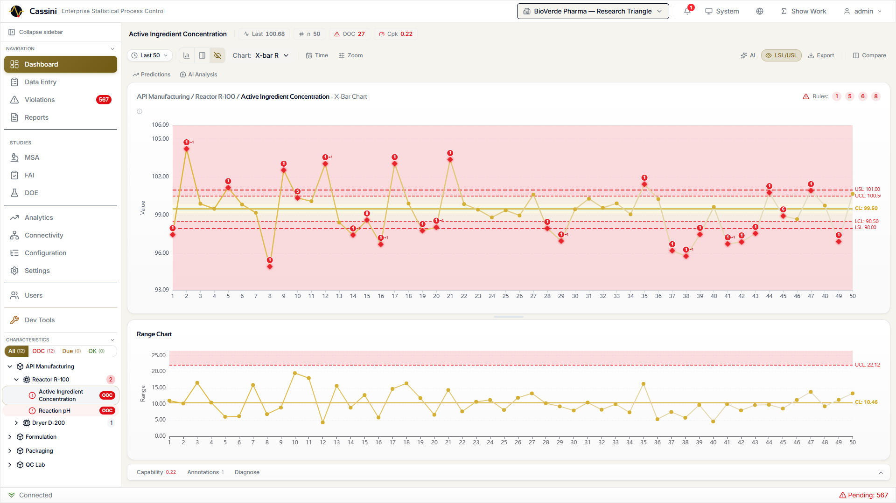
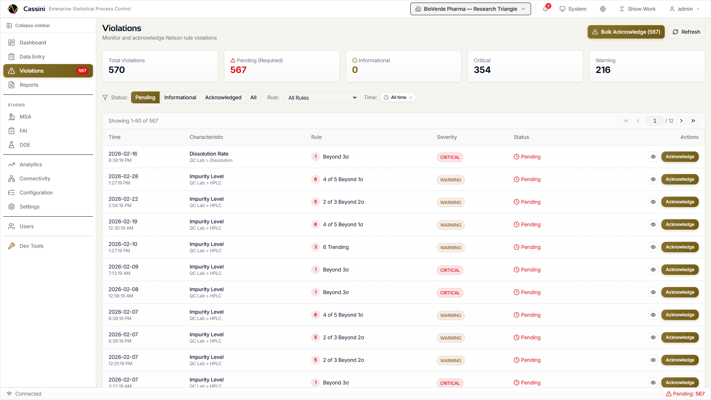
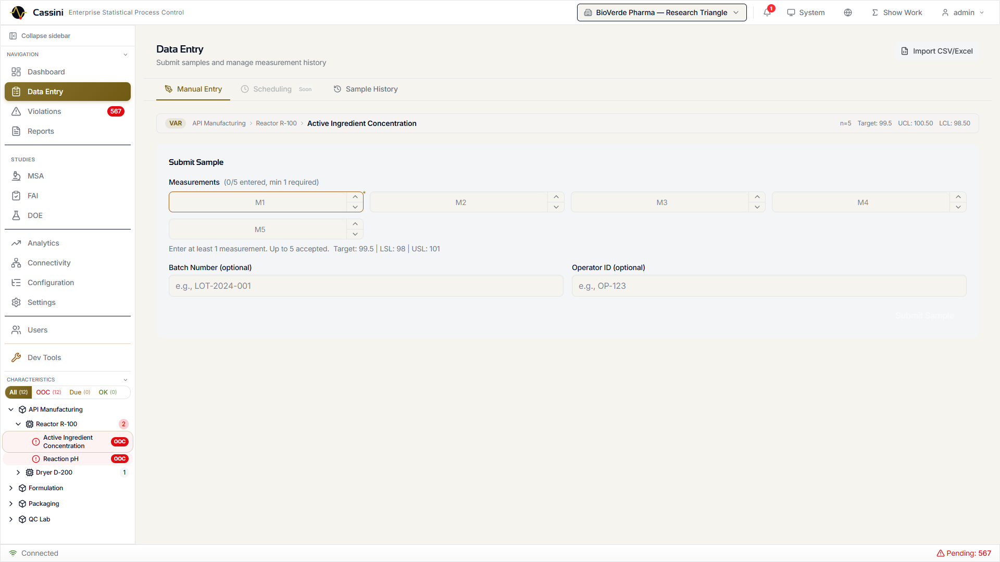
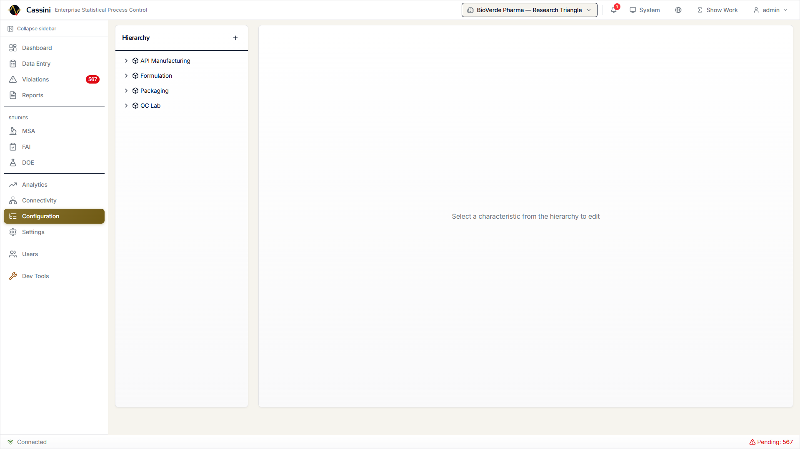
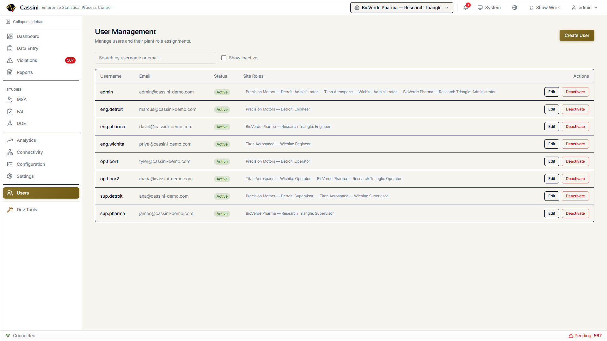
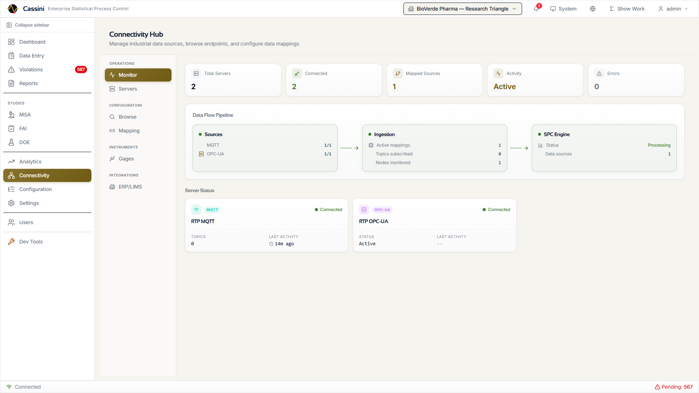
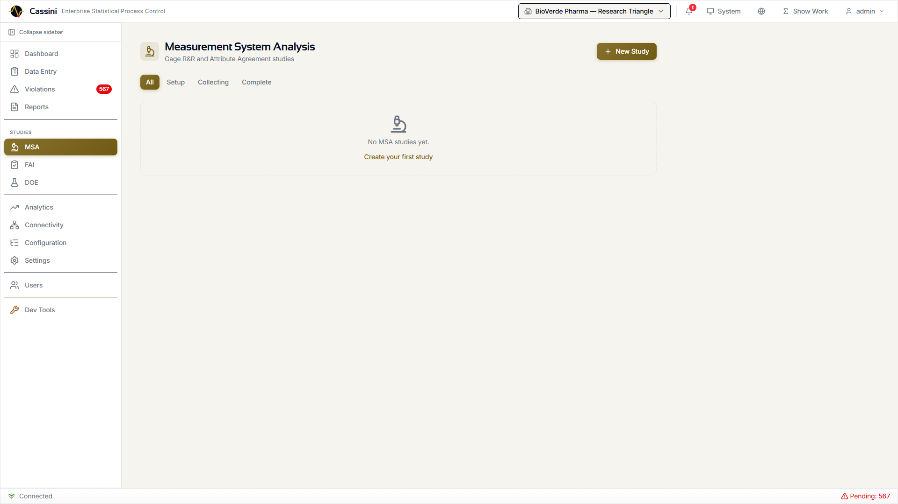
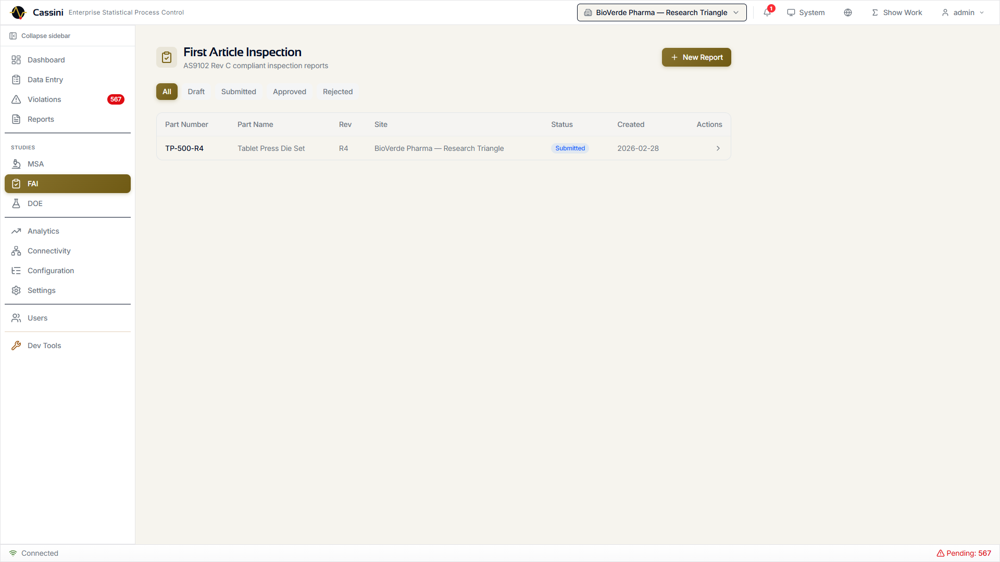
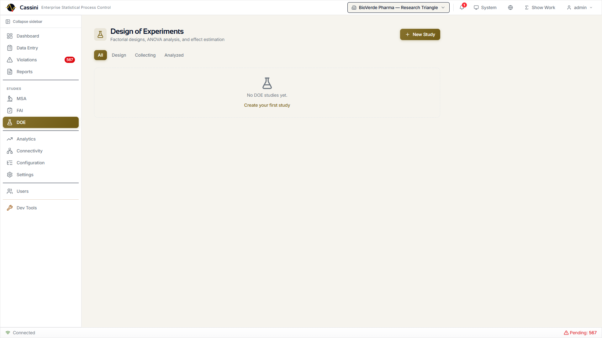
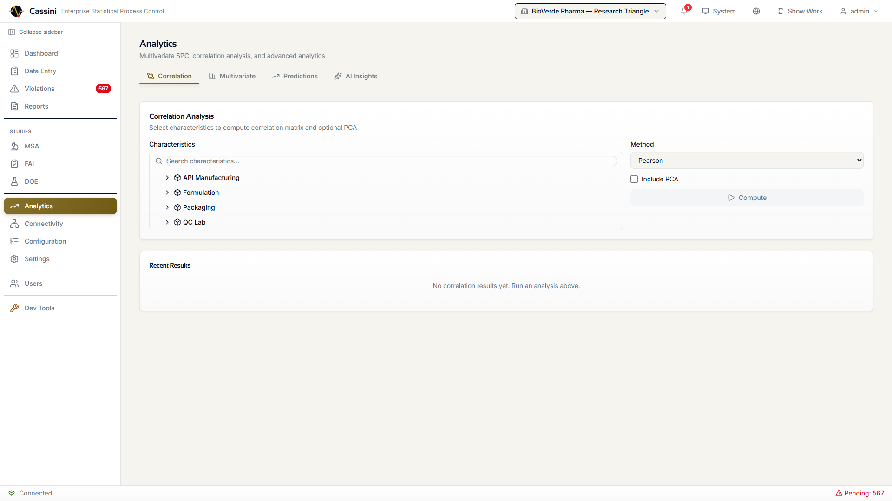

```
  ██████╗  █████╗  ██████╗ ██████╗ ██╗███╗   ██╗██╗
 ██╔════╝ ██╔══██╗██╔════╝██╔════╝ ██║████╗  ██║██║
 ██║      ███████║╚█████╗ ╚█████╗  ██║██╔██╗ ██║██║
 ██║      ██╔══██║ ╚═══██╗ ╚═══██╗ ██║██║╚██╗██║██║
 ╚██████╗ ██║  ██║██████╔╝██████╔╝ ██║██║ ╚████║██║
  ╚═════╝ ╚═╝  ╚═╝╚═════╝ ╚═════╝  ╚═╝╚═╝  ╚═══╝╚═╝

 Statistical Process Control Platform
 by Saturnis LLC
```


# Cassini

**Open-source statistical process control for manufacturing. Free forever, commercially supported.**

Monitor process stability, detect out-of-control conditions, run capability studies, and manage quality data across your manufacturing operation — from a single control chart to a regulated multi-plant deployment.

*"In-control, like the Cassini Division."*



> **Open-core model**: The Community Edition is free under AGPL-3.0 and includes a complete SPC platform. [Commercial licenses](LICENSE-COMMERCIAL.md) unlock multi-plant, compliance, and advanced analytics features for organizations that need them.

---

## Quick Start

**Prerequisites:** Python 3.11+, Node.js 18+, Git

```bash
# Clone the repository
git clone https://github.com/djbrandl/Cassini.git
cd Cassini

# Start the backend
cd backend
python -m venv .venv && .venv/Scripts/activate   # Windows
# source .venv/bin/activate                       # macOS/Linux
pip install -e .
alembic upgrade head
uvicorn cassini.main:app --reload --host 0.0.0.0 --port 8000

# In a new terminal, start the frontend
cd frontend
npm install && npm run dev
```

Open **http://localhost:5173** and log in with `admin` / `password`.

### Docker

```bash
docker compose up -d
```

The compose file starts the app with PostgreSQL. See [Getting Started](docs/getting-started.md) for configuration details.

---

## Community Edition (Free, AGPL-3.0)

Everything you need for production SPC — no license key required.

### Control Charts & SPC Engine

Real-time control charts rendered on HTML5 canvas with zone shading, gradient lines, cross-chart hover sync, and resizable panels. WebSocket push means charts update the moment new data arrives.


- **Variable charts**: X-bar, X-bar & R, X-bar & S, I-MR, CUSUM, EWMA
- **Attribute charts**: p, np, c, u with Laney p'/u' overdispersion correction
- **Nelson Rules**: All 8 rules individually configurable with parameterized thresholds and four built-in presets (Nelson, AIAG, WECO, Wheeler)
- **Short-run charts**: Deviation mode and standardized Z-score mode for low-volume, high-mix production
- **Annotations**: Point and period annotations with categories and descriptions
- **Show Your Work**: Click any statistical value to see the formula (KaTeX-rendered), step-by-step computation, raw inputs, and AIAG citation

### Capability Analysis

Full process capability with Cp, Cpk, Pp, Ppk, and Cpm. Non-normal distributions are handled automatically via Shapiro-Wilk normality testing, Box-Cox transformation, and 6-distribution auto-fitting (normal, lognormal, Weibull, gamma, exponential, beta).

- Color-coded capability metrics with trend charting
- Distribution analysis modal with histogram, Q-Q plot, and comparison table
- Snapshot history for tracking capability over time

### Violations & Nelson Rules



Violations are detected in real time as data flows in. Each violation references the specific Nelson rule triggered, the sample that caused it, and the characteristic's current state. Bulk acknowledgment, filtering by severity/status/rule, and one-click navigation to the offending chart point.

### Data Entry



Multiple paths to get data into the system:

- **Manual entry**: Form-based sample submission with validation
- **CSV/Excel import**: 4-step wizard (upload, validate, map columns, confirm)
- **MQTT / Sparkplug B**: Automatic via connectivity mappings
- **API**: RESTful endpoints for programmatic integration

### MQTT Connectivity

Native MQTT and Sparkplug B support with multi-broker management, topic tree browsing, tag-to-characteristic mapping, and live value preview. Data flows directly from your industrial network into the SPC engine.

### Equipment Hierarchy



ISA-95 / UNS-compatible equipment hierarchy (enterprise > site > area > line > station) with characteristics as leaves. Create, move, and organize your plant structure visually.

### User Management



Plant-scoped role-based access control across four tiers:

| Role | Access |
|------|--------|
| **Operator** | Dashboard, data entry, violations |
| **Supervisor** | + Reports |
| **Engineer** | + Configuration, settings, connectivity |
| **Admin** | + User management, all plants |

### Multi-Database

SQLite (default, zero-config), PostgreSQL, MySQL, and MSSQL. Encrypted credential storage (Fernet), one-click switching, and a database administration panel for backup, vacuum, and migration status.

### Reports & Display Modes

- **Reports**: PDF, Excel, and PNG export with built-in templates
- **Kiosk Mode**: Full-screen auto-rotating characteristic display for factory floor monitors
- **Wall Dashboard**: Multi-chart grid layouts (2x2, 3x3, 4x4) with saved presets for control room displays

### Infrastructure

- **Docker**: Production-ready multi-stage Dockerfile + docker-compose with PostgreSQL
- **REST API**: 260+ endpoints for full programmatic access
- **WebSocket**: Real-time push for chart updates and notifications
- **PWA**: Progressive web app with offline queue support

---

## Commercial Features

> Unlock additional capabilities with a [commercial license](LICENSE-COMMERCIAL.md). Professional starts at $500/month. [Learn more](https://saturnis.io/cassini/pricing).

### Industrial Connectivity Hub



A unified Connectivity Hub manages all data sources with a visual data flow pipeline showing source health, ingestion metrics, and SPC engine status at a glance.

- **OPC-UA**: Multi-server management, node tree browsing, subscription-to-SPC engine pipeline with priority triggers
- **RS-232/USB Gages**: Python bridge agent (`cassini-bridge` pip package) translates serial gage protocols (Mitutoyo Digimatic, generic regex) to MQTT on shop floor PCs
- **ERP/LIMS**: SAP OData, Oracle REST, generic LIMS, and webhook adapters with cron-based sync scheduling

### Quality Studies

**Measurement System Analysis (Gage R&R)**



Crossed ANOVA, range method, nested ANOVA, and attribute agreement analysis (Cohen's and Fleiss' Kappa). Uses AIAG MSA 4th Edition d2* tables. Full wizard from study setup through results interpretation.

**First Article Inspection**



AS9102 Rev C compliant inspection reports with Forms 1, 2, and 3. Draft-to-submitted-to-approved workflow with separation of duties enforcement. Print-optimized view for physical records.

**Design of Experiments**



Full factorial, fractional factorial, Plackett-Burman, and central composite designs. Interactive design matrix, run table, ANOVA results, main effects plot, and interaction plots.

### Advanced Analytics



A four-tab analytics hub:

- **Correlation**: Multi-variate correlation heatmap across characteristics
- **Multivariate SPC**: PCA biplot, Hotelling T-squared chart, decomposition table
- **Predictions**: Time series forecasting with ARIMA/Prophet overlay on control charts
- **AI Insights**: LLM-generated analysis with guardrails for responsible interpretation

### AI/ML Anomaly Detection

Three machine learning detectors per characteristic:

- **PELT Changepoint**: Detects abrupt shifts in process mean or variance
- **Kolmogorov-Smirnov**: Identifies distribution drift over sliding windows
- **Isolation Forest**: Spots multivariate outliers invisible to univariate rules

Anomalies overlay directly on control charts and integrate with the notification system.

### Enterprise Compliance

**Electronic Signatures (21 CFR Part 11)** — Configurable multi-step signature workflows with password re-authentication, SHA-256 tamper detection, plant-scoped signature meanings, and FDA-compliant password policies.

**Audit Trail** — Fire-and-forget middleware captures every data modification. Event bus integration logs background operations. Searchable viewer with filters and CSV export.

**Data Retention** — Configurable retention policies with inheritance chain (global > plant > area > line > station). Purge engine with full history tracking for regulatory compliance.

### Multi-Plant & SSO

- **Multi-plant**: Manage up to 5 sites (Professional) or unlimited sites (Enterprise)
- **SSO/OIDC**: Multiple identity providers, claim mapping, plant-scoped role mapping, account linking
- **Notifications**: Email, HMAC-signed webhooks, and PWA push notifications
- **Scheduled Reports**: Cron-based report scheduling with email delivery

---

## Feature Comparison

| Feature | Community | Professional | Enterprise |
|---------|:---------:|:------------:|:----------:|
| **Control Charts** | | | |
| X-bar, I-MR, CUSUM, EWMA, p/np/c/u | Yes | Yes | Yes |
| Short-run (deviation / Z-score) | Yes | Yes | Yes |
| Custom run rule presets | Yes | Yes | Yes |
| Laney p'/u' correction | Yes | Yes | Yes |
| **Capability** | | | |
| Cp, Cpk, Pp, Ppk, Cpm | Yes | Yes | Yes |
| Non-normal distribution fitting | Yes | Yes | Yes |
| Show Your Work explanations | Yes | Yes | Yes |
| **Data** | | | |
| Manual entry + CSV/Excel import | Yes | Yes | Yes |
| MQTT / Sparkplug B | Yes | Yes | Yes |
| OPC-UA integration | — | Yes | Yes |
| RS-232/USB gage bridge | — | Yes | Yes |
| ERP/LIMS connectors | — | — | Yes |
| **Infrastructure** | | | |
| Docker deployment | Yes | Yes | Yes |
| REST API + WebSocket | Yes | Yes | Yes |
| Multi-database (SQLite/PG/MySQL/MSSQL) | Yes | Yes | Yes |
| 4-tier RBAC | Yes | Yes | Yes |
| Single plant | Yes | Yes | Yes |
| Multi-plant (up to 5) | — | Yes | Yes |
| Unlimited plants | — | — | Yes |
| SSO/OIDC | — | Yes | Yes |
| **Notifications** | | | |
| Email notifications | — | Yes | Yes |
| Webhook notifications (HMAC) | — | Yes | Yes |
| Push notifications (PWA) | — | Yes | Yes |
| Scheduled report delivery | — | Yes | Yes |
| **Compliance** | | | |
| Electronic signatures (21 CFR Part 11) | — | — | Yes |
| Audit trail | — | — | Yes |
| Password policies | — | — | Yes |
| Data retention policies | — | Yes | Yes |
| **Studies** | | | |
| Gage R&R / MSA (AIAG) | — | — | Yes |
| FAI (AS9102 Rev C) | — | — | Yes |
| Design of Experiments | — | — | Yes |
| **Analytics** | | | |
| AI/ML anomaly detection | — | — | Yes |
| Multivariate SPC | — | — | Yes |
| Predictive analytics | — | — | Yes |
| AI-powered analysis | — | — | Yes |
| | **Free** | **$500/mo** | **$2,500/mo** |

> **Enterprise Plus** — Custom pricing for on-premise deployments, dedicated support, SLAs, validation documentation, and custom integrations. [Contact sales](mailto:sales@saturnis.io).

---

## Architecture

> **Interactive diagrams**: Open [docs/cassini-architecture.html](docs/cassini-architecture.html) for a detailed visual architecture overview.

```
┌────────────────────────────────────────────────────────────────┐
│                        Data Sources                            │
│  MQTT/SparkplugB  OPC-UA  RS-232 Gages  CSV/Excel  ERP/LIMS  │
└──────────────────────────┬─────────────────────────────────────┘
                           │
┌──────────────────────────▼─────────────────────────────────────┐
│                    FastAPI Backend                              │
│  JWT Auth · RBAC · Audit Middleware · Rate Limiting             │
│                                                                │
│  ┌─────────────┐ ┌──────────────┐ ┌──────────────┐            │
│  │ SPC Engine   │ │ Capability   │ │ MSA Engine   │            │
│  │ 8 Nelson     │ │ Non-normal   │ │ Gage R&R     │            │
│  │ rules        │ │ distributions│ │ ANOVA        │            │
│  └─────────────┘ └──────────────┘ └──────────────┘            │
│  ┌─────────────┐ ┌──────────────┐ ┌──────────────┐            │
│  │ Anomaly Det.│ │ Signature    │ │ Notification  │            │
│  │ PELT/KS/IF  │ │ Engine       │ │ Dispatcher    │            │
│  └─────────────┘ └──────────────┘ └──────────────┘            │
│                                                                │
│  Event Bus ──── WebSocket · Notifications · Audit · MQTT Out   │
│                                                                │
│  SQLAlchemy Async ── SQLite / PostgreSQL / MySQL / MSSQL       │
└────────────────────────────────────────────────────────────────┘
                           │
┌──────────────────────────▼─────────────────────────────────────┐
│                    React Frontend                               │
│  TanStack Query · Zustand · ECharts 6 · Zod · Tailwind CSS    │
│                                                                │
│  19 pages · 145+ components · 120+ React Query hooks           │
│  PWA with push notifications and offline queue                 │
└────────────────────────────────────────────────────────────────┘
```

### Tech Stack

| Layer | Technology |
|-------|-----------|
| **Backend** | Python 3.11+, FastAPI, SQLAlchemy async, Alembic, Pydantic |
| **Frontend** | React 19, TypeScript 5.9, Vite 7, TanStack Query v5, Zustand v5 |
| **Charts** | ECharts 6 (tree-shaken, canvas renderer) |
| **Validation** | Zod v4 (frontend), Pydantic v2 (backend) |
| **Styling** | Tailwind CSS v4 with retro and glass visual themes |
| **Bridge** | Python, pyserial, paho-mqtt (pip-installable `cassini-bridge`) |
| **Database** | SQLite, PostgreSQL, MySQL, MSSQL via dialect abstraction |
| **Real-time** | WebSocket (FastAPI native), MQTT (paho-mqtt / asyncio-mqtt) |
| **ML** | ruptures (changepoint), scikit-learn (Isolation Forest), scipy |

### Monorepo Structure

```
cassini/
├── backend/           FastAPI application
│   ├── src/cassini/
│   │   ├── api/       Routers, schemas, dependencies
│   │   ├── core/      SPC engine, capability, MSA, anomaly, signatures
│   │   └── db/        Models, repositories, migrations
│   └── alembic/       38 database migrations
├── frontend/          React SPA
│   └── src/
│       ├── api/       API client, hooks, namespaces (26 API modules)
│       ├── components/ 145+ components organized by domain
│       ├── pages/     19 page components
│       ├── stores/    Zustand state stores
│       └── hooks/     Custom React hooks
├── bridge/            Serial gage → MQTT translator
│   └── src/cassini_bridge/
│       ├── parsers/   Mitutoyo Digimatic, generic regex
│       ├── serial_reader.py
│       └── mqtt_publisher.py
└── docs/              Documentation and images
```

---

## Development

```bash
# Type checking (frontend)
cd frontend && npx tsc --noEmit

# Full build check
cd frontend && npx tsc -b

# Production build
cd frontend && npm run build

# Run backend with auto-reload
cd backend && uvicorn cassini.main:app --reload

# New database migration
cd backend && alembic revision --autogenerate -m "description"

# Install bridge for development
cd bridge && pip install -e .
```

### Key Conventions

- **TypeScript**: Strict mode, `noUnusedLocals`, `noUnusedParameters`
- **Formatting**: Prettier — no semicolons, single quotes, trailing commas, 100 char width
- **Imports**: `@/` alias for `src/` (never relative cross-directory)
- **Components**: Function components, named exports, one per file
- **API paths**: Never include `/api/v1/` prefix in `fetchApi` calls (prepended automatically)

See [CONTRIBUTING.md](CONTRIBUTING.md) for the full contribution guide.

---

## License & Commercial Use

Cassini is dual-licensed:

- **Community Edition**: [GNU Affero General Public License v3.0](LICENSE) (AGPL-3.0)
- **Commercial License**: Available from [Saturnis LLC](https://saturnis.io/cassini/pricing)

### What This Means

The Community Edition is **genuinely free** and includes a complete SPC platform. Use it, deploy it, build on it.

The AGPL-3.0 is a strong copyleft license that ensures improvements stay open. The key requirement: **if you modify Cassini and make it available over a network — including internal company networks — the AGPL requires you to share your complete source code with all users.** This is what keeps open source sustainable.

If your organization needs to make proprietary modifications, embed Cassini in a closed-source product, or requires enterprise features like electronic signatures and audit trails, a [commercial license](LICENSE-COMMERCIAL.md) removes the AGPL obligations and unlocks the full platform.

**Not sure which you need?** See the [Commercial License FAQ](LICENSE-COMMERCIAL.md#faq) or email [sales@saturnis.io](mailto:sales@saturnis.io).

---

## Links

| | |
|---|---|
| **Documentation** | [docs/](docs/) |
| **Pricing** | [saturnis.io/cassini/pricing](https://saturnis.io/cassini/pricing) |
| **Commercial License** | [LICENSE-COMMERCIAL.md](LICENSE-COMMERCIAL.md) |
| **Contributing** | [CONTRIBUTING.md](CONTRIBUTING.md) |
| **Security** | [SECURITY.md](SECURITY.md) |
| **Code of Conduct** | [CODE_OF_CONDUCT.md](CODE_OF_CONDUCT.md) |
| **Support** | [community@saturnis.io](mailto:community@saturnis.io) |

---

Copyright 2026 [Saturnis LLC](https://saturnis.io). Built with FastAPI, React, ECharts, and statistical rigor.
