<div align="center">

```
  ██████╗  █████╗  ██████╗ ██████╗ ██╗███╗   ██╗██╗
 ██╔════╝ ██╔══██╗██╔════╝██╔════╝ ██║████╗  ██║██║
 ██║      ███████║╚█████╗ ╚█████╗  ██║██╔██╗ ██║██║
 ██║      ██╔══██║ ╚═══██╗ ╚═══██╗ ██║██║╚██╗██║██║
 ╚██████╗ ██║  ██║██████╔╝██████╔╝ ██║██║ ╚████║██║
  ╚═════╝ ╚═╝  ╚═╝╚═════╝ ╚═════╝  ╚═╝╚═╝  ╚═══╝╚═╝
```

### Open-source Statistical Process Control for manufacturing

*"In-control, like the Cassini Division."*

[](https://www.python.org/)
[](https://react.dev/)
[](https://fastapi.tiangolo.com/)
[](https://www.typescriptlang.org/)
[](https://echarts.apache.org/)
[](LICENSE)
[](https://docker.com)

**Open** (free, AGPL-3.0) · **[Pro](https://saturnis.io/pricing)** ($1,200/plant/yr) · **[Enterprise](https://saturnis.io/pricing)** ($5,000/plant/yr)

</div>

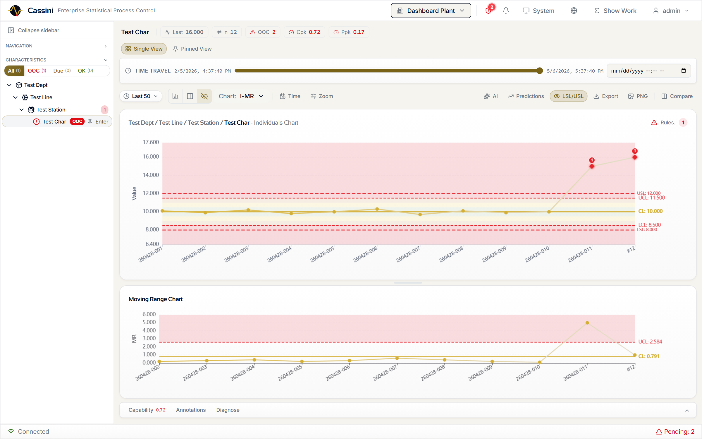

Cassini is the SPC platform that lives next to the production line. Charts update in
real time as samples flow in. Every number on every chart links back to the formula
that produced it. Every change is recorded in a hash-chained audit log. AI agents
talk to it natively over MCP. Multi-plant, multi-database, multi-tier — the open
core ships a complete SPC platform with no license key required.

---

## Why Cassini

**Ambient.** Charts, dashboards, and kiosks update via WebSocket push. Operators
don't refresh — the floor reflects reality.

**Agentic.** A built-in MCP server exposes a curated agent surface so Claude Code,
Cursor, and Claude Desktop query plants, capability, and violations directly.

**Audited.** Every mutation is hash-chained. Every numeric value links to its
formula, inputs, intermediate steps, and AIAG citation. Time-travel replay
reconstructs any chart's state at any historical moment.

**Open.** AGPL-3.0 community edition is a complete SPC platform — Nelson rules,
capability, MSA, DOE, Show Your Work. Pro and Enterprise unlock multi-plant,
compliance, and advanced analytics.

---

## Try it

| Path | Platform | Time |
|------|----------|------|
| **[Windows Installer](docs/getting-started.md#windows)** | Windows 10/11 | 2 minutes — download, run, login |
| **[Docker](docs/getting-started.md#docker)** | Linux / macOS / Windows | 5 minutes — `docker compose up -d` |
| **[From source](docs/getting-started.md#from-source)** | Linux / macOS / Windows | 10 minutes — full dev environment |

Default login: `admin` / `cassini` (you'll be prompted to change the password).

> **Want to see what Pro and Enterprise look like first?** Request a 30-day
> trial license at [saturnis.io/pricing](https://saturnis.io/pricing) — same
> binary, no reinstall.

---

## What's inside

Everything organized around what you actually do during the day.

### Watch the floor

Real-time control charts and dashboards. Charts update by WebSocket push as
samples arrive — no polling, no refresh. Variable charts (X-bar/R, X-bar/S,
I-MR, CUSUM, EWMA) and attribute charts (p, np, c, u with Laney p'/u'
overdispersion correction). Pin views, compare side-by-side, deviation mode for
short-run, standardized Z-score for high-mix.

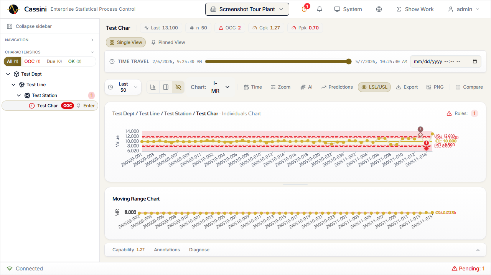

Display modes for the factory floor:

| Kiosk | Wall |
|---|---|
|  | Multi-chart grid layouts (2×2, 3×3, 4×4) with saved presets for control room displays. |

### Catch problems

All eight Nelson / WECO / AIAG run rules, individually configurable per
characteristic with parameterized thresholds. Violations are detected in real
time and bubble up to the violations page, the kiosk, the wall, and (optional)
push notifications.


Every violation references the specific rule triggered, the sample that caused
it, and the characteristic's current state. Bulk acknowledgement, filter by
severity / status / rule, one-click navigation to the offending chart point.

### Understand *why*

Click any number on any chart. Cassini shows you the formula, every input,
every intermediate step, and the AIAG citation it came from. The displayed
value must equal the explained value — verified by a contract test that runs
on every PR.

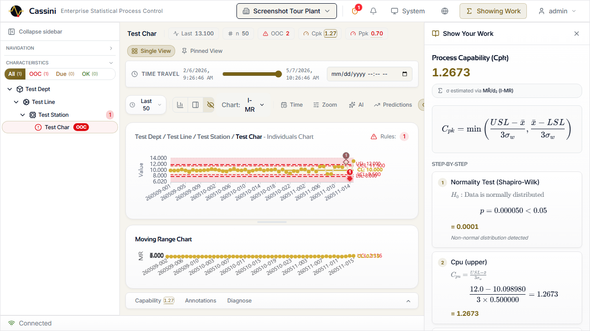

For regulated manufacturing — FDA, ISO, AS9100 — Cassini reconstructs any
chart's control limits, rule configuration, signatures, and contributing
sample list at any historical timestamp. Pick a date, see the chart as it was.
Designed against 21 CFR Part 11 §11.10(b).

> **SOP-grounded RAG with citation lock** *(Enterprise)*

Operators ask the SOP corpus questions and get cited answers. Every claim in
the response must point to a chunk from a document you uploaded — uncited
claims are rejected. The model can't drift outside your controlled documents.

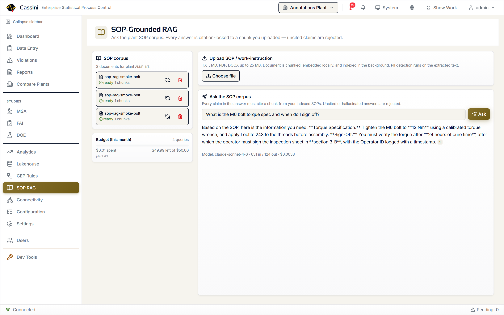

Hybrid retrieval (vector + BM25), local embedder by default (no data leaves
your network), per-plant monthly cost cap, full audit trail.

### Improve

**Capability** — Cp, Cpk, Pp, Ppk, Cpm with snapshot history. Color-coded
indices and full computation traceability. Non-normal capability via Box-Cox
and a 6-distribution auto-fit (Pro+) — automatic Shapiro-Wilk test with
fallback through Box-Cox, distribution fitting, and percentile methods.


**MSA / Gage R&R** — Crossed ANOVA, range method, nested ANOVA, and attribute
agreement (Cohen's and Fleiss' Kappa). AIAG MSA 4th Edition d2* tables. Full
wizard from study setup through results interpretation.

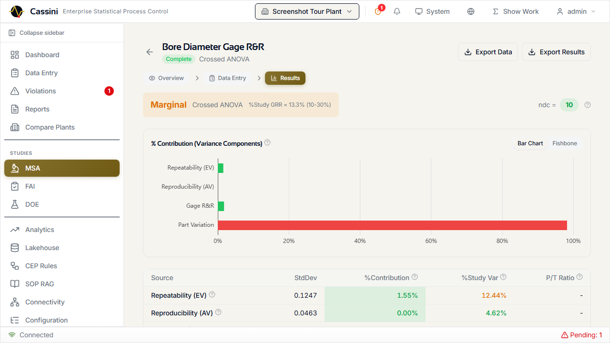

**DOE** — Full factorial, fractional factorial, Plackett-Burman, and central
composite designs. Interactive design matrix, run table, ANOVA, main-effects
plot, and interaction plots.

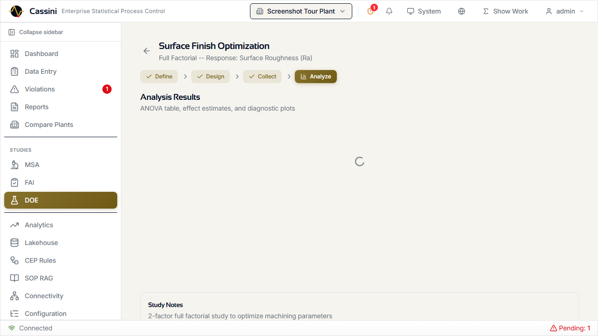

**Advanced analytics** *(Enterprise)* — Multivariate SPC (Hotelling T²,
MEWMA), anomaly detection (PELT changepoint, Kolmogorov-Smirnov drift,
Isolation Forest), predictive forecasting (ARIMA / Prophet), AI-powered chart
analysis with guardrails.

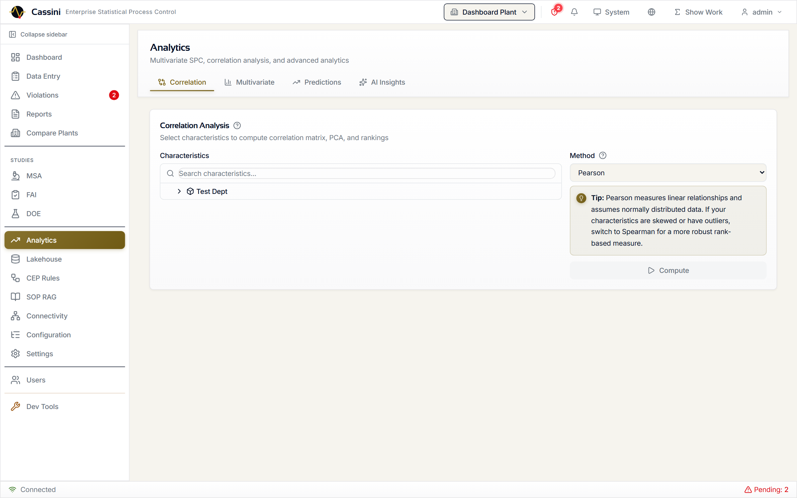

### Connect

The Connectivity Hub manages every data source with a visual data flow
pipeline showing source health, ingestion metrics, and SPC engine status at a
glance.

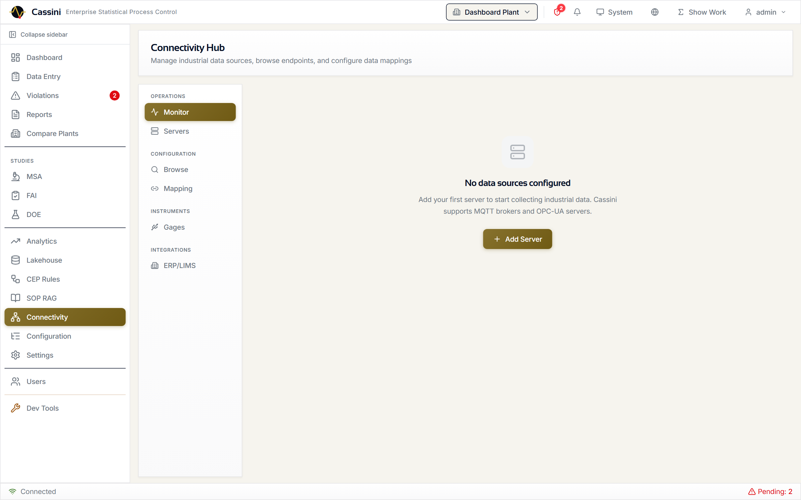

| Source | What it does | Tier |
|--------|--------------|------|
| **MQTT / Sparkplug B** | Topic-to-characteristic mapping with live value preview | Open (1 broker) · Pro+ (unlimited) |
| **OPC-UA** | Server management with node tree browsing and subscription-to-SPC pipeline | Pro+ |
| **RS-232 / USB Gages** | `cassini-bridge` agent translates serial gage protocols to MQTT | Enterprise |
| **CSV / Excel** | 4-step wizard (upload → validate → map → confirm) | Open |
| **ERP / LIMS** | SAP OData, Oracle REST, generic LIMS, webhook adapters with cron sync | Enterprise |
| **REST API** | a comprehensive REST API — single sample, batch (10K/req), or async high-throughput | Open |

### Comply

The compliance surface is layered: a community-edition install already gives
you the bones of a defensible record; Pro and Enterprise add the formal
workflows on top.


| Capability | Tier | What it provides |
|------------|------|------------------|
| **Hash-chained audit log** | Open | Every mutation is SHA-256-chained to the previous entry. `GET /audit/verify` walks the chain end-to-end. |
| **Show Your Work** | Open | Click any number to see the formula, inputs, steps, and AIAG citation. Displayed value = explained value, contract-tested. |
| **Plant-scoped RBAC** | Open | Operator / Supervisor / Engineer / Admin, plant-scoped. Cross-plant probes return 404. |
| **Time-travel replay** | Pro | Reconstruct any chart's state at any historical moment. 21 CFR Part 11 §11.10(b). |
| **Lakehouse with audited exports** | Pro | Every analytical export is recorded — table, format, row count, plant filter, columns. |
| **Electronic signatures (21 CFR Part 11)** | Enterprise | Configurable multi-step workflows with password re-auth, SHA-256 tamper detection, FDA-compliant password policies. |
| **First Article Inspection (AS9102 Rev C)** | Enterprise | Forms 1, 2, 3 with separation-of-duties enforcement and print-optimized output. |
| **Data retention enforcement** | Enterprise | Inheritance chain (global → plant → area → line → station) with full purge history for the regulator. |

> Validation packages (IQ / OQ / PQ templates, traceability matrix) ship with
> Enterprise. The OQ test scripts that exercise the compliance surface live
> at `.testing/oq/` in the repository — every Part 11 mechanism (audit chain
> verification, signature workflow, retention purge) has a dedicated test you
> can run against your own deployment as part of qualification.
> [Contact sales](mailto:sales@saturnis.io) for the full validation package.

### Integrate

**REST API.** a comprehensive REST API. Single-sample submission, batch up to 10K samples
per request, or async high-throughput mode (~175K samples/min with full Nelson
rule evaluation, Enterprise).

**MCP server.** Built-in Model Context Protocol server. Claude Code, Cursor,
and Claude Desktop query plants, capability, violations, and SOP corpus
natively. Read-only by default; writes require the `--allow-writes` flag.

**Cassini Lakehouse** *(Pro)* — read-only data product API. Curated tables
exported as JSON / CSV / Parquet / Arrow IPC, plant-scoped, audited,
rate-limited.

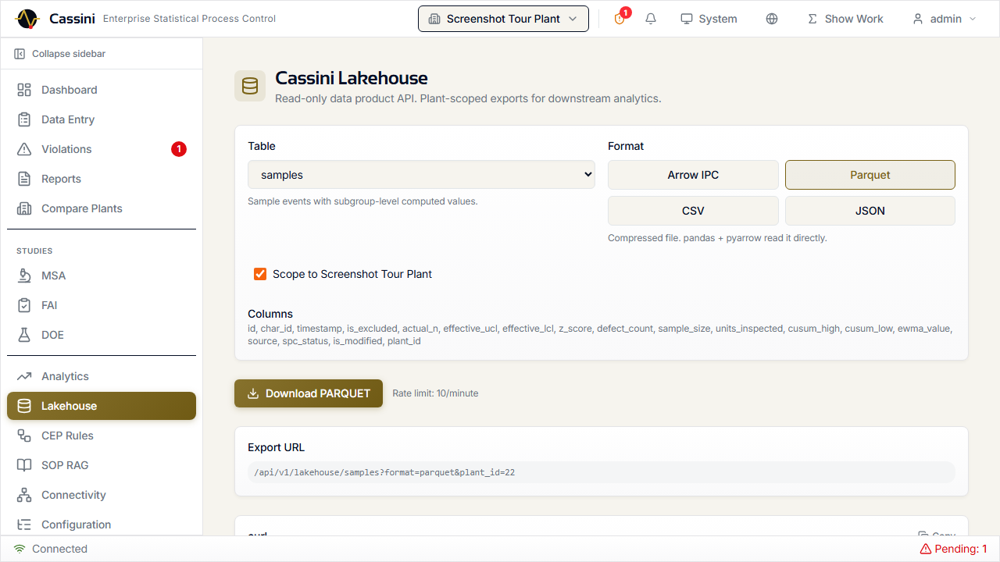

**CLI.** `cassini plants list`, `cassini samples submit`, `cassini login` —
structured output for operators and scripts.

### Streaming pattern detection *(Enterprise)*

A multi-stream complex-event-processing engine fires when a pattern across two
or more characteristics holds inside a sliding time window. Rules are authored
in YAML, edited live in a Monaco editor with inline validation, and
hot-reloaded into the running engine without restarting the backend.

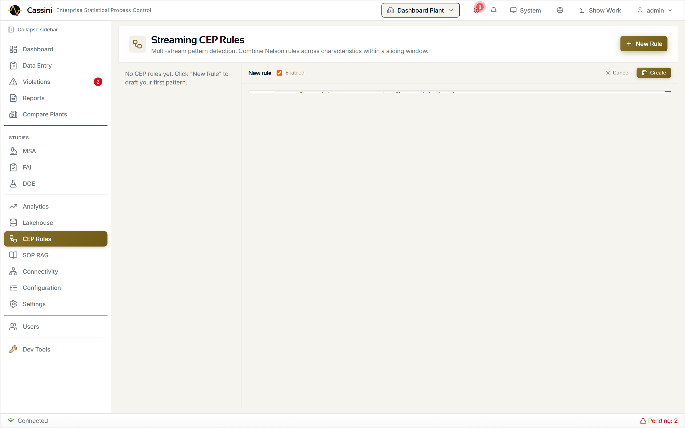

Catches what no single Nelson rule sees: shaft OD drifts up while bore ID
drifts down, every station on a line walks the same way at once, coolant
temperature climbs while cut diameter grows.

### Reports

PDF, Excel, and PNG export with built-in templates. Scheduled report delivery
*(Pro)* — cron-based scheduling with email delivery and run history.

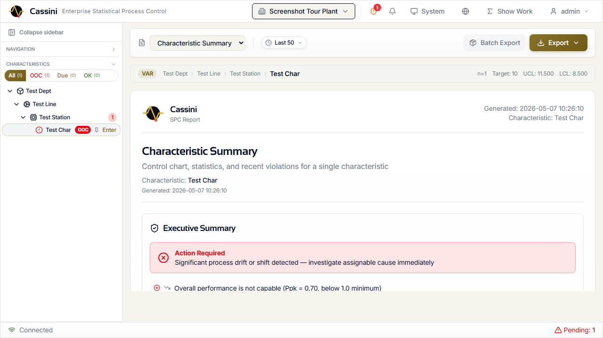

---

## Editions

| Capability | Open | Pro | Enterprise |
|---|:---:|:---:|:---:|
| **SPC Engine** |  |  |  |
| Control charts (X-bar/R, X-bar/S, I-MR, CUSUM, EWMA, p/np/c/u) | ✓ | ✓ | ✓ |
| Capability analysis (Cp, Cpk, Pp, Ppk, Cpm) | ✓ | ✓ | ✓ |
| Nelson / WECO / AIAG run rules | ✓ | ✓ | ✓ |
| Short-run SPC (deviation + Z-score) | ✓ | ✓ | ✓ |
| Show Your Work (computation transparency) | ✓ | ✓ | ✓ |
| Non-normal distribution fitting | — | ✓ | ✓ |
| Run rule preset management | — | ✓ | ✓ |
| **Data & Ingestion** |  |  |  |
| Manual data entry · CSV/Excel import wizard · Batch API (10K/req) | ✓ | ✓ | ✓ |
| Bulk import throughput | 200K/min | 200K/min | 200K/min |
| Throughput with full SPC rules | 26K/min | 26K/min | **175K/min (async)** |
| MQTT / Sparkplug B brokers | 1 | unlimited | unlimited |
| OPC-UA · RS-232 USB gage bridge · ERP / LIMS | — / — / — | ✓ / — / — | ✓ / ✓ / ✓ |
| Plants per deployment | 1 | multi-plant | multi-plant |
| **Quality Studies** |  |  |  |
| MSA / Gage R&R · DOE | — / — | ✓ / ✓ | ✓ / ✓ |
| First Article Inspection (AS9102) | — | — | ✓ |
| Electronic signatures (21 CFR Part 11) | — | — | ✓ |
| Hash-chain audit log · Time-travel replay | ✓ / — | ✓ / ✓ | ✓ / ✓ |
| **Analytics** |  |  |  |
| Dashboard · Violations · Reports | ✓ / ✓ / ✓ | ✓ / ✓ / ✓ | ✓ / ✓ / ✓ |
| Ishikawa · Correlation · Lakehouse · Scheduled reports | — | ✓ | ✓ |
| Multivariate SPC · Anomaly detection (ML) · Predictive · AI analysis | — | — | ✓ |
| Streaming CEP rules · SOP-grounded RAG | — | — | ✓ |
| **Administration** |  |  |  |
| User management · Plant-scoped RBAC · Audit trail | ✓ | ✓ | ✓ |
| Scoped API keys · Push notifications | — | ✓ | ✓ |
| SSO / OIDC · Data retention · ERP / MES | — | — | ✓ |
| **Infrastructure** |  |  |  |
| Windows installer · CLI · MCP server · REST API | ✓ | ✓ | ✓ |
| Database | SQLite | SQLite + Pg + MySQL + MSSQL | SQLite + Pg + MySQL + MSSQL |
| Cluster deployment (multi-node, Valkey broker, leader election, drain mode) | — | — | ✓ |
| Source code access | ✓ | ✓ | ✓ |
| Modification rights | AGPL (share-alike) | proprietary | proprietary |
| Support | Community | Community | SLA-backed |
| **Price** | **Free** | **$1,200/plant/yr** | **$5,000/plant/yr** |

> Need custom terms, on-premise deployment assistance, validation
> documentation, or SLA guarantees? [Contact sales](mailto:sales@saturnis.io).

---

## Architecture (under the hood)

| Layer | Technology |
|-------|------------|
| **Backend** | Python 3.11+, FastAPI, SQLAlchemy async, Alembic, Pydantic, Click |
| **Frontend** | React 19, TypeScript 5.9, Vite 7, TanStack Query v5, Zustand v5 |
| **Charts** | ECharts 6 (tree-shaken, canvas renderer) |
| **Validation** | Zod v4 (frontend), Pydantic v2 (backend) |
| **Styling** | Tailwind CSS v4 with light/dark + modern/retro/glass visual themes |
| **Database** | SQLite, PostgreSQL, MySQL, MSSQL via dialect abstraction |
| **Real-time** | WebSocket (FastAPI native), MQTT (paho-mqtt / asyncio-mqtt) |
| **Analytics export** | Apache Arrow IPC, Parquet (via `pyarrow`) |
| **Bridge** | Python, pyserial, paho-mqtt (pip-installable `cassini-bridge`) |
| **Desktop** | PyInstaller (freeze), Inno Setup (installer), pystray (tray), pywin32 (service) |
| **Broker** | Local in-memory (default) or Valkey for cluster mode |
| **ML** | ruptures (changepoint), scikit-learn (Isolation Forest), scipy |
| **Test harness** | Docker Compose, testcontainers-python, Playwright, multi-DB CI matrix |

Detailed architecture diagram: [docs/architecture.md](docs/architecture.md).

---

## Advanced usage

Everything below is for engineers integrating Cassini into pipelines, scripting,
or running the operations side. Day-to-day operators don't need any of this.

<details>
<summary><strong>CLI as HTTP client</strong></summary>

The `cassini` CLI wraps the operations subset of the API. Structured output for
both human operators and AI agents.

```bash
cassini login --server https://factory:8000
cassini plants list
cassini characteristics list --plant-id 1
cassini samples submit --char-id 5 --values 1.2,1.3,1.4
cassini violations list --char-id 5 --active
cassini audit search --after 2026-03-01
cassini cluster status   # Enterprise
```

Output modes:

```bash
cassini plants list                    # human-readable table (TTY)
cassini plants list --json | jq .      # pipe-friendly
cassini plants list --csv              # CSV export
```

Full reference: [docs/cli.md](docs/cli.md).

</details>

<details>
<summary><strong>MCP server (AI agent integration)</strong></summary>

Cassini ships with an MCP (Model Context Protocol) server. Claude Code, Cursor,
and Claude Desktop query Cassini natively.

```bash
cassini mcp-server                              # stdio (default)
cassini mcp-server --transport sse --port 3001  # SSE for remote clients
cassini mcp-server --allow-writes               # enable write tools
```

Configure your MCP client (`~/.claude/mcp_servers.json` for Claude Code):

```json
{
  "cassini": {
    "command": "cassini",
    "args": ["mcp-server", "--allow-writes"],
    "env": {
      "CASSINI_SERVER_URL": "https://factory:8000",
      "CASSINI_API_KEY": "cassini_..."
    }
  }
}
```

Read-only tools (always available): plants, characteristics, capability,
violations, samples, audit, license, replay, lakehouse, CEP rules, SOP-RAG.
Write tools (require `--allow-writes`): submit samples, create plants, create
users, create CEP rules.

Full reference: [AGENTS.md](AGENTS.md).

</details>

<details>
<summary><strong>REST API — high-throughput batch ingestion</strong></summary>

Three ingestion endpoints optimized for different use cases:

| Endpoint | Use case | Throughput |
|----------|----------|------------|
| `POST /api/v1/data-entry/submit` | Single sample with full SPC + supplementary analysis | Real-time |
| `POST /api/v1/samples/` | Single sample (user auth) | Real-time |
| `POST /api/v1/samples/batch` | Bulk import up to 10,000 samples per request | Up to 200K/min |

Batch request:

```json
{
  "characteristic_id": 42,
  "skip_rule_evaluation": false,
  "async_spc": false,
  "samples": [
    {"measurements": [10.1, 10.2, 10.0]},
    {"measurements": [9.9, 10.1, 10.0], "batch_number": "B-2024-001"},
    {"measurements": [10.3, 10.1, 10.2], "timestamp": "2024-01-15T08:30:00Z"}
  ]
}
```

Three processing modes:
- `skip_rule_evaluation: true` — direct DB insert (historical migration / backfill)
- default — full SPC pipeline (Nelson rules, zone classification, violation detection)
- `async_spc: true` — samples committed immediately, SPC evaluation deferred to
  background workers (Enterprise; ~175K/min vs 26K/min sync)

Individual sample failures don't abort the batch — successful samples commit while
errors accumulate in the response.

</details>

<details>
<summary><strong>Lakehouse exports for analytics</strong></summary>

Read-only data product API. Curated tables exported plant-scoped, audited,
rate-limited (10 exports/minute by default).

```python
import io, pyarrow.ipc as ipc, requests

resp = requests.get(
    "https://cassini.example.com/api/v1/lakehouse/samples",
    params={"format": "arrow", "from": "2026-01-01", "to": "2026-04-01"},
    headers={"Authorization": f"Bearer {token}"},
)
df = ipc.open_stream(io.BytesIO(resp.content)).read_all().to_pandas()
```

Tables: `samples`, `measurements`, `violations`, `characteristics`, `plants`.
Formats: JSON, CSV, Parquet, Arrow IPC. Schema is additive — column additions
are non-breaking; column removals or type changes ship in `/v2/lakehouse/...`,
never silently in `/v1/`.

Full reference: [docs/features/lakehouse.md](docs/features/lakehouse.md).

</details>

<details>
<summary><strong>Cluster mode (Enterprise)</strong></summary>

Run Cassini across multiple nodes with a Valkey (Redis-compatible) broker for
distributed task queues, event streaming, and WebSocket fan-out.

```bash
export CASSINI_BROKER_URL=valkey://valkey-host:6379

# API nodes (behind load balancer)
cassini serve --roles api

# SPC processing node
cassini serve --roles spc

# Background services node
cassini serve --roles reports,erp,purge

# All roles (small HA deployment)
cassini serve --roles all
```

| Role | Description | Scaling |
|------|-------------|---------|
| `api` | HTTP, auth, WebSocket | Horizontal (stateless) |
| `spc` | Nelson rules, CUSUM, EWMA evaluation | Horizontal (competing consumers) |
| `ingestion` | MQTT + OPC-UA connections | Per-broker singleton |
| `reports` | Scheduled PDF generation | Singleton (leader election) |
| `erp` | ERP sync connectors | Per-connector singleton |
| `purge` | Data retention enforcement | Singleton (leader election) |

Health probes: `/api/v1/health` (broker, roles, queue depth) and
`/api/v1/health/ready` (returns 503 when draining). `cassini cluster status`
shows all nodes, roles, and current leaders.

</details>

<details>
<summary><strong>Multi-database support</strong></summary>

The same Alembic migration set runs against every dialect. CI runs the full
integration suite against PostgreSQL and MySQL on every PR, plus MSSQL nightly.

| Dialect | Driver | Connection string example |
|---------|--------|---------------------------|
| **SQLite** (default, dev) | `aiosqlite` | `sqlite+aiosqlite:///./data/cassini.db` |
| **PostgreSQL** (recommended for production) | `asyncpg` | `postgresql+asyncpg://user:pw@host/cassini` |
| **MySQL** | `aiomysql` | `mysql+aiomysql://user:pw@host/cassini` |
| **MSSQL** | `aioodbc` | `mssql+aioodbc://...?driver=ODBC+Driver+18+for+SQL+Server` |

Configure in `cassini.toml` or via the `CASSINI_DATABASE_URL` environment
variable.

</details>

<details>
<summary><strong>Environment variables</strong></summary>

| Variable | Description | Default |
|----------|-------------|---------|
| `CASSINI_DATABASE_URL` | SQLAlchemy URL for the application database | SQLite local |
| `CASSINI_BROKER_URL` | Valkey/Redis URL for cluster mode | (empty = local mode) |
| `CASSINI_ROLES` | Comma-separated node roles | `all` |
| `CASSINI_DATA_DIR` | Directory for `.signature_key`, license file, instance ID | `<backend>/data` |
| `CASSINI_JWT_SECRET` | JWT signing secret (≥32 chars in production on non-loopback) | (auto in dev) |
| `CASSINI_SERVER_URL` | Server URL for CLI / MCP client | `http://localhost:8000` |
| `CASSINI_API_KEY` | API key for CLI / MCP authentication | (none) |

Full list: [docs/configuration.md](docs/configuration.md).

</details>

---

## Documentation

- [Getting started](docs/getting-started.md) — Windows / macOS / Linux install
- [Configuration](docs/configuration.md) — environment variables, TOML, database options
- [CLI reference](docs/cli.md) — `cassini serve`, `cassini check`, `cassini plants list`, …
- [Production deployment](docs/deployment.md) — reverse proxy, services, backups, upgrades
- [Testing harness](docs/testing-harness.md) — Docker-orchestrated multi-DB stack
- [AGENTS.md](AGENTS.md) — API surface for AI agents and integrators
- [CHANGELOG.md](CHANGELOG.md) — release history
- [SECURITY.md](SECURITY.md) — security policy and disclosure
- [CONTRIBUTING.md](CONTRIBUTING.md) — development setup, coding standards, PR process
- Feature deep-dives:
  [Time-travel replay](docs/features/time-travel-replay.md) ·
  [Lakehouse](docs/features/lakehouse.md) ·
  [Streaming CEP](docs/features/streaming-cep.md)

---

## License & commercial use

Cassini is dual-licensed:

- **Open Edition** — [GNU Affero General Public License v3.0](LICENSE) (AGPL-3.0)
- **Pro / Enterprise** — Commercial licenses available from [Saturnis LLC](https://saturnis.io/pricing)

The Open Edition is genuinely free and includes a complete SPC platform. Use
it, deploy it, build on it.

The AGPL-3.0 is a strong copyleft license that ensures improvements stay open.
The key requirement: **if you modify Cassini and make it available over a
network — including internal company networks — the AGPL requires you to share
your complete source code with all users.**

If your organization needs to make proprietary modifications, embed Cassini in
a closed-source product, or requires commercial features like multi-plant
management and electronic signatures, a [Pro or Enterprise license](https://saturnis.io/pricing)
removes the AGPL obligations and unlocks additional capabilities.

Not sure which you need? Email [sales@saturnis.io](mailto:sales@saturnis.io).

---

## Community

| | |
|---|---|
| Bug reports & feature requests | [GitHub Issues](https://github.com/saturnis-io/cassini/issues) |
| Questions & discussion | [GitHub Discussions](https://github.com/saturnis-io/cassini/discussions) |
| Community support | [community@saturnis.io](mailto:community@saturnis.io) |
| Security disclosures | [security@saturnis.io](mailto:security@saturnis.io) |
| Commercial licensing | [sales@saturnis.io](mailto:sales@saturnis.io) |

---

<div align="center">

Copyright © 2026 [Saturnis LLC](https://saturnis.io). Built with FastAPI, React,
ECharts, and statistical rigor.

</div>
