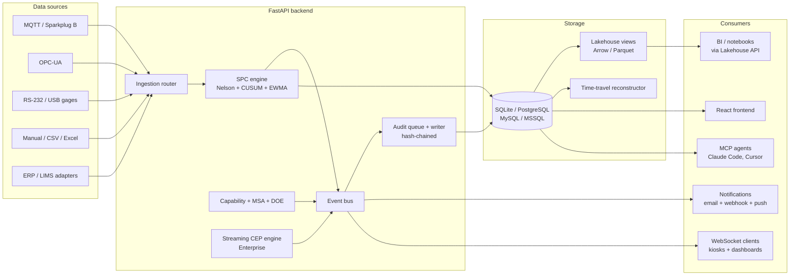

# Architecture

A production deployment of Cassini has three layers: data sources feeding the
ingestion path, the FastAPI backend (with the SPC, capability, MSA, DOE, anomaly,
and signature engines), and a React frontend that talks to the backend over
HTTP and WebSocket.

## High-level

```text
┌────────────────────────────────────────────────────────────────┐
│                        Data Sources                            │
│  MQTT/SparkplugB · OPC-UA · RS-232 Gages · CSV/Excel · ERP     │
└──────────────────────────┬─────────────────────────────────────┘
                           │
┌──────────────────────────▼─────────────────────────────────────┐
│                      FastAPI Backend                           │
│  JWT Auth · RBAC · Audit Middleware · Rate Limiting            │
│                                                                │
│  ┌─────────────┐ ┌──────────────┐ ┌──────────────┐             │
│  │ SPC Engine  │ │ Capability   │ │ MSA Engine   │             │
│  │ 8 Nelson    │ │ Non-normal   │ │ Gage R&R     │             │
│  │ rules       │ │ distributions│ │ ANOVA        │             │
│  └─────────────┘ └──────────────┘ └──────────────┘             │
│  ┌─────────────┐ ┌──────────────┐ ┌──────────────┐             │
│  │ Anomaly Det.│ │ Signature    │ │ Notification │             │
│  │ PELT/KS/IF  │ │ Engine       │ │ Dispatcher   │             │
│  └─────────────┘ └──────────────┘ └──────────────┘             │
│                                                                │
│  Event Bus ──── WebSocket · Notifications · Audit · MQTT Out   │
│                                                                │
│  SQLAlchemy Async ── SQLite / PostgreSQL / MySQL / MSSQL       │
└────────────────────────────────────────────────────────────────┘
                           │
┌──────────────────────────▼─────────────────────────────────────┐
│                      React Frontend                            │
│  TanStack Query · Zustand · ECharts 6 · Zod · Tailwind CSS     │
│                                                                │
│  24 pages · 200+ components · 240+ React Query hooks           │
│  PWA with push notifications and offline queue                 │
└────────────────────────────────────────────────────────────────┘
```

## Data flow



## Cluster mode (Enterprise)

A multi-node deployment uses a Valkey (Redis-compatible) broker for distributed
task queues, event streaming, and WebSocket cross-node fan-out. Each role can
scale independently:

- `api` — HTTP endpoints, auth, WebSocket fan-out (horizontal, stateless)
- `spc` — SPC queue consumer running Nelson rule evaluation (horizontal,
  competing consumers)
- `ingestion` — MQTT and OPC-UA connections (per-broker singleton)
- `reports` — scheduled PDF generation (singleton via leader election)
- `erp` — ERP sync connectors (per-connector singleton)
- `purge` — data retention enforcement (singleton via leader election)

Singleton roles use distributed leader election (`SET NX EX` with Lua atomic
release) so only one node executes that role at a time. Leader handover is
graceful — the outgoing leader drains in-flight work before releasing the lock.

Drain mode (`/api/v1/health/ready` returns 503) lets a load balancer pull a
node out of rotation before shutdown. The node finishes in-flight requests,
releases any held locks, closes broker connections, and exits cleanly.

## Backend layout

```
apps/cassini/backend/
├── alembic/                    # Database migrations (dialect-agnostic)
├── scripts/                    # Seed scripts for dev/test
└── src/cassini/
    ├── api/v1/                 # FastAPI routers
    ├── api/schemas/            # Pydantic v2 request/response shapes
    ├── api/deps.py             # Auth, RBAC, license helpers
    ├── core/
    │   ├── engine/             # SPC + supplementary chart engines (CUSUM, EWMA)
    │   ├── capability.py       # Cp/Cpk/Pp/Ppk/Cpm
    │   ├── msa.py              # Gage R&R (ANOVA, range, attribute)
    │   ├── doe.py              # DOE designs + analysis
    │   ├── cep/                # Streaming CEP engine
    │   ├── rag/                # SOP-grounded RAG (Enterprise)
    │   ├── anomaly/            # PELT, KS-drift, Isolation Forest
    │   ├── ai_analysis/        # LLM provider abstraction + tool use
    │   ├── auth/               # JWT, password hashing, RBAC roles
    │   ├── audit.py            # Hash-chained audit middleware
    │   ├── licensing.py        # Ed25519 license JWT validation
    │   ├── broker/             # Local + Valkey task queue / event bus
    │   └── ...
    ├── db/
    │   ├── models/             # SQLAlchemy ORM
    │   ├── repositories/       # Query helpers (one per resource)
    │   ├── database.py         # Async session factory
    │   └── dialects.py         # SQLite/Pg/MySQL/MSSQL helpers
    ├── cli/                    # Click CLI: serve, login, plants list, ...
    ├── opcua/                  # OPC-UA manager + provider plumbing
    ├── mqtt/                   # MQTT manager + provider plumbing
    └── main.py                 # FastAPI app, middleware stack, lifespan
```

## Frontend layout

```
apps/cassini/frontend/
├── e2e/                        # Playwright E2E specs
├── src/
│   ├── pages/                  # One file per route
│   ├── components/             # Shared UI primitives
│   ├── api/                    # fetchApi + per-domain *.api.ts
│   ├── api/hooks/              # React Query hooks (one file per domain)
│   ├── stores/                 # Zustand client state stores
│   ├── providers/              # ThemeProvider, PlantProvider, RequireAuth
│   ├── hooks/                  # Custom hooks (useECharts, useFormValidation, ...)
│   ├── lib/                    # Pure utilities (echarts, font-pairings, brand-engine)
│   ├── schemas/                # Zod v4 validation
│   └── i18n/                   # i18next translations (en seeded)
└── public/                     # Static assets
```

## Show Your Work — the trust contract

Every numeric value rendered on the UI must be reproducible by the explain
endpoint. The pattern:

1. The UI wraps a value in `<Explainable metric="cpk" target="char-42">`.
2. The wrapper renders the value with a dotted underline when "Show Your Work"
   mode is on.
3. Clicking opens the `<ExplanationPanel>` which calls `GET /api/v1/explain/...`.
4. The endpoint runs the same engine code that produced the displayed value,
   collecting every input, intermediate step, and AIAG citation.
5. A contract test (`tests/test_showcase_consistency.py`) verifies that the
   displayed value equals the explained value to floating-point precision.

If the displayed value drifts from the explained value, the contract test
fails on every PR. This is the load-bearing mechanism for 21 CFR Part 11
defensibility.

## Audit log — hash chain integrity

Every mutation (POST / PUT / PATCH / DELETE) goes through the audit middleware.
The middleware enqueues the event to an in-memory ring buffer; a separate
writer task batch-flushes to the `audit_log` table. Each row's `hash` column
is `SHA-256(prev_hash || canonicalized_event)`, producing a tamper-evident
chain.

`GET /api/v1/audit/verify` walks the chain end-to-end, recomputing each hash
from the previous one and the row's content. Any tampering anywhere in the
chain is detected — modifying a row or deleting a row both break the chain
and the endpoint reports the first broken link.

The same audit log feeds the time-travel replay engine. Reconstructing a
chart's state at a historical timestamp means walking the audit log from the
beginning up to that timestamp, applying each event in order. The replay is
read-only and rebuilt on demand — never persisted as a derived artifact, so
the chain remains the single source of truth.

## Multi-database

Cassini runs against SQLite (default, dev), PostgreSQL (recommended for
production), MySQL, and MSSQL. The `db/dialects.py` module abstracts the small
set of differences (timestamp precision, conflict resolution syntax, identifier
quoting) so the application code and the Alembic migrations are dialect-clean.

CI runs the integration suite against PostgreSQL and MySQL on every PR and
MSSQL nightly via the `docker-compose.full.yml` harness. The seed library
(`scripts/seed_e2e_unified.py`) produces an identical fixture set across all
four dialects so test outcomes are dialect-portable.
